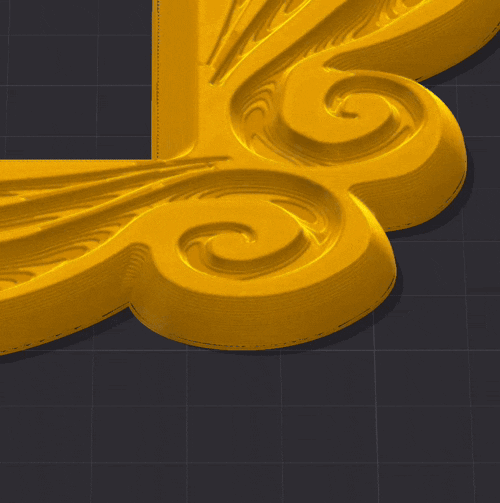

## Proud to announce that @Snapmaker is officially sponsoring this project!!

Development is conducted in close collaboration with the Snapmaker ecosystem and with Radoux/Radu, author of FullSpectrum and now part of the Snapmaker team.
By Neotko — inventor of Ironing/Neosanding (Ultimaker Cura, PrusaSlicer)

---

# Neotko FullSpectrum 2.4.3 — on Snapmaker Orca 2.3.5 — Release Notes

> ⚠️ **Review your generated G-code before long or production prints, especially if you
> turn on anything marked **expert-only** below.**

**2.4.3 is an incremental release on top of 2.4.2** (see `NEOTKOCM_RELEASE_2_42.md` and earlier
notes for the full feature set). Everything remains **opt-in**: at defaults the build behaves like
stock Snapmaker Orca.

---

## What's new in 2.4.3

### Height Adaptive Effects — settings that change with height, drawn over the real layers

A new gizmo (LibreMode) where a slicer setting is driven by a curve you draw against the
object's **actual layer bands**, adaptive layer height included — instead of typing a Z into a
height range modifier and finding out where the transition landed after slicing.

You **build the list yourself**: press **Add**, pick an effect, and it joins this object's list.
The panel only ever shows the effects you actually use, and a **trash button per row removes the
effector completely** — not just its points. Each row carries a small preview of its own curve, so
a list of similarly-named effects stays readable at a glance.

The effects available:

- **Sparse infill line width** — thin lines under solid surfaces so they print better supported,
  thick lines deep inside where nothing rests on them. Same density, same material.
- **Outer wall** and **inner wall line width** — the wall thickness itself following the height.
- **Fuzzy skin thickness** — texture that fades in and out with height. Where the curve reaches
  zero the fuzzy skin is switched off for that layer entirely, not just flattened.
- **Fuzzy skin point distance, noise scale, octaves and persistence** — the texture's *character*
  changing with height, not only its depth.

Only the three line widths that **stack** are offered. Internal solid infill and top surface were
tried and deliberately left out: a ramp there varies the width of the very surfaces the eye reads
as flat.

Each curve chooses **steps or ramp**. For sparse infill width the panel reports how far the
lines of one layer shift from the ones below, and a **Staircase** button turns a ramp into
layer-aligned bands when that shift gets too large. Curves are stored per object, so they travel
in the 3mf and go through undo/redo.

### RealColor now shows which way each line was printed

**Where**: G-code **Preview** → the view-type dropdown → **RealColor**.

Pick up a printed part and turn it under a lamp. The surface flares and goes dull as you move it, and
two areas printed at different infill angles never catch the light at the same moment. That is not a
trick of the eye: a printed surface is a bundle of parallel cylinders, so it reflects the way brushed
metal or silk does — in a band running *across* the lines, not in a round highlight. RealColor drew
every surface as if it were flat, and the direction each line was laid down went unused, even though
it was sitting in the toolpath all along.

It is used now. Ironed tops, walls and infill each catch the light along their own axis, so the same
part looks different depending on how it was sliced — which is exactly what happens on the bed.

The give-away is what happens when you orbit. A normal highlight follows the camera around like a
spot stuck to the surface; this one sweeps across the lines and moves from one region to the next as
the angle changes, because it is anchored to the print direction and not to your point of view.

Where a run of extrusion has no dominant direction — the loop of an external perimeter, which turns
through every angle — there is nothing to catch light along, and RealColor leaves it alone rather
than inventing a direction for it.

**Lines are also drawn closer to their real thickness — and that turned out to matter for colour.**
Surfaces used to be sealed by drawing every extrusion swollen by a fixed amount, which closed the
gaps but made thin lines look far fatter than they are and pushed the whole silhouette outwards. The
swelling now takes each line's own width and height into account, and the outer wall — the part that
*is* the silhouette — swells least.

The part no longer looks inflated next to the plain preview, but the useful consequence is subtler:
a gap between two drawn extrusions lets the background through, and RealColor was mixing that
background into the colour it computed for those pixels. Close the gaps and the colour stops being
contaminated. With the lighting and swelling settings shipped in this release, surfaces come out
sealed and the colour lands where it should.

⚠️ This view is doing real work per pixel and it is not free — expect the fans to spin up on a large
plate. It composites the surface many times over, and the sheen is computed on top of that.

### Tell RealColor what your filaments are made of

**Where**: G-code **Preview** → **RealColor** → the **Filament finish…** button in the legend.

Matte PLA, silk and TPU do not reflect light the same way, and until now RealColor drew all of them
as the same mildly glossy plastic. There is now a window with one row per filament — its real colour,
a preset, and three sliders if you want to go further.

The presets are the ones you would expect: Plastic, Glossy, Matte PLA, Rubber TPU, Metal, Silk. They
stack with the per-surface finish rather than replacing it, so a bridge in matte PLA still reads
rougher than an ironed top in matte PLA — the material and the way it was laid down are two separate
questions, and the picture keeps both answers.

Silk is worth trying on a part with large flat tops: what makes silk look half-metallic in real life
is the directional sheen described above, so silk turns it up and matte turns it almost off.

This only changes the preview. It is stored per filament slot and never touches your G-code or
triggers a reslice.

### Calibrate TD against a real print, by eye

The same window carries each filament's **TD** — how far light travels through it before it is
absorbed. TD is what decides whether a colour underneath shows through, so it is the single number
that makes a colour-mixed or Sandwich preview match the part that comes off the bed. It has always
been adjustable, but only in a dialog with no picture next to it, which meant guessing.

Now you can hold the printed part next to the screen and drag the slider until they agree.

**TD edits here are preview-only until you press Save.** Move the slider and the preview updates as
you go; nothing is written and nothing is resliced. When it matches, **Save TD** stores it and
applies it to the print — and because TD really does change what gets printed, that is the moment
the reslice happens. **Discard** puts back what was there before.

A practical way to use it: print something with a lighter colour laid over a darker one, look at
where the underneath stops showing through, and match that on screen. Once one filament is right the
others usually fall into place quickly, because you are calibrating your eye as much as the number.

Finish and TD sit together on purpose: they are the two optical properties of a material — how much
light passes *through* the plastic, and how it reflects off the *surface*. Judging one without
seeing the other is what made this hard before.

### The RealColor lighting can finally be adjusted

Every surface used to carry a bright streak running along each extrusion line that no setting could
turn down, and it made parts read as though they were made of metal whatever filament you picked.

The cause turned out to be plain geometry rather than a stray highlight: a round bead lit from one
side is always brightest along the line facing the light — over three times brighter than the bead's
own average — and a G-code preview is a field of round beads. Turning the light down just darkened
everything and left the streak exactly as prominent.

RealColor's lighting is now adjustable rather than fixed, including a **softness** control that
changes how light falls off around each bead instead of merely how much of it there is. That is the
one that removes the metallic reading. The defaults have been rebalanced around it: less of the
picture comes from one hard light and more from the ambient fill.

### Snap & Drag has its own button now — and can carry a selection without rearranging it

Snap & Drag's settings used to live in an object's right-click menu. That meant they were only
reachable from the menu *that particular selection* produced: select several objects and the
options were simply not there — precisely when you were most likely to want them.

They now live behind a **magnet icon in the plate's icon column**, under the camera. Click it and a
small panel opens with all of it in one place: **Snap & Drag**, **Snap to bed** (what 2.4.0 called
"Allow Bed" — same setting, same default), and one new option.

**Move selection as one block** — off by default. With it off, every object in a selection falls on
its own, so parts picked up together can land at different heights (objects stacked on each other
still travel together). That is the right answer when you are *placing* parts, and the wrong one
when you are *carrying* a finished arrangement somewhere else — drag a loose object together with
an assembled one and the loose one can drop to the plate while the assembled part stays high.

Tick the option and the whole selection becomes one rigid body: nothing changes height relative to
anything else, and the block falls until its **first** part meets a surface, then stops. No part is
ever pushed through its own floor to make another one land.

Full description in `WIKI.md` §17a.

### Notifications now fold into a single band

Orca's warnings are written for someone who is still learning where the walls are. In LibreMode you
are deliberately past that point: objects touching on purpose, parts assembled, plates packed
tight — and every one of those choices spawns a card that stacks up the side of the plate, covers
what you are working on, and has to be dismissed one at a time. Going further than the traditional
Orca workflow should not cost you your screen.

Messages now collapse into **one thin coloured band** at the bottom of the stack, showing how many
are pending. Click it to unfold and read them exactly as before, click the cross to dismiss them
all at once. The band is **amber** for warnings and turns **red** as soon as one of them is an
error, so the thing that actually matters — a part off the plate, a model cut by the build volume —
is still one glance away without a wall of text. Nothing is silenced: everything is one click away,
and slicing progress and the export message are never folded in.

The band follows LibreMode by default and can be turned on or off on its own in
**Preferences > Neotko**. With it off, notifications behave exactly as they always have.

Stale warnings were also fixed along the way. A validation warning about one object used to pile on
top of the previous one instead of replacing it, so cards describing a plate arrangement you had
already changed stayed on screen until dismissed by hand. Each validation pass now clears what it
supersedes.

### "Safely remove hardware" has moved to the menu

The green *Exported successfully* message used to offer an eject button whenever the destination
looked like a removable drive — inherited from the SD-card era. The U1 receives jobs over wifi, and
in practice the button showed up on ordinary external work disks nobody wants unmounted. It now
lives in **File > Export > Eject SD card / Flash drive**, greyed out unless a removable drive really
was the export target, so the rare USB-stick workflow keeps it.

### Small islands lost to XY size compensation are now reported

A negative XY size compensation can shrink a thin feature until it disappears, and until now that
happened silently — you found it in the preview, or on the bed. The slicer now tells you when
compensation merged or removed small islands, naming the lowest Z where it happened.

### The detached Process panel remembers how wide you made it

In LibreMode the Process panel detaches from the sidebar and docks on the right, where it can be
widened by dragging its edge — settings names are long, and a narrow column truncates most of them.
It was reopening as a thin strip every session no matter how wide you left it.

Two things were wrong. The width was only written down when you switched LibreMode *off*, so
quitting with it on — the normal way to work — saved nothing. And the panel was being created
while the main window was still sizing itself at startup, which squeezed its dock down to the
minimum allowed width and left it there permanently, ignoring the width that had been asked for.

The panel now opens at the width you last left it, and the width is tracked continuously instead of
only at the moment it is put away.

### The Home and Device pages follow the dark theme — experimental

**Where**: the **house** icon and the **Device** tab.

Both of those pages stayed bright white with the rest of the application in dark mode, and they are
the two you leave open the longest — one to pick up where you left off, the other to watch a print
run. They are not part of Orca's interface: they are Snapmaker's own app, compiled and drawn on a
canvas, so there was no theme to switch and no stylesheet to restyle. Their own dark mode exists but
is unfinished, and the dark screens are not in the desktop build at all.

They now follow the application's theme. Nothing is duplicated or replaced: the page is still theirs,
still served from their files, and it keeps updating from Snapmaker as it always has. Only the
palette it draws with is translated on the way to the screen — so the model thumbnails, the printer's
camera feed and the filament spool images stay in their true colours, which is the whole reason this
is done by translating colours rather than by inverting the picture.

⚠️ **Experimental, and deliberately provisional — until Snapmaker ships their own dark mode**, at
which point this comes out. Two rough edges to expect: the label on the blue **NewProject** button
reads dark rather than white, because a single white does duty as both page background and button
text and the two cannot be told apart; and the sidebar icons keep their original tone, being images
rather than colours.

It is built to fail quietly. If a Snapmaker update changes the shape of what we are reading, the page
is served exactly as it arrived and simply appears in light mode again — tinting a page is never
worth risking the one screen that drives the printer. In light mode nothing is touched at all.

