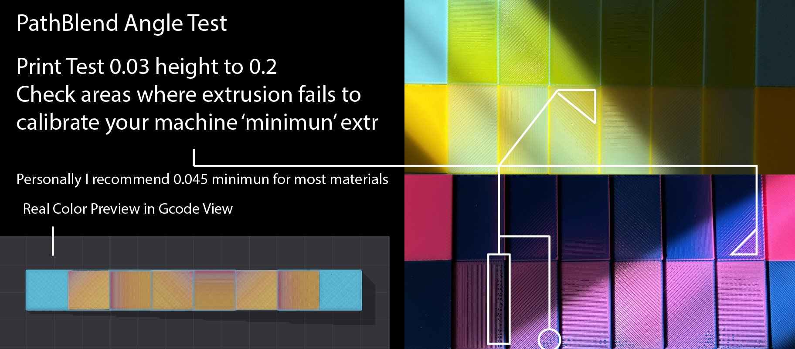

## Proud to announce that @Snapmaker is officially sponsoring this project!!

Development is conducted in close collaboration with the Snapmaker ecosystem and with Radoux/Radu, author of FullSpectrum and now part of the Snapmaker team.
By Neotko — inventor of Ironing/Neosanding (Ultimaker Cura, PrusaSlicer)

---

# Neotko 2.4.4 — on Snapmaker Orca 2.3.5 — Release Notes

> ⚠️ **Review your generated G-code before long or production prints, especially if you
> turn on anything marked **expert-only** below.**

**2.4.4 is an incremental release on top of 2.4.3** (see `NEOTKOCM_RELEASE_2_43.md` and earlier
notes for the full feature set). Everything remains **opt-in**: at defaults the build behaves like
stock Snapmaker Orca.

---

## What's new in 2.4.4

### Photo Studio comes to the G-code viewer

**Where**: G-code **Preview** → the view-type dropdown → **RealColor** → **Photo mode…** in the legend.

RealColor already got close enough to a real photograph of a printed part that the obvious next
question was why you still had to go back to the Prepare tab to light one. Now you don't. The
lighting of the G-code view is no longer welded into the shader: the key and fill lights can be
aimed, and the part is lit in the room rather than by a fixed lamp bolted to the camera.

**The lettering casts shadows onto its own face.** Until now nothing in RealColor knew where the
light was coming from — raised text read as *sunken* rather than as lit from a direction, because
the only shading of that kind was ambient. The object's own mesh is now used to cast a real shadow
onto the printed surface, so embossed text, engraving and overhangs land the way they do on the bed.
Supports, brim and the wipe tower are not part of that mesh and do not cast.

Photo mode is shared with the one in the Prepare tab and turns itself off when you leave the tab it
was opened from, so you never come back to a stripped scene you didn't ask for. Filament finish is
**not** duplicated here — the existing *Filament finish…* window is still the one place that decides
how each material behaves optically.

**And the picture comes out.** *Save PNG…* and *Copy image*, at 1080p, 1440p or 2160p, over a pure
white or a fully transparent background — no bed, no plate, no grid, just the print.

**The cast shadow is carried in the transparency.** Paste the PNG onto any colour and the part still
sits on a soft shadow instead of floating on it. That is the difference between a cutout and a
product shot, and it costs nothing to use: it is the same shadow already on screen.

Two things about the export are worth knowing, because both were found the hard way and both are
invisible until you compare files side by side. The picture is rendered at twice the resolution and
averaged down, which is what keeps the joints between extrusion lines from showing as speckle on a
white background — the dark viewport was hiding them all along. And the screen-space effects are
rescaled for the export, so the photo is not flatter than what you were looking at.

> Export from the **Prepare** tab's Photo Mode is still parked: it frames the shot wrongly and a
> button that writes a broken file is worse than no button. Use *Hide UI for screenshot* there, or
> the G-code viewer's Photo Mode, which does export properly.

### RealColor works past four filaments

**Where**: G-code **Preview** → **RealColor**.

Loading more than four filaments made tools 5 and up render in arbitrary colours, or simply black.
Every colour and TD table in this view was sized for four — the tool count of the machine it was
written for — and the shader read straight past the end of them.

The limit is now sixteen. This matters for two things the view is genuinely good at and could not
do before: **previewing someone else's G-code**, which can arrive with any number of tools, and
**designing with more colours than you intend to print**, keeping the spare tools around until you
decide which ones survive.

### The bed now heats for the hottest filament on the plate

**Where**: nothing to switch on. It applies to any multi-material print.

The first-layer bed temperature used to be taken from whichever filament happened to print first.
Put PLA at 65 °C and TPU at 35 °C on the same plate, start with the TPU, and the whole first layer
was laid down on a 35 °C bed, PLA included. The bed temperature is now the **highest** among the
filaments actually used on the plate, and the same rule applies at the transition to the second
layer.

> ⚠️ This changes the `M140` and `M190` your G-code emits on any multi-material plate whose
> filaments ask for different bed temperatures. It goes in the safe direction, but it is a real
> change to the first layer: worth reading the top of one file before a long print.

A plate whose bed type has no temperature of its own no longer falls back to a meaningless value
either; it uses the PEI figures.

### Variable layer height survives a reload

A project saved with a variable layer height profile could come back with that profile quietly
replaced by a fixed one, if its first segment disagreed with the first layer height. The stored
profile is now kept. The first layer height is applied separately, so there was never a reason to
throw the rest away.

### Painted Sandwich zones no longer go missing on variable layer height

**Where**: nothing to switch on. It applies to any painted Sandwich zone.

On a plate with variable layer height, a painted zone could simply not be there in the sliced
G-code, while the Prepare view kept showing it. It was deterministic: the same zones failed on every
re-slice, and a fixed layer height never showed it at all.

Up top, where variable layer height makes the layers thinnest, a gradient's thinner pass could come
out under the minimum height the printer can lay down. That pass was dropped, and the pass below it
kept the share of the layer it was authored with, so it printed a fraction of the layer and left a
void above. The colour you painted was gone and there was a gap where it should have been.

The recipe is now **collapsed** rather than punctured. Passes that are too thin are removed, and the
ones that remain are grown to fill the whole layer, so the layer is always solid. If every pass in a
recipe is too thin, the thickest one is kept, because in a Sandwich the thicker layer is what drives
the colour you actually see through the one above it.

Those zones therefore print in **one colour instead of the full recipe**, and the slice tells you
which ones:

> Sandwich: the layer height is too thin to fit every pass of the recipe in slots 6, 61, 62…

The slot numbers are the ones the Sandwich colour picker shows, so you can go straight to the zones
concerned. Raising the layer height, narrowing the adaptive range, or rebalancing the recipe's pass
ratios will all bring the full recipe back. Whether it is worth doing is your call: a single-colour
zone with a solid layer under it is a good part, just not the one you painted.

> Prepare still draws the full recipe on those zones. The warning is what tells you the G-code
> differs, so it is worth reading when it appears.

This was present in 2.4.3 and earlier, and it was not caused by anything in this release.

### Crashes and dead ends fixed

Several of these come from Snapmaker's own 2.3.7 line and are folded in here.

- **Opening a G-code file that has moved or been deleted** used to walk into the parser and die on a
  null file handle. It now says the file does not exist, which is what you needed to know.
- **Dropping the same G-code file twice** would flash you into an empty 3D editor. It stays on the
  preview you were already looking at.
- **Restoring a project could hand a plate somebody else's print job** when two plates competed for
  the same internal slot, leaking memory on the way. Each plate now gets a free slot or the load
  reports an error instead of silently mixing them up.
- **A crash while ordering tools** on plates where a tool index ran past the flush table.
- **A crash while slicing a painted model**, in the grid that walks polygon edges.
- Two divide-by-zero crashes in the tips panel, and a preview that could scramble the legend.

### Every mixed recipe is reachable in the ColorStitch dialog

**Where**: **ColorStitch** dialog → *Pattern style* → **MixedFilament recipe**.

The recipe list stopped at five. That limit belongs to hand-typed patterns, where a recipe has to
fit in a single digit, and it never applied to the buttons: picking a recipe stores the recipe
already expanded into physical filaments. So the sixth recipe onward was hidden for no reason.

The list now holds every recipe you have. Beyond the first few there is a **Show all…** button that
opens the complete list, so the dialog cannot grow off the screen the way it once did.

### Deleting a mixed filament no longer shifts the others

Deleting the last custom row from the sidebar's Color Mix panel left it half-deleted: hidden from
the list, still counted by the renumbering. Every virtual filament above it shifted by one, and a
saved Sandwich recipe kept pointing at the old number, so it printed the wrong colour without
warning. The three places that decide whether a row still counts now share one answer.

### Patterns are snapshots

A ColorStitch pattern is a record of what you chose, and it no longer changes meaning when the
Mixed Filament list does. A hand-typed digit referring to a virtual filament used to be resolved
again on every slice; it is now frozen into physical filaments when you save the pattern, the same
way the recipe buttons have always worked. If you want a pattern to follow a changed recipe, repaint
it.

### ColorStitch is called ColorStitch everywhere

The engine kept the old internal name **ColorMix** in its source, its classes and its files, while
the interface has said ColorStitch since 2.3.x. Snapmaker is now adopting "Color Mixing" upstream
for their own MixedFilament, so the two names had to stop overlapping before that arrives.

Nothing about your projects or presets changes: every setting key and everything written into a
3MF is untouched, and old projects with painting, recipes and stickers load exactly as before. Two
things you can see: the Painter gizmo's tooltip now reads **ColorStitch Painter**, and the debug
channel is `ORCA_DEBUG_COLORSTITCH`, writing to `/tmp/neotko_colorstitch.log`.

### PathBlend gradients now go the way you point them

**Where**: **Painter** → a **PathBlend** pass → the *angle* control.

PathBlend makes a gradient out of geometry. One filament climbs as a staircase, one print height
step per fill line, and a second one caps whatever is left. How light or dark a spot looks comes
from how thick the line is at that spot, so the fade you see is the staircase seen from above.

The angle control decided which lines got printed, and that was all it decided. Where the fade ran
was locked to one axis of the plate. You could set 45 and the fade still ran the way it always had.
At one angle it got worse: with the lines running along that locked axis, every line came out at the
same height, the staircase flattened, and the gradient went away. You got a solid block with no fade
in it, which is exactly what one of us found by printing a row of blocks at 45, 90, 135, 180 and 225
and looking at them.

The axis is now measured from the lines that actually get printed, so the fade always runs across
them. Set 45 and it fades diagonally, set 90 and it fades the other way round instead of vanishing.

The angle also covers a full turn now instead of half of one. 0 and 180 print the same lines, but
the fade runs in opposite directions, so you can flip a gradient end for end without touching
anything else in the profile.

> ⚠️ This changes the G-code of any PathBlend pass whose angle is not 0, and the default angle is 45.
> If you have printed PathBlend parts you were happy with, they will come out different. That is the
> point of the fix, but it is still a change, so run a test print before a long job.

### PathBlend on an assembled object prints in the right order

**Where**: **Painter** → **PathBlend** passes, on an object that holds several separate parts.

Weld five letters into one object, give each one a PathBlend pass at the same height, and the slicer
could order the passes wrong. PathBlend lays a ramp and then a cap over it, and on some of those
letters the cap came out **before** its own ramp. The nozzle dropped about 0.1 mm onto material it
had just laid and dragged through it. It also built a prime tower far bigger than the job needed,
because the plan kept swapping filament to get through the layer.

The cause was a step that merges duplicate passes at the same height. It compared everything about
two passes except **which part they belonged to**, so the ramps of different letters got welded into
one, and a letter's cap ended up buried inside another letter's ramp. Once a cap is no longer the
last thing in its own sequence, nothing is left holding it after its ramp.

Each part now keeps its own sequence. On the five-letter test the layer went from three broken
sequences to five complete ones, the prime tower came back to a normal size, and the toolpaths are
clean. There is also a new check that says so out loud if a sequence ever comes out incomplete
again, because this one stayed invisible for a long time.

Assembled and split-to-parts now give you the same thing. You no longer need to split, and
`ORCA_PB_ISLAND_CHAINS=0` is no longer a workaround anyone has to reach for.

### The painter tells you which zones have no angle set

**Where**: **Painter** → *Brush & view* → **Mark bands with no angle**.

Leaving a fill angle on auto means the slicer flips it by 90 degrees every other layer, so there is
no single direction anyone can show you. 2.4.4 tried saying that by making the preview blink between
the two directions, and it turned out to be tiring to look at and it kept the 3D view redrawing the
whole time.

The blinking is gone. Those zones now get a violet outline that pulses slowly instead, and there is
a small legend in the corner of the 3D view telling you what green and violet mean. It covers
ColorStitch and PathBlend, and in PathBlend it matters more, because there the angle decides the
gradient and not just the finish.

### The palette shows the angle of each recipe

**Where**: **Painter** → **Profiles** → hover a swatch.

Until now the only way to find out what angle a saved recipe carried was to open it in Pro, one at a
time. If you were spreading different angles across several recipes, which is the whole point of the
control, you were doing it blind. The hover tooltip now shows it, per zone, and says **auto** in the
same violet as the outline when there is no fixed angle.

---

### Supports you aim

A support enforcer block used to be a box you draw, and everything about it below the object got
thrown away. The block said *what* to support and nothing else, so the column always fell straight
down from the overhang, wherever you put the box.

That is no longer true, and there is now a tool for it. **Requires Libre Mode.**

**You point at what you want held up, then you point at where it should land.** Two clicks. The
pillar is built between the two, and it follows the surface you picked rather than a bounding box:
its roof is the real patch with its curve, so it sits flush against a rounded underside instead of
leaving a gap under it.

**The panel draws what you are going to get.** The middle of it is a section of your pillar at true
scale: forty five degrees on the slider is forty five degrees on screen. Behind it there is a ghost
wedge covering everything the slicer can actually follow, so a landing it will not reach is a shape
you can see rather than a number you have to believe.

**The lean is a number you choose, and it has a ceiling the slicer sets.** A support column can only
step so far sideways from one layer to the next, so there is a steepest angle it can actually follow.
Ask for more and you get a staircase in mid air. The tool takes the angle as the input and works out
the rest: the pillar leans at that angle, reaches a knee, and drops straight down from there. Because
the angle is the input, the impossible case cannot be drawn at all, which is a better deal than being
warned about it afterwards.

**And the block stops being opaque.** A grid of markers shows where a zone finds surface facing
downward, which is the thing that predicts what you get. The failure this kills is quiet and common:
a block that swallows solid material looks completely full on screen and produces nothing at all. Now
it lights up nowhere and says so. There is a second map for the opposite question, in red: surface
that leans past your threshold and sits inside no zone at all. Simplify3D fills everything with
support and lets you carve it back. This shows you the gap and leaves the decision to you. Both are
drawn through the part, so a gap hiding behind the model is still a gap you can see.

**A soluble roof, and an ordinary body.** Each zone can take its own filament for the roof, picked
from a strip of colour chips. The roof is the part that touches your model, so a soluble roof buys
you a clean underside while the body stays whatever is cheap. The body deliberately keeps following
the object, because a support body set that way is where the slicer dumps its purge, and pinning a
tool to it would give that up and grow the wipe tower in exchange for controlling the part of the
support that cares least about material.

**Zones you can reopen.** A pillar built with the tool remembers the two clicks that made it. Press
the pencil on its card and the whole gesture comes back into the panel: patch, landing, footprint,
edges, angle. Change what you want and apply, one edit and one undo. That memory holds while the zone
is locked, which is what the padlock on the card means. Move, rotate or scale it with the ordinary
gizmos and the link between the gesture and the geometry is broken, so the lock goes and the zone
becomes an ordinary support block. It still prints exactly as it is; it just cannot be reopened. One
way door, and another zone is two clicks away.

**Zones that touch and share their settings print as one column.** Two pillars meeting under the same
overhang used to split the shared band between them, and the one with lower priority came out thinner
all the way down to the plate. They now merge. Zones with different settings, or different roof
filaments, still get out of each other's way, which is what that rule was for.

**It sets up the object for you.** Creating the first pillar on an object writes the support settings
these pillars were tested and printed with onto that object: normal supports, a 0.1 mm top gap, one
support wall, three interface layers, solid rectilinear interface. Only settings you have not already
chosen yourself, and all of them visible and removable from the object list. If the object was on tree
supports it is switched to normal, keeping whether it was automatic or manual, because the tree
generator does not know about the corridor and the lean you draw would not come out.

**Why this instead of tree supports.** A drawn pillar is one column that goes where you put it, so
the toolhead prints it in one place and moves on. Tree supports branch, and every branch is another
island on the layer, which is another travel and another retraction. Fewer retractions is not just
faster: it is much kinder to the materials that hate being pulled back, and those are exactly the
flexible and moisture sensitive filaments where stringing and grinding show up first. You also decide
where the foot lands, so it can stay off a delicate surface instead of finding one on its way down.

**You can paint the area instead of clicking it.** Pick the brush and drag on the surface to mark
what you want held up. The brush is the size of the slider, so a small one draws a narrow strip and a
big one fills a region in a sweep; shift and drag rubs it out. While the brush is chosen the surface
you can paint on is lit faintly, and it is deliberately much larger than what a single click takes:
on a curve one click gives you a tiny coplanar patch, and painting is exactly the tool for going past
it. It stops where the surface stops facing downward, because that is where support stops making
sense.

**A shape can cut, or it can cover.** Cutting trims the shape to the surface you picked, so it can
never be bigger than the patch — that is what the round and square did until now. Covering makes the
shape *be* the section of the pillar: it can be bigger than the patch and grow as far as you want, up
to 200 mm, while the roof still follows the real surface wherever there is one and stays flat where
there is not. Growing the outline of a patch always runs out, because the shape eventually folds
through itself; replacing the outline with a shape has no such ceiling. The tool now starts in
**square** rather than whole patch, because whole patch is the one mode that cannot be expanded and
starting there hides the choice.

**The footprint got its geometry audited, and it needed it.** The shape you asked for and the solid
you got were built by two different pieces of code, so on simple surfaces they disagreed visibly:
a face made of two large triangles could only answer "all of it" or "none of it" to a round cut, a
90 degree corner moved in less than you asked, meshes with mixed winding grew holes and inner walls,
and an unwelded seam invented a border in the middle of the patch. There is now one piece of geometry
that the outline, the solid and the highlight are all derived from, and the shape is cut exactly
rather than triangle by triangle. On a dense mesh — a torus — this was invisible. On a box it was the
whole effect.

**This has been printed.** A part held up by leaning pillars came off the bed exactly as the G-code
described it, and a torus with a 0.2 mm gap came out clean.

**Two support-zone bugs worth naming, because both were silent.** Applying an edit used to hand you
a broken pillar while the preview showed the right one: the scene matches its copies of a volume by
id and reuses the old triangles when the id has not changed, so the new mesh never arrived. And
giving a zone its own roof filament used to schedule that tool on **every** layer of the zone, so the
wipe tower paid a purge on each one while the roof existed on four. A flag describing the whole layer
was being read inside a loop over zones, on both the planning side and the emitting side.

**Two things it does not do yet.** While you are editing a zone the landing spot stays where it was,
so moving the foot means making a new zone. And red markers show up on the skirt where the model meets
the plate: that surface really does lean past the threshold and really is in no zone, it just does not
need support, and deciding that properly is the slicer's own overhang test rather than this map's job.

A plate with no zones slices exactly as it did before.

### Light mode is light all the way through

**Where**: your macOS appearance setting. Nothing to turn on in Orca.

Put macOS in Light and Orca used to come back half dressed. The sidebar and the process panel went
light, the 3D scene and the object list stayed dark, the title bar was black whatever you did, and
the Home and Guide pages were dark every single time, even on a fresh install. Flipping back to Dark
hid all of it, which is probably why it lasted this long.

**This is not new in 2.4.4.** It has been there since the fork started, and the parts of it that live
in Orca's own code go back further still. It is fixed now.

There were two different ways of asking "are we in dark mode", and on macOS they could disagree. One
read the appearance the app was actually drawing with. The other read a raw system preference key
that is not always cleared when you switch back to Light, so it kept answering "dark" in broad
daylight. Every part of the interface picked one of the two, which is how you end up wearing half a
theme. There is one answer now, and everything reads it.

The rest came off the same thread once it was pulled:

- **The Home and Guide pages.** These decide their theme from a stylesheet that is supposed to be
  removed when you are in light mode. The removal never matched, because the page asked for that
  file by a slightly different path than the code that takes it away. So the page kept its dark
  sheet forever, and quietly collected a second copy of it on every launch.
- **The title bar** was painted a fixed dark grey when the window was built, with white title text
  to match. Both follow your theme now.
- **The Neotko gizmo panels** (Support Zones, Height Adaptive Effects, Precision Adaptive Layer
  Height and Align & Stack) have a real light face instead of staying black inside a bright window.

That last one took two goes and is worth a sentence. Every gizmo panel in Orca sits on a background
that is set once, dark, with no theme branch anywhere near it, so handing the controls light colours
just produced white text on pale sliders and buttons nobody could read. The background has to be
claimed before the panel is opened rather than after. Dark mode is untouched by all of this and looks
exactly as it did.

> **One rough edge.** The title bar takes its colour when the window is created, so changing your
> system appearance while Orca is open leaves that one strip on the old colour until you restart.
> Everything else changes over on the spot.

---

---

## Try it yourself

Three projects ship in the repository root:

- **`BIGTEST.3mf`**, the long standing kitchen sink plate.
- **`BIGTEST-ADAPTIVE.3mf`**, the same idea on variable layer height. This is the plate the
  Sandwich collapse fix above was hunted on, so it is the one to load if you want to see painted
  zones survive adaptive layers.
- **`PathBlend-Angle.3mf`**, small and quick: a row of PathBlend blocks at different angles. Slice
  it and switch the preview to **RealColor** to see the gradients turn. Before this release the 90
  degree block came out flat.

**That plate is also a minimum extrusion test.** The steps run from **0.03 mm up to 0.2 mm**, so
somewhere along the row your printer stops laying a continuous line and starts skipping. Print it,
hold it against the light, and find the first step that comes out clean. That is your machine's
real floor, and it moves with the material: a glittery or heavily filled filament gives up earlier
than a plain one, and two printers on the same spool will not always agree.

PathBlend reserves **0.035 mm** for the closing bead of a ramp, which is a floor that keeps the
geometry honest rather than a promise that your setup can print it. In practice **0.045 mm is the
safer starting point for most materials**, so if the thin end of a gradient comes out patchy that
is the first number to raise. It is an expert knob and it lives in the environment rather than in
the UI: `ORCA_PB_MIN_H=0.045` before launching Orca. Leave it alone and you get 0.035.

---

## Notes

- Photo mode and the G-code viewer's lighting are **opt-in**: with the mode closed, RealColor renders
  exactly as it did in 2.4.3.
- The lighting knobs live in Photo Mode's own window, **not** in RealColor's tuning panel. That panel
  holds values calibrated for colour accuracy and then frozen; mixing a "make it look nicer" control
  in among them is how a colour simulation quietly stops being one.
- Shadows in the G-code viewer are cast by the **object mesh**, so they follow the shape you designed
  rather than the toolpath. Supports, brim and the wipe tower do not cast.
- **Support zones are opt-in and per object.** A plate with no zones slices exactly as it did before.
  Creating the first zone on an object does write support settings onto **that object** — the values
  these pillars were tested with, only where you had not chosen your own, and all of them visible and
  removable from the object list. If the object was on tree supports it is switched to normal there
  too, keeping automatic or manual as you had it.
- Two changes here alter G-code you did not ask to change: the **bed temperature** on multi-material
  plates, and the **Sandwich collapse** on plates with variable layer height, where affected zones
  now print solid in one colour instead of hollow in two. Both go in the safe direction and the
  second one announces itself in the slice. Everything else is either opt-in or a fix for something
  that was already wrong.

---

## Known issue, still open

**The angle a zone reports does not always match what gets sliced.** Some of this is understood now:
with the angle left on auto, the painter had to pick one direction to draw while the slicer flips
between two, so the two views could never agree. The default angle is a real 45 rather than auto,
and zones still on auto are called out with the violet outline described above, which covers most of
what people were running into.

There are still cases where the number shown and the printed result disagree, and that is being
tracked for a later version.

**Until it is fixed, slice and look at the G-code preview in RealColor.** RealColor draws the effect
from the toolpaths that were actually generated, so for anything to do with angles and gradients it
is the view to trust. The painter preview is a pre-slice approximation and cannot know everything
the slicer will do.
