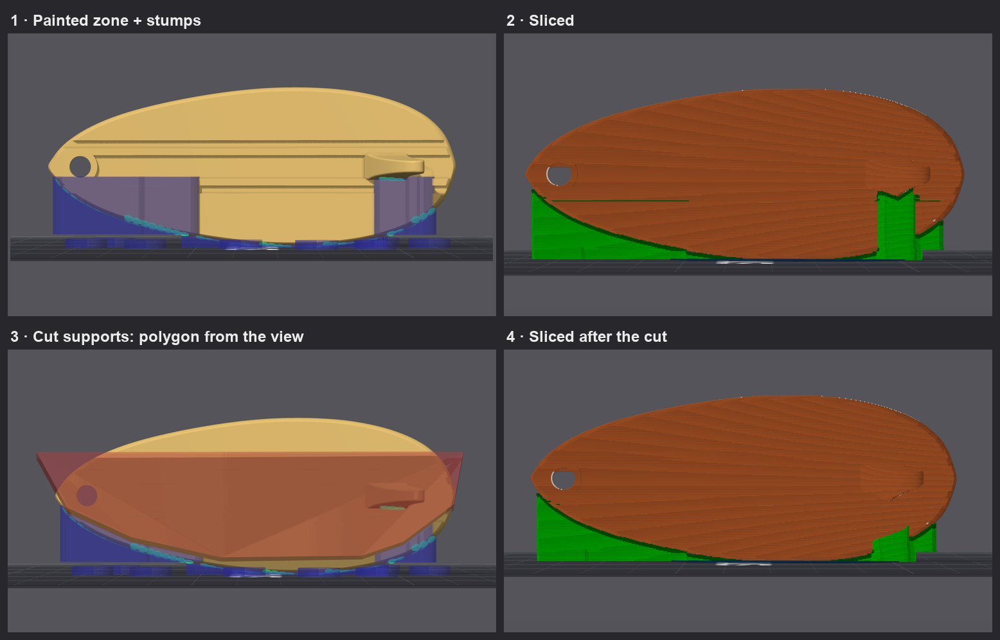

## Proud to announce that @Snapmaker is officially sponsoring this project!!

Development is conducted in close collaboration with the Snapmaker ecosystem and with Radoux/Radu, author of FullSpectrum and now part of the Snapmaker team.
By Neotko — inventor of Ironing/Neosanding (Ultimaker Cura, PrusaSlicer)

---

# Neotko 2.4.7 — on Snapmaker Orca 2.4.0 — Release Notes

> ⚠️ **Review your generated Gcode before long or production prints, especially if you
> turn on any of the features below.**

**2.4.7 is an incremental release on top of 2.4.6** (see `NEOTKOCM_RELEASE_2_46.md` and earlier
notes for the full feature set).

---

## What's new in 2.4.7

### NeoStroke: cleaner paths and solid letters (still debug mode only)

**Where**: Quality → Wall generator → **NeoStroke**.

> ⚠️ NeoStroke is still not ready for production prints. It is a lot closer than in 2.4.6: on our
> test plates small raised lettering now comes out closed, including the letters that always had a
> hole. Check the Gcode before a long print.

**One switch to unlock it.** Tick **Enable NeoStroke wall generator (unstable)** in Preferences and
that is it. Libre Mode is no longer needed. In 2.4.6 the checkbox was missing from the Preferences
window, so the only way in was starting Orca with `ORCA_DEBUG_NEOSTROKE=1`. It is there now and it
applies straight away. The variable still works too.

**The hole in letters like B and E.** Most of it was not in either engine. It was in the seam between
them. Where the outer wall turns an inside corner it leaves a small pocket, and Classic counts on its
own gap fill to close it. With NeoStroke gap fill is off, and NeoStroke used to start exactly where the
wall ended, so nobody filled the pocket. NeoStroke now reaches under the wall by the same
**Infill/Wall overlap** you already use for infill, so there is one setting for both. 20 % closed most
of it on our plates. 10 % leaves some of the pockets, and 35 % started to push neighbouring letters
into each other.

> 💡 **For lettering, set Infill/Wall overlap to about 18 %** in the profile you use for it. The Snapmaker
> profiles ship with 15 %.

**No more flow stops at the end of each stroke.** A stroke with several lines used to stop and restart
the flow at every turn between two lines, and every stop can leave a small dent. The lines are now
joined and printed in one go (**Join line ends (no flow stops)**, on by default). The join runs
straight across the end of the stroke. A tight half circle there, which we tried first, left more of a
notch than stopping did.

**Fewer lines where a stroke narrows.** A stroke used to keep the same number of lines along its whole
length, so where it got thin those lines became hairs the nozzle cannot really print. Now the count
drops where the stroke narrows and no line goes below **Thinnest printable line**. A line that is
dropped tapers out while its neighbours take its room, so there is no gap where it ends. Rings keep
one count all the way round so they stay tidy. (**Fewer lines where it narrows**, on by default.)

**Settings renamed and grouped.** The names now say what you see in the print rather than how the
engine works inside. Some of them:

| Before | Now |
|---|---|
| real minimum bead | Thinnest printable line |
| thinnest bead | Thinnest small detail |
| maximum width | Target line width |
| minimum width | Thinnest line at tips |
| hard bead limit | Widest line allowed |
| width reference | Reference line width |
| curve overlap | Extra flow on wide lines |
| corner hooks | Reach into corners |
| skate over printed lines | Glide over printed lines |

Five of them said "% of nozzle" while they were really a percentage of the reference line width. They
now say "% of reference". The Advanced window is split into groups: line widths, shape, extra flow,
path order and travel, and Classic's wall with its overlap.

**What we tried and left out.** Very wide lines (twice the nozzle) do print on straight runs, but
they over-extrude in curves and circles, and making them overlap each other did not help. Thinner
lines than the default (0.20 mm) and a higher speed made things worse. The defaults are the settings
that came out best across all of it.

**Removed**: the end cap join (replaced by joining the line ends) and the five settings that shaped
the extra flow on wide lines. Those keep the values they always had. Projects that carry them still
open; the old values are simply ignored.

### NeoStroke Preview: see the paths before you print

**Where**: the new **NeoStroke Preview** tool in the 3D view's toolbar (available once NeoStroke is
unlocked in Preferences).

The old preview lived in the Advanced window and read the settings of the tab it was opened from, so on
a plate with per-object settings it showed something different from the Gcode. The new one is a tool on
the plate, and it slices each object with **its own settings**, the same way the real slice does. It
uses the same engine, so what you see is what the Gcode will get.

- **What to look at**: the selected objects, every object inside a rectangle you draw on the bed
  (**Zone**), or an STL, OBJ or 3MF you load only for the preview (**File**). A 3MF keeps each
  object's settings, and the plate is never touched.
- **Which layer**: one slider, **Layer**, that counts the layers of the object chosen in Settings → Object.
  It opens on that object's last layer with plastic in it. Other objects show their layer at the same height.
  Only that layer is sliced; the object is cut there, so below it you see the part. (The Depth slider from the
  first version is gone: slicing several layers at once cost time and got in the way.)
- **How it looks**: lines are drawn with the room they really take on the layer. Classic's wall is
  grey, NeoStroke is coloured by width, by path, by extra flow or by risk. Gaps are filled in by
  where they are: next to Classic, in the joint between both, or inside NeoStroke. Every path start and
  stop is marked.
- **Numbers that stay on screen**: how much of NeoStroke is a real bead, how many times the flow
  starts, how long a path runs on average, and the gaps. **A/B** freezes a result so you can change a
  setting and compare.
- **Risks**: what our macro photos of the test plates showed that fails. A path that starts or ends
  with nothing on either side, printed faster than about 20 mm/s, stretches and snaps at the tip (it
  held at 15 mm/s and broke at 30 and 60). Two lines 0.6 mm or wider next to each other leave a seam
  between them. A thin line with no neighbours does not come out. Passes over lines already printed are
  shown too.
- **Settings in place**: NeoStroke's settings are inside the tool, with the value in mm next to each
  percentage. Hover one to see a small drawing of what it changes and where it applies on your part.
  Changes go to the selected object, like the object list, with undo.
- **The lock**: turn it on and clicks only move the camera, so you can look around without selecting or
  moving anything by accident.
- **Pile-ups**: where NeoStroke lays more plastic than fits, averaged over a third of a millimetre. That is
  where plastic heaps up and the nozzle drags it. Holes are shown in red, and the view switches sit next to
  the numbers so you can hide the pile-ups and look underneath while you change settings.
- **Hills, grooves and bunched starts** (new after TEST25, where we laid the photos of a printed plate over its
  Gcode and the preview): **Hills**, in blue, show where a little too much plastic runs along a whole stretch and
  rises into a ridge; extra flow in curves does this. **Grooves**, in yellow under Risks, are lines that do not
  overlap their neighbour, which shows as a groove and lets light through against a lamp. **Pits** now also mark
  two or more path starts bunched together: after the travel none of them has pressure yet, and they leave a
  hole. Pile-ups now count extra flow in curves too; before, they could not see it.
- **Warning level and material closure**: two sliders under the view modes. Warning level moves every warning at
  once (higher warns sooner). Material closure is how much two lines must overlap for you not to see a groove:
  glossy PLA needs more, matte PLA spreads and needs less.
- **Presets**: Detail, Standard and Fast in one click: 15, 30 and 45 mm/s for NeoStroke, all three with the
  default widths and flows below and the Infill/Wall overlap at 18 %. With several objects selected, changes go to all of them unless you
  untick it.

**Small gaps between strokes are now closed.** Each stroke used to decide its lines looking only at its own
lane, so the spot where two strokes meet (the stem and the bowl of a P, an inside corner) belonged to
neither. When that spot was a little too narrow for a line it stayed empty, and whether it did depended on
tenths of a millimetre of the shape: the P of a test logo came out with a hole in some layers and not in
others. NeoStroke now looks at all the gaps of a layer once its lines are placed, and the lines next to each
gap widen towards it and shift a little, never past **Widest line allowed**. There is no new line, no new
start and no extra travel. Gaps thinner than 0.06 mm are left alone: the bead closes those by itself.

Areas still left over that are narrower than **Widest shape handled** are filled by NeoStroke with closed
rings instead of going to the infill. Wider areas go to the infill as before.

### A new way to plan NeoStroke's paths

NeoStroke no longer draws each stroke on its own and fills what is left between them. It shares out the whole
width of every section at once: the lines follow the letter like the wall does, the middle line runs along the
centre of the stroke, and a line that is no longer needed thins out between its neighbours instead of stopping.
On our test plates it closes the holes at joints and serifs, keeps more of the plastic in lines the nozzle can
really lay, and the paths come out clean, with no odd or repeated moves. Small raised lettering is where it shows
the most.

Very wide areas (wider than **Widest shape handled**) still use the previous planner, which leaves them to the
infill as before.

**Fewer settings.** The new planner only needs three limits, and they are now the main NeoStroke settings in the
tab: **Widest line allowed**, **Target line width** and **Thinnest printable line**. Five settings of the old
planner are gone from view because the new one does not use them: Thinnest line at tips, Join line ends, Thinnest
small detail, Fewer lines where it narrows and Reach into corners. Projects that carry them still open.

### Three new NeoStroke settings for the path starts and the lines

All three are per object and live in the Advanced window and inside the NeoStroke Preview tool.

- **Overlap between lines**: the new planner lays its lines exactly side by side. They touch but do not
  overlap, and on glossy filament the join can show. This adds the same small amount of plastic to every
  NeoStroke line, so each one reaches a little over its neighbour. Extra flow in curves did the same job, but
  only in tight curves, and there it heaped up. Default 0 %: with the fix below the lines already meet.
- **End paths at junctions**: where several paths meet, they are printed so they end there and start at their
  free end. Starts bunched together leave a hole; ends bunched together close. Same path and same plastic, only
  the direction changes. On by default.
- **Lead-in before each start**: each path starts this far ahead on its own line and runs back to the real start
  before going on. The weak first bit after a travel lands where the line passes again right away, so the real
  start already has pressure. How much you need depends on the filament. Default 0.4 mm.

**New defaults** from the last test plates, which all printed fine: widest line allowed 155 %, target line width
100 %, thinnest printable line 60 %, reference width 0.32 mm, widest shape handled 5 mm, extra flow in curves 2 %,
overlap between lines 0 %, lead-in 0.4 mm, and end paths at junctions, a new start each layer and glide over lines
all on. For lettering we print NeoStroke at 15 mm/s with the Infill/Wall overlap at 18 %; those two live in your
profile.

### NeoStroke: thin strokes no longer get too much plastic

Letters printed with NeoStroke came out visibly fatter than the same letters with Classic, whatever the wall
order. The cause was the middle line of a stroke that has only one line inside the wall, which is most of a
small letter. NeoStroke sized that line by the room left between it and its neighbour lines, and in a thin stroke
there are no neighbours, so the line always went to **Widest line allowed** and ran over the wall on both sides.
On our test logo NeoStroke laid 58 % more plastic per layer than Classic. The line is now also limited by the
real room inside the wall. On the same logo NeoStroke now lays 16 % more than Classic. Inside the letters it
puts exactly what fits, and the extra is the Infill/Wall overlap reaching under the wall, as it should.

The order of the walls (outer first or inner first) does not change the amount of plastic. We checked both on the
same text, and the Gcode is identical.

### NeoStroke: limit it to a band next to the wall

**Where**: NeoStroke Preview → Settings → Shape, and the Advanced window: **Limit to a band (mm)**.

On logos with large flat areas, NeoStroke following the shape all the way to the middle can look busy. With this
setting above 0, NeoStroke only fills that many millimetres inside the wall and the middle goes to the normal
infill. Strokes narrower than twice the band are still filled completely, so small lettering does not change.
0 (the default) keeps it as before. Very large islands (roughly more than 24 × 24 mm) still use the previous
planner, which does not know about the band yet.

### The previews now cut the model like the slice does

Both NeoStroke previews (the tool on the plate and the old one in the Advanced window) cut the model with their
own simple cut, and it did not use **Slice gap closing radius** from your profile. That setting closes very small
gaps and sharp inside corners when the model is cut. On small letters it matters: in the A of our test logo the
tip of the inside hole comes out about 0.1 mm lower and flat in the real slice, and that changed which lines
NeoStroke planned. The preview drew a line along the left leg of the A that the Gcode did not have. The previews
now cut the model with the same closing radius and resolution as the slice, so they match the Gcode, and if you
change the closing radius the preview shows you straight away what it does to small holes.

### NeoStroke: settings per island (per letter)

**Where**: NeoStroke Preview → Settings → **Island**.

A logo or a line of text is one object, but each letter can need something different: a thin serif, a wide
stem, a small O. You can now give single islands their own NeoStroke settings.

- **Pick an island** from the list (the islands of the layer shown, left to right) or with **Pick in view** and a
  click on the letter. The island under the mouse lights up while you pick; the one you edit keeps a white glow.
- **Rename it** so you know which letter it is, or **Remove** it to send it back to the object's settings.
- With an island chosen, the settings in the tool change **that island only**. A filled dot marks its own value;
  click the dot to go back to the object's value. Everything goes into undo and is saved in the 3MF.
- What can change per island: the line widths (widest, target, thinnest, thinnest detail, widest line allowed),
  Widest shape handled, Limit to a band, the extra flow settings, the lead-in, End paths at junctions and the two
  path shape switches. Travel, glide, the reference line width and Classic's wall stay per object.

**How the island is found.** Each island is stored as a point inside it. On every layer, the island that contains
the point uses its settings. That is why it keeps working if you move or rotate the object on the plate (checked
at 90°). If two letters join in some layer, the first one in the list wins there, and the list says "shares
with…". If a letter shrinks and the point falls outside it in some layer, that layer uses the object's settings,
and the list says "not in this layer".

### NeoStroke is much faster

Each layer's islands are now worked out at the same time, one per core, instead of one after another. The
shape each letter covers is also merged inside its own letter before the layer puts them together, which was the
slowest step left. On a test logo with 15 letters, one layer in the NeoStroke Preview went from 9.3 s to about
2 s: NeoStroke itself from 4.6 s to 1.5 s, and the preview's numbers from 3.2 s to 0.3 s. A full slice gains less,
because the slice was already working on several layers at once.

**The Gcode does not change.** We sliced the same plate both ways and compared the files: every move is
identical. The only differences are the date in the header and the object id Orca writes for "cancel object".

### Painter: the eyedropper and sticker placing no longer change the selected object

With the eyedropper, moving the mouse towards the object you wanted to read used to select every object you
crossed on the way, and each one stayed marked. The list of objects and the side panel jumped with it. The
eyedropper now reads the face under the cursor without selecting anything, from any object. Placing a sticker
works the same way: hovering does nothing, and a click on another object selects it and places the sticker in
the same click. Paint and erase work as before.

### Support Zones: easier painting, supports that reach the bed, and a cut tool

**Where**: the Support Zones tool, brush footprint.

We tested the painted zones on a hard case: a small surfboard standing on its edge. The printed support was good,
but painting it was slow and clumsy, and some support stopped a few millimetres above the bed. Here is what changed.

**The overhang map follows the object's rotation.** The red and green map ("Show what still needs holding") looked
for "down" in the object's own axes, before your rotation. On the surfboard, turned 90°, it marked one of the flat
sides as needing support. It now uses the direction of the plate, like the slice does. The "this zone catches
nothing" warning on the zone cards had the same problem and is fixed too.

**Overhang only** (new, on by default). The brush used to mark everything inside its circle: the underside, the
edge and a bit of the top. On the surfboard only a third of what we painted was real overhang, and painting along
the edge made the zone grow up to the top of the board. With **overhang only** the brush still sweeps across walls,
so your stroke is not cut, but it only keeps the faces that lean past the overhang angle. That angle is the one of
**Highlight overhangs**: turn it on and move **overhangs**, and what you painted is redone live, so you see how much
it grabs before you create the zone. Zones made before this version open with it off and stay exactly as they were.

**View from below** (new button in the row of view icons). What needs holding faces the bed, so it is hidden from
above. One click puts the camera under the part, the same as the Bottom view.

**Painting down to the bed no longer breaks the tree.** A painted zone is a head (what you painted), stumps on the
bed, and nothing in between; the support grows from the head down to the stumps. If you painted all the way down
to the bed, the head started at the bed, there was no room left in between, and the stumps did nothing: it printed
as a plain block. Now whatever you paint lower than 1 mm above the stumps becomes a **foot**, a block from the bed
that works as one more stump, and the head starts above it. The warning **Not a tree: stumps unused** tells you when
everything you painted is at stump height.

**Support that cannot reach a stump goes straight down.** Before, a part of the column that could not reach any
stump, or that arrived wider than its stump, was trimmed away, and the support above it was left hanging above the
bed. Now that part goes straight down to the bed as normal support. The log still tells you which part did not
reach a stump, if you want to plant another one there.

**Cut supports** (new button in the row of view icons). Draw a polygon on screen: click to add points, click the
first point again to close it, right click to cancel. Everything behind the polygon, in the direction you are
looking, gets no support. That includes columns coming down from above, which a normal support blocker lets through.
Turn the view before you draw, because the cut goes through the whole part. Dragging to turn the view in the middle
of a polygon throws the points away. Each cut is saved as a **Support cut** in the object list and goes into undo.

Under the view icons you see how many cuts the object has, and three buttons:

- **remove last cut**.
- **merge cuts**: joins all cuts into one. They cut exactly the same, the list just gets shorter.
- **apply to zones**: takes the cuts out of every support zone of the object and deletes the cuts. The list stays
  clean, but after that the zones can no longer be reopened to edit, automatic support is no longer cut, and a
  guided column coming in from the side can pass there again. Undo brings everything back.

Cuts only work on normal and snug supports. Tree supports are built another way and ignore them; the tool warns you
if the object uses them.

On the ring, after the cut is applied, the support has to find its own way down to the stumps around the part that
was removed. It is not pretty, but it holds what you painted and only that.

**Remember** to change the support type from **Normal (auto)** to **Normal (manual)** (or tick **only my zones** in
the tool), or the automatic supports are added on top of your zones.

### The maths behind NeoStroke

NeoStroke's planner is built on published methods. The tuning on top of them, which widths, which overlaps, where
a path should start, came from printing test plates and looking at them under a macro lens, and that part is not
in any paper. For anyone reading the code:

- **Shape of a letter**: the skeleton (medial axis, Blum 1967) is taken from the Voronoi diagram of the outline,
  computed with Boost.Polygon's Voronoi (Andrii Sydorchuk; sweep line after Fortune 1987). Short branches are
  pruned by the area they add, in the spirit of Bai & Latecki (2007). The skeleton is walked with Dijkstra (1959).
- **The field planner**: the distance from every point of the letter to its wall is an exact Euclidean distance
  transform (Felzenszwalb & Huttenlocher, *Distance Transforms of Sampled Functions*, 2012). It is smoothed with a
  Gaussian made of three box blurs, which costs the same whatever the radius (Wells 1986; the fast version follows
  Ivan Kutskir). The lines are the level curves of that distance, traced with marching squares (the idea of
  Lorensen & Cline's marching cubes, 1987), so they follow the letter the way a wall does.
- **Line widths**: a bead is modelled as a rectangle with round sides, so the room it takes next to another one is
  its width minus h·(1 − π/4), the flow model from Slic3r (Alessandro Ranellucci). Variable line width inside a
  wall has its precedent in Arachne (Kuipers, Doubrovski, Wu and Wang, *Computer-Aided Design*, 2020).
- **Paths**: gliding over printed lines finds its route with A* (Hart, Nilsson and Raphael, 1968) and then
  straightens it. The start of each layer turns by the golden angle, 137.5° (the same angle as Vogel's sunflower,
  1979), so starts never stack on the same spot. The extra flow ramps use smoothstep, a cubic Hermite curve.
- **Polygon work** (offsets, unions, differences) uses Clipper by Angus Johnson, after Vatti's clipping algorithm
  (1992).
- The prototype that every step was checked against is written in Python on SciPy and scikit-image.

The ideas of travel over printed plastic come from Skeinforge's comb (Enrique Perez), Cura's combing (Daid),
Slic3r/PrusaSlicer's avoid crossing perimeters, and Simplify3D, which exposed it with a high enough factor to
force it.

### Now on Snapmaker Orca 2.4.0

This build carries everything relevant from Snapmaker Orca 2.4.0. These are their changes, so the short
version, by pull request number. Where we did something on top, it says so below the table.

| PR | What it brings |
|---|---|
| #794 | **High Flow nozzle support.** Pick Standard or High Flow per nozzle; filament and speed settings keep a value for each |
| #861 · `5f702813a1` | Calibration and per object speed fixes that go with High Flow |
| #702 · #813 · #601 · #602 · #778 | Mixed filament: batch colour matching, the Full Spectrum palette, sync and dialog fixes |
| #589 · #626 | Slicing is blocked, with a per filament breakdown, on high/low temperature mixing and on a flow ratio of 0 |
| #627 · #759 | Plate list for the U1 cleaned up (Cool Steel Plate) |
| #584 | By object printing lifts the head clear of the parts before the end Gcode |
| #642 | Memory guard: slicing pauses and asks when the computer runs out of RAM |
| #663 | Fit all in view |
| #640 · #733 | Timelapse export from the printer to the computer |
| #468 · #587 · #670 · #679 · #684 · #758 · #767 · #768 · #809 · #814 · #818 · #830 · #838 · #843 · #849 · #852 · #857 · #865 | Printer connection, sign in, device pages and logging |
| #648 · #735 · #848 · `a22ecadf20` | Crash fixes: missing Gcode files, printer connection, unsaved changes dialog, loading odd 3mf files |
| #590 · #599 | 3mf files over 2 GB, faster profile loading |
| #582 · #709 · #712 · #736 · #739 · #742 · #781 | Small fixes; the PC name is no longer sent with crash reports |
| #708 · #816 · #832 · #841 | Updated Snapmaker filament and U1 process profiles |
| #749 · #812 · #773 · #822 · #837 · #862 | Tests on Catch2 v3, OpenSSL 3.5.7 and paho MQTT, build scripts, macOS 26 SDK, minimum firmware text 2.0.0 |
| #821 | Version 2.4.0 |

What we did on top:

- **High Flow and our features.** NeoTower, NeoStroke and NeoArachne now read the value for the nozzle
  you picked, the same way Snapmaker's own tower does. With the Standard nozzle the Gcode is the same
  as before.
- **The minimum firmware of 2.0.0 is only the text in About.** U1s on 1.6 keep working.
- **#642** also runs outside the main slice here (previews, the command line), so we added a guard so
  it can not crash there.
- **The dark mode of the device pages** was redone for Snapmaker's new web build.
- **Left out on purpose:** #501 (it would break NeoTower), their render changes #463 · #737 · #764 · #940
  (they clash with RealColor and the ColorStitch preview) and their new app icons.

---

## Notes

- NeoStroke changes the Gcode of projects that already use it: the new defaults are on, and the
  Infill/Wall overlap of your profile now applies to it.
- **Review your generated Gcode** before long prints with NeoStroke.

---

## Known issue, still open

**The angle a zone reports does not always match what gets sliced.** Carried over from 2.4.4, where
it is described in full. **Until it is fixed, slice and look at the Gcode preview in RealColor.**
