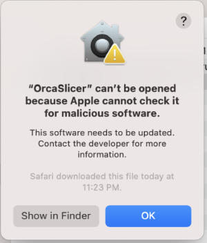

# OrcaSlicer FullSpectrum — Neotko Feature Pack

> All features in this pack were **conceived and designed by [Neotko](https://github.com/sebsucmor-alt/)** — creator of *Neosanding* (now known as **Ironing** in OrcaSlicer, PrusaSlicer, Bambu Studio and Cura).
> Implementation assistance: Claude (Anthropic).

---

## Feature Overview

---

### Feature 19 — Penultimate Top Layers Control

Configure how many layers below the top surface are treated as "penultimate" — with their own density, dedicated extrusion role (`erPenultimateInfill`), and surface-specific features (ColorMix, Neoweaving).

**Parameters** (Strength → Top/bottom shells):
- `penultimate_top_layers` — number of penultimate layers (0 = disabled, default 1)
- `penultimate_solid_infill_density` — independent infill density for penultimate layers

---

### Feature 20 — Surface ColorMix

Alternates between multiple filament tools on a per-line basis across top and/or penultimate surfaces, creating color-blended top layers without manual tool change setup.

**How it works**: A pattern string (e.g. `"1212"`) defines which tool prints each successive fill line. The pattern loops, producing true per-line toolchanges through the wipe tower.

**Fill pattern compatibility**: Works with Rectilinear (single zig-zag → split at direction changes) and Monotonic/MonotonicLine (pre-split paths → tools assigned directly). Detection is automatic: `n_paths > 1` in the sub-collection → Monotonic mode.

**Travel optimization**: After grouping paths by tool, each tool's block is reordered using nearest-neighbor with endpoint flipping (O(n²)), minimizing travel moves between same-tool lines. Implemented in `optimize_tool_block_travel()` in `SurfaceColorMix.cpp`.

**Parameters** (Quality → ColorMix & Multi-Pass Blend group):
- `interlayer_colormix_enabled` — master switch (mutually exclusive with MultiPass in UI)
- `interlayer_colormix_surface` — apply to top / penultimate / both
- `interlayer_colormix_pattern_top` — pattern string for top surface
- `interlayer_colormix_pattern_penultimate` — pattern string for penultimate
- `interlayer_colormix_min_length` — minimum line length to apply ColorMix

**UI**: "Edit Color Patterns…" button opens an interactive dialog with colored filament buttons to build patterns visually.

**Debug**: `ORCA_DEBUG_COLORMIX=1` → `/tmp/neotko_colormix.log`. Look for `MONOTONIC_MODE` entries to confirm Monotonic detection.

---

### Feature 21 — MultiPass Blend

Prints top/penultimate surfaces multiple times (1–3 passes) per layer, each at a reduced line width, offset to tile seamlessly. Each pass can use a different tool, angle, fan speed, and speed multiplier — enabling texture blending, cross-hatch patterns (NeoSanding), and multi-color top surface effects without separate layer slices.

**1-pass mode**: With `multipass_num_passes=1`, the single pass sits at zero offset (centred on the original paths). At `ratio=1.0` it retraces the surface with a different tool (filament glaze). At `ratio<1.0` it deposits a controlled low-flow layer — intentionally sparse, useful for surface texture and experimental material effects. PathBlend works with 1-pass mode.

**Parameters** (Quality → ColorMix & Multi-Pass Blend group):
- `multipass_enabled` — master switch (mutually exclusive with ColorMix in UI)
- `multipass_num_passes` — 1, 2 or 3 passes
- `multipass_surface` — top / penultimate / both
- `multipass_tool_1/2/3` — tool per pass (0-based)
- `multipass_width_ratio_1/2/3` — line width ratio × top surface line width (Σ ≈ 1.0 for full coverage)
- `multipass_angle_1/2/3` — fill angle per pass (-1 = auto, 0–359 = fixed)
- `multipass_fan_1/2/3` — fan PWM override per pass (-1 = no change)
- `multipass_speed_pct_1/2/3` — speed % per pass (100 = no change)
- `multipass_gcode_start/end_1/2/3` — custom GCode before/after each pass
- `multipass_vary_pattern` — alternate pass direction (180° flip)
- `multipass_sort_by_ratio` — sort passes by width ratio
- `multipass_pa_mode` / `multipass_pa_value` — Pressure Advance override during passes

**UI**: "Edit MultiPass Config…" button opens a full dialog with interactive visual preview, drag-adjustable width ratios, preset save/load.

**Note on flow**: MultiPass uses fractional `width_ratio` per pass (Σ ≈ 1.0). Each pass covers a fraction of the surface, so flow per pass is also fractional. PathBlend (below) works on full-coverage passes and needs full flows. Changing MultiPass ratios affects the effective flow available to PathBlend — these two systems share the same surface and their flow accounting must be considered together.

#### MultiPass Z-Blend

When `multipass_z_blend` is enabled, passes are distributed across Z layers using ToolOrdering — each tool occupies a different Z position within the layer stack, creating a true volumetric blend. Tool order is optimized to minimize flush volume.

#### MultiPass PathBlend (FASE 3)

When `multipass_path_gradient` is enabled, a diagonal intra-layer color gradient is created by varying Z height and extrusion flow across the top surface fill paths.

**Concept**: Pass 0 (T0) prints each fill path at a fixed Z below nominal — the Z level increases path-by-path across the surface. Flow also increases proportionally. Pass 1 (T1) prints all paths at nominal Z with complementary flow (flow_0 + flow_1 = 1.0, exact conservation). The result is a smooth color gradient across the surface: T1-dominant on one side, T0-dominant on the other.

**Gradient direction**: Computed geometrically — path centroid Y normalised within the layer bounding box (`m_layer->lslices_bboxes` union). Works for any fill angle; direction follows the Y axis of the build plate.

**GCode output** (per pass-0 path):
```gcode
G1 Z{z_path} F{print_speed}   ; step down to path Z
G1 X Y E                       ; extrude at constant Z and flow
G1 Z{nominal_z} F{print_speed} ; restore Z before next travel
```

**Parameters** (Quality → ColorMix & Multi-Pass Blend group):
- `multipass_path_gradient` — master switch (requires `multipass_enabled`)
- `path_gradient_segments` — reserved for future within-path subdivision (default 32)
- `path_gradient_min_flow_pct` — minimum T0 flow % at the T1-dominant edge (default 5%)

**Key files**:
- `src/libslic3r/SurfaceColorMix.hpp/cpp` — `PathBlendEngine::needs_blend()` + `apply_path()`
- `src/libslic3r/GCode.cpp` — hook in `_extrude()` (~line 7394), `surface_t` geometry computation, z-blend gate (~line 6672)
- `src/libslic3r/PrintConfig.hpp` — keys in `PrintRegionConfig` after `multipass_z_blend`
- `src/slic3r/GUI/Tab.cpp` — UI wiring after `multipass_z_blend` line

**Debug**: `ORCA_DEBUG_MULTIPASS=1` → `/tmp/neotko_multipass.log`
```
PathBlend layer=2050um pass=0 t=0.022 z_path=1.854 flow=0.05 pts=2
PathBlend layer=2050um pass=1 t=0.022 z_path=1.854 flow=0.95 pts=2
```

---

### Features 5 & 6 — Neoweaving (Linear mode)

Alternates the Z height of successive fill lines between nominal Z and nominal Z + amplitude on each layer. Adjacent layers have the pattern inverted (parity flip), so the elevated lines of one layer nestle into the nominal gaps of the layer below — creating mechanical interlocking between layers without changing the overall object dimensions.

**Parameters** (Quality → Neotko Neoweaving):
- `interlayer_neoweave_enabled` — master switch
- `interlayer_neoweave_mode` — `linear` (Wave mode disabled, see Known Issues)
- `neoweave_filter` — `top_only` or `all` (includes solid infill)
- `interlayer_neoweave_amplitude` — Z peak deviation in mm (typical 0.05–0.2)
- `interlayer_neoweave_period` — oscillation period (0 = auto = line width)
- `interlayer_neoweave_min_length` — minimum line length to apply Z move
- `neoweave_penultimate_layers` — also apply to N penultimate layers (0 = top only)
- `neoweave_speed_pct` — speed multiplier for neoweaved lines (100 = no change)
- `infill_neoweave_enabled` — per-object tristate override for sparse infill

**Angle lock (Linear mode)**: penultimate and solid infill layers share the same fill angle across layers, maximising Z-motion interdigitation. Implemented in `FillBase::_infill_direction`.

---

### Feature 14 — Monotonic Interlayer Nesting

On odd layers, the fill reference point is shifted by half the line spacing perpendicular to fill direction. The fill lines of layer N nest precisely into the gaps of layer N−1, improving inter-layer adhesion in monotonic fills.

Applies automatically to `FillMonotonic` patterns with no additional configuration.

---

### Feature — S3DFactory Import (.factory)

Import Simplify3D `.factory` project files directly into OrcaSlicer. Preserves multi-part layouts, extruder assignments, and 3D positions. Libre Mode preserves world-space XYZ.

**Files**: `src/libslic3r/Format/S3DFactory.hpp/.cpp`, `src/slic3r/GUI/GUI_App.cpp` (FT_MODEL wildcard)

---

## Neotko Libre Mode

Libre Mode is a runtime toggle (`neotko_libre_mode` in app_config) that unlocks physics-free object placement and advanced per-volume overrides. All features gate on `wxGetApp().app_config->get_bool("neotko_libre_mode")`.

**UI**: Toggle button in top toolbar (MainFrame). "↺ Refresh Part" button appears next to it when LM is active.

---

### Libre Mode — Floating Objects

Objects can exist at arbitrary Z (above or below the build plate) without being snapped to bed. The slicer issues a **warning** (not an error) when an object has no initial layer, allowing GCode generation to continue.

- GLCanvas3D flying-instances: move/rotate/scale/translate gated in Libre Mode
- GCode.cpp: empty initial layer → `active_step_add_warning(NON_CRITICAL, ...)` via `const_cast<Print*>` proxy
- `LIBRE_ENSURE_ON_BED` macro gates `ensure_on_bed()` calls throughout Plater.cpp

---

### Libre Mode — World-Space Import

When importing STL or .factory files in Libre Mode, geometry is preserved in world-space coordinates — objects appear exactly where the source file placed them, not re-centered to origin.

```cpp
// Key pattern (Plater.cpp):
const bool _lmo_was_fresh = model_object->instances.empty();
// Fresh import + LM ON  → skip center_around_origin(), add_instance at (0,0,0)
// Fresh import + LM OFF → center_around_origin() + ensure_on_bed (normal)
// Existing instances    → LIBRE_ENSURE_ON_BED gate
```

---

### Libre Mode — Feature 3: Bridge Infill Disable

Disables bridge infill detection in Libre Mode, preventing unwanted bridging behaviour on floating geometry.

- Config key: `neotko_disable_bridge_infill` (PrintObjectConfig — NOT in s_Preset_print_options)
- Always injected in `schedule_background_process()` with current LM state (true or false) — critical to avoid stale value after toggle

---

### Libre Mode — Feature 4: Surface Density UI

Exposes `top_surface_density` and `bottom_surface_density` controls in the Tab UI for direct per-object override.

---

### Libre Mode — Per-Volume XY Compensation (Assembled Parts)

In Libre Mode, volumes within an Assembled object can have independent XY contour/hole compensation values. The delta between per-volume override and per-object value is applied to `VolumeSlices` before `slices_to_regions()` merges them.

**Injection point**: `PrintObjectSlice.cpp` — between `firstLayerObjSliceByVolume = objSliceByVolume` and `slices_to_regions(...)`.

```cpp
// delta = scaled(vol_value - obj_value)
// Positive delta: _shrink_contour_holes(dc, dh, lslices)
// Negative delta: _shrink_contour_holes(dc, dh, lslices)  (negative args)
```

Natural LM gate: volume overrides only appear in UI when LM is active.

---

### Libre Mode — Crash Fix: OptionsGroup::get_line()

`get_line()` skipped widget-only lines (lines with empty `m_options`) that have no `opt_id`. Fixed with guard:

```cpp
if (l.get_options().empty()) continue;  // widget-only lines — no opt_id
```

Also removed `TabPrintPart::build()` override entirely (was source of orphan widget line). Refresh button moved to toolbar.

---

### Libre Mode — Temporal Link

Groups objects with a shared `link_group_id` persisted in 3MF. Objects in the same group can be selected together with Ctrl+G / "Select Grouped".

- `Ctrl+G` with ≥2 selected → link group
- `Ctrl+Shift+G` / context menu "Select Grouped" → select all in group
- "Break Link" / "Break All Links" → context menu only
- `link_group_id` saved in 3MF metadata (valid_keys + metadata loop in `Format/3mf.cpp`)
- Right-click fallback: if GL selection was cleared before handler, falls back to `obj_list()->get_selected_obj_idx()`

**Debug**: `ORCA_DEBUG_LIBRE=1` → `/tmp/neotko_libre.log`

---

### Libre Mode — Detachable Process Panel

In Libre Mode, the Process panel (ParamsPanel) detaches from the sidebar and floats as an independent right-side dockable window managed by the same wxAuiManager as the sidebar.

- `float_params_panel(bool)` in `Plater::priv` handles reparenting, AuiMgr registration, and re-docking
- Layout state (docked vs. floating, position, size) is saved to `app_config` keys `window_layout` / `libre_window_layout` via `save_window_layout()`
- On startup with LM=true, restore is deferred via `CallAfter` in `MainFrame::create_preset_tabs()` to avoid being overwritten by the AuiMgr update triggered by `select_tab(tp3DEditor)` during `GUI_App::OnInit`

---

## Architecture

All Neotko engine logic is centralised in:
- `src/libslic3r/SurfaceColorMix.hpp/.cpp` — ColorMix (Rectilinear + Monotonic), travel optimization, MultiPass apply, PathBlend, `NeoweaveEngine`
- `src/libslic3r/GCode/ToolOrdering.hpp/.cpp` — tool ordering, Z-blend scheduling
- `src/libslic3r/Fill/Fill.cpp` — surface grouping, role assignment, MultiPass/ColorMix dispatch
- `src/libslic3r/Fill/FillBase.cpp` — angle lock for Neoweaving Linear
- `src/libslic3r/Fill/FillRectilinear.cpp` — Monotonic Interlayer Nesting
- `src/libslic3r/PrintObjectSlice.cpp` — per-volume XY compensation delta injection

GCode.cpp contains only one-liner hooks that delegate to `SurfaceColorMix`/`NeoweaveEngine`.

All additions are wrapped in `// NEOTKO_*_TAG_START` / `_END` pairs for easy auditing.

---

## Known Issues / Future Work

| Issue | Status |
|-------|--------|
| Neoweaving Wave mode | ⛔ Disabled — OOM crash on large surfaces (8 GB RAM). Code intact. Fix: pre-reserve string buffer in `NeoweaveEngine::apply_path()` before the wave loop. |
| ColorMix — travel retractions | Paths split by tool cross empty surface space without retraction. Needs retract/unretract injection at tool-block boundaries within the same layer. |
| ColorMix + MultiPass + PathBlend UX | ✅ Unified "ColorMix & Multi-Pass Blend" optgroup in Tab.cpp. ColorMix ↔ MultiPass mutual exclusion via `toggle_options()` (hard grey). PathBlend sub-options gated on MultiPass state. "Edit" buttons intentionally always active (pre-configure while disabled). |
| PathBlend — surface filter bug | ✅ Fixed: `needs_blend()` now respects `multipass_surface`. With `surface=1` (top only) `erSolidInfill` paths are excluded — PathBlend no longer fires on every internal solid infill layer. |
| PathBlend — penultimate precision | `erSolidInfill` with `surface=0/2` still applies to ALL solid infill layers, not just the Nth-below-top. True penultimate targeting needs layer index context passed into `needs_blend()`. Intentionally deferred — multiple penultimate layers is by design. |
| PathBlend — refinements | First real-print tests confirm gradient visible. Known issues: gradient direction per-region, within-path Z subdivision (FASE 3.3), interaction with MultiPass flow ratios. |
| Neoweaving Wave + OOM | Pre-reserve `gcode.reserve(n_lines * n_segs * 35)` in `NeoweaveEngine::apply_path()`. |
| `penultimate_infill_speed` | Key exists, UI hidden. Penultimate currently uses `top_surface_speed`. |
| MultiPass + ColorMix combined | Concept documented in `SurfaceColorMix.cpp` (CAMINO 2). Not yet implemented. |
| PathBlend FASE 3.3 — within-path subdivision | Subdivide paths like NeoweaveEngine wave mode. Replace `sin(phase)` by `t * layer_height`. |
| Seam position per-volume | Requires GCode.cpp changes — future work. |
| Less Used Toggle | ✅ Implemented. Options marked as less-used are hidden; a second button restores them. UX is functional but rough — fade-to-bottom or collapsible section are candidate improvements (NEOTKO_TODO.md §5). |

---

## Config Key Reference

To find all Neotko parameters:
```bash
grep -n "NEOTKO_" src/libslic3r/PrintConfig.hpp | grep "TAG_START"
grep -n "NEOTKO_" src/libslic3r/Preset.cpp
```

All parameters follow the golden rule:
1. Declared in `PrintConfig.hpp` struct macro
2. Registered in `PrintConfig.cpp::init_fff_params()`
3. Listed in `Preset.cpp::s_Preset_print_options`
4. Wired in `Tab.cpp` optgroup

---

## About Neotko

**Neotko** is a Spanish maker, hacker, and 3D printing researcher whose work on layer mechanics has quietly shaped how modern slicers approach surface quality.

In the early days of FDM development, Neotko invented and published **Neosanding** — a technique where the nozzle makes a final low-flow ironing pass over top surfaces to flatten layer lines. The idea spread through the RepRap community and was eventually adopted by PrusaSlicer under the name **Ironing**, then picked up verbatim by Bambu Studio, OrcaSlicer, and Cura. It is now a standard feature used by millions of printers worldwide. Neotko received no credit in any of those implementations.

This feature pack is Neotko's continued work on the same frontier: what happens at the boundary between layers and on top surfaces. The research areas covered here are:

**Neoweaving** — alternating Z height of adjacent fill lines so successive layers mechanically interlock. A structural technique, not cosmetic: tested to improve inter-layer adhesion and vibration damping in functional parts.

**Surface ColorMix** — true per-line toolchange patterns on top surfaces using wipe tower. Not a color effect per se — the same mechanism can drive material blending, property gradients, and experimental filament combinations. Supports Monotonic fill ordering.

**MultiPass Blend** — re-printing the same surface layer multiple times at fractional width with per-pass tool, angle, speed, and fan control. Neotko's evolution of his own Neosanding concept: instead of ironing at near-zero flow, each pass is a full contributing extrusion at a different angle and optionally a different tool.

**PathBlend (Z+Flow Gradient)** — within a single layer, smoothly interpolating both Z height and extrusion flow path-by-path across the surface. The first known implementation of a continuous intra-layer material gradient in an open-source FDM slicer. Two tools blend across the surface without a hard boundary.

**Libre Mode** — a runtime physics override that unlocks OrcaSlicer for professional multi-part assembly workflows: floating objects, world-space import, per-volume compensation, temporal linking of parts, and a detachable process panel for multi-monitor setups.

All of this work is open and free. Fork it, improve it, credit it.
-----

Now all the info from the Original FullSpectrum 0.95 (beta)

<h1> <p "font-size:200px;"> Full Spectrum</p> </h1>

### A Snapmaker Orca Fork with Mixed-Color Filament Support

[](https://github.com/Snapmaker/OrcaSlicer/actions/workflows/build_all.yml)

---

## ☕ Support Development

If you find this fun or interesting!

<a href="https://www.buymeacoffee.com/ratdoux" target="_blank"></a>

---

## ⚠️ **IMPORTANT DISCLAIMER** ⚠️

**This fork is currently in active development and has NOT been tested on actual hardware! **

- **Not Production Ready**: The mixed-color filament feature is experimental and untested
- **No U1 Access**: Development is being done without access to a Snapmaker U1 printer
- **Help Needed**: If you have a U1 and are willing to test this fork, please reach out!
- **Use at Your Own Risk**: This software may produce incorrect G-code or unexpected behavior

**I am actively seeking testers with Snapmaker U1 printers to help validate and improve this feature.**

---

**Full Spectrum** is an open source slicer for FDM printers based on Snapmaker Orca and OrcaSlicer, optimized for Snapmaker's U1 multi-color 3D printer with independent tool heads. This fork adds support for virtual mixed-color filaments, enabling you to create new colors by alternating layers between physical filaments.
 


# Download

### Stable Release
📥 **[Download the Latest Stable Release](https://github.com/ratdoux/OrcaSlicer-FullSpectrum/releases)**  
Visit our GitHub Releases page for the latest stable version of Full Spectrum, recommended for most users.

# Features

## Mixed-Color Filaments
Full Spectrum includes support for **virtual mixed-color filaments** designed for the Snapmaker U1 multi-color printer with independent print heads.

### How It Works
- **Create new colors by mixing**: Combine two physical filaments to create a new color appearance through layer alternation
- **Example**: One layer of red + one layer of green = apparent yellow color
- **Customizable ratios**: Adjust the alternation pattern (e.g., 2:1 ratio = two layers of filament A, one layer of filament B)

### Features
- Automatic generation of all possible color combinations from your loaded filaments
- Visual preview showing the additive color blend
- Enable/disable individual mixed filaments
- Per-layer resolution control with customizable ratios
- Seamless integration with the existing filament management system

### Using Mixed Filaments
1. Load 2 or more physical filaments in your printer
2. The "Mixed Colors" panel will automatically appear in the sidebar
3. Each combination shows:
   - Color preview swatch
   - Component filaments (e.g., "Filament 1 + Filament 2")
   - Layer ratio controls (spin controls for fine-tuning)
   - Enable/disable checkbox
4. Mixed filaments can be assigned to objects just like physical filaments
5. During slicing, the mixed filament resolves to alternating layers of its components

### Dithering Settings
Full Spectrum includes advanced dithering controls to fine-tune the layer alternation behavior for mixed filaments. These settings are found in **Others → Dithering** in the print settings:

#### Dithering Cadence Height A & B
- **What it does**: Controls the height (in mm) of each alternating segment for the two component filaments
- **Cadence Height A**: The height of layers using the first filament in the mix
- **Cadence Height B**: The height of layers using the second filament in the mix
- **Example**: Setting A=0.3mm and B=0.15mm creates a 2:1 ratio pattern where you get twice as much of filament A as filament B
- **Use case**: Fine-tune color intensity by adjusting the relative amounts of each component color

#### Dithering Step Size
- **What it does**: Defines the Z-height increment (in mm) for each dithering step
- **Purpose**: Controls the resolution of the layer alternation pattern
- **Default**: Typically matches your layer height setting
- **Advanced usage**: Set smaller values for smoother color transitions, or larger values for more distinct color banding
- **Compatibility**: Must be compatible with your printer's Z-axis resolution

These settings give you precise control over how your mixed colors appear in the final print, allowing you to achieve different visual effects from the same filament combinations.

### Technical Details
- Virtual filament IDs start after physical filaments (e.g., with 4 physical filaments, first mixed ID is 5)
- Layer-based alternation is computed during tool ordering
- Works with all existing features: supports, infill, and multi-material painting

# How to install
**Windows**: 
1.  Download the installer for your preferred version from the [releases page](https://github.com/Snapmaker/OrcaSlicer/releases).
    - *For convenience there is also a portable build available.*
    - *If you have troubles to run the build, you might need to install following runtimes:*
      - [MicrosoftEdgeWebView2RuntimeInstallerX64](https://github.com/SoftFever/OrcaSlicer/releases/download/v1.0.10-sf2/MicrosoftEdgeWebView2RuntimeInstallerX64.exe)
          - [Details of this runtime](https://aka.ms/webview2)
          - [Alternative Download Link Hosted by Microsoft](https://go.microsoft.com/fwlink/p/?LinkId=2124703)
      - [vcredist2019_x64](https://github.com/SoftFever/OrcaSlicer/releases/download/v1.0.10-sf2/vcredist2019_x64.exe)
          -  [Alternative Download Link Hosted by Microsoft](https://aka.ms/vs/17/release/vc_redist.x64.exe)
          -  This file may already be available on your computer if you've installed visual studio.  Check the following location: `%VCINSTALLDIR%Redist\MSVC\v142`

**Mac**:
1. Download the DMG for your computer: `arm64` version for Apple Silicon and `x86_64` for Intel CPU.  
2. Drag Snapmaker_Orca.app to Application folder. 
3. *If you want to run a build from a PR, you also need to follow the instructions below:*  
    <details quarantine>
    - Option 1 (You only need to do this once. After that the app can be opened normally.):
      - Step 1: Hold _cmd_ and right click the app, from the context menu choose **Open**.
      - Step 2: A warning window will pop up, click _Open_  
      
    - Option 2:  
      Execute this command in terminal: `xattr -dr com.apple.quarantine /Applications/Snapmaker_Orca.app`
      ```console
          softfever@mac:~$ xattr -dr com.apple.quarantine /Applications/Snapmaker_Orca.app
      ```
    - Option 3:  
        - Step 1: open the app, a warning window will pop up  
              
        - Step 2: in `System Settings` -> `Privacy & Security`, click `Open Anyway`:  
              
    </details>
    
**Linux (Ubuntu)**:
 1. If you run into trouble executing it, try this command in the terminal:  
    `chmod +x /path_to_appimage/Snapmaker_Orca_Linux.AppImage`
    
# How to compile
- Windows 64-bit  
  - Tools needed: Visual Studio 2019, Cmake, git, git-lfs, Strawberry Perl.
      - You will require cmake version 3.14 or later, which is available [on their website](https://cmake.org/download/).
      - Strawberry Perl is [available on their GitHub repository](https://github.com/StrawberryPerl/Perl-Dist-Strawberry/releases/).
  - Run `build_release.bat` in `x64 Native Tools Command Prompt for VS 2019`
  - Note: Don't forget to run `git lfs pull` after cloning the repository to download tools on Windows

- Mac 64-bit  
  - Tools needed: Xcode, Cmake, git, gettext, libtool, automake, autoconf, texinfo
      - You can install most of them by running `brew install cmake gettext libtool automake autoconf texinfo`
  - run `build_release_macos.sh`
  - To build and debug in Xcode:
      - run `Xcode.app`
      - open ``build_`arch`/Snapmaker_Orca.Xcodeproj``
      - menu bar: Product => Scheme => Snapmaker_Orca
      - menu bar: Product => Scheme => Edit Scheme...
          - Run => Info tab => Build Configuration: `RelWithDebInfo`
          - Run => Options tab => Document Versions: uncheck `Allow debugging when browsing versions`
      - menu bar: Product => Run

- Ubuntu 
  - Dependencies **Will be auto-installed with the shell script**: `libmspack-dev libgstreamerd-3-dev libsecret-1-dev libwebkit2gtk-4.0-dev libosmesa6-dev libssl-dev libcurl4-openssl-dev eglexternalplatform-dev libudev-dev libdbus-1-dev extra-cmake-modules libgtk2.0-dev libglew-dev libudev-dev libdbus-1-dev cmake git texinfo`
  - run 'sudo ./BuildLinux.sh -u'
  - run './BuildLinux.sh -dsir'


# Note: 
If you're running Klipper, it's recommended to add the following configuration to your `printer.cfg` file.
```
# Enable object exclusion
[exclude_object]

# Enable arcs support
[gcode_arcs]
resolution: 0.1
```


## Some background
**Full Spectrum** is forked from Snapmaker Orca, which is originally forked from Orca Slicer by SoftFever.

Orca Slicer was originally forked from Bambu Studio, it was previously known as BambuStudio-SoftFever.
Bambu Studio is forked from [PrusaSlicer](https://github.com/prusa3d/PrusaSlicer) by Prusa Research, which is from [Slic3r](https://github.com/Slic3r/Slic3r) by Alessandro Ranellucci and the RepRap community. 
Orca Slicer incorporates a lot of features from SuperSlicer by @supermerill
Orca Slicer's logo is designed by community member Justin Levine(@freejstnalxndr)

## Acknowledgements
Special thanks to [u/Aceman11100](https://www.reddit.com/user/Aceman11100/) for the inspiration and idea behind the mixed-color filament feature!  


# License
Full Spectrum is licensed under the GNU Affero General Public License, version 3. Full Spectrum is based on Snapmaker Orca.

Snapmaker Orca is licensed under the GNU Affero General Public License, version 3. Snapmaker Orca is based on Orca Slicer by SoftFever.

Orca Slicer is licensed under the GNU Affero General Public License, version 3. Orca Slicer is based on Bambu Studio by BambuLab.

Bambu Studio is licensed under the GNU Affero General Public License, version 3. Bambu Studio is based on PrusaSlicer by PrusaResearch.

PrusaSlicer is licensed under the GNU Affero General Public License, version 3. PrusaSlicer is owned by Prusa Research. PrusaSlicer is originally based on Slic3r by Alessandro Ranellucci.

Slic3r is licensed under the GNU Affero General Public License, version 3. Slic3r was created by Alessandro Ranellucci with the help of many other contributors.

The GNU Affero General Public License, version 3 ensures that if you use any part of this software in any way (even behind a web server), your software must be released under the same license.

Orca Slicer includes a pressure advance calibration pattern test adapted from Andrew Ellis' generator, which is licensed under GNU General Public License, version 3. Ellis' generator is itself adapted from a generator developed by Sineos for Marlin, which is licensed under GNU General Public License, version 3.

The Bambu networking plugin is based on non-free libraries from BambuLab. It is optional to the Orca Slicer and provides extended functionalities for Bambulab printer users.

Filament color blending is powered by [FilamentMixer](https://github.com/justinh-rahb/filament-mixer), an openly licensed library.

# Feedback & Contribution
We greatly value feedback and contributions from our users. Your feedback will help us to further develop Full Spectrum for our community.
- To submit a bug or feature request, file an issue in GitHub Issues.
- To contribute some code, make sure you have read and followed our guidelines for contributing.
