## Proud to announce that @Snapmaker is officially sponsoring this project!!

Development will be conducted in close collaboration with Snapmaker ecosystem and with Radoux/Radu, author of FullSpectrum the now official part of the Snapmaker team. So from v1.9 forward expect big things!
By Neotko — inventor of Ironing/Neosanding (Ultimaker Cura, PrusaSlicer)

# How does it work, what is this?

> ### 👉 **[Open the site](https://sebsucmor-alt.github.io/OrcaFS-NeotkoCM/)**
>
> Two ways in, pick either:
>
> - **[The interactive tour](https://sebsucmor-alt.github.io/OrcaFS-NeotkoCM/tour/)** — every feature,
>   with demos you can pull apart. Build a Sandwich and watch the printed colour resolve, drag a
>   gradient's ramp, draw a layer-height curve, see what the wipe tower has to swallow. The colour
>   maths and the dither are the slicer's own code, ported to run in your browser, so a recipe you
>   land on there is a recipe you can type into the app. 18 pages, 31 live demos, nothing to install.
> - **[The video series](https://sebsucmor-alt.github.io/OrcaFS-NeotkoCM/beginners.html)** — seven
>   short animated walkthroughs, in order, from "why fork Orca at all" to painting a Sandwich click
>   by click. The gentlest way in if you have never seen any of this.
>
> There is also **[the Playground](https://sebsucmor-alt.github.io/OrcaFS-NeotkoCM/tour/play.html)**,
> where the simulators live full size, and
> **[the feature map](https://sebsucmor-alt.github.io/OrcaFS-NeotkoCM/tour/map.html)**, which lists
> every feature with the gate it needs, how finished it actually is, and where the control lives.

# Download Last versión

> Check **[Releases](https://github.com/sebsucmor-alt/OrcaFS-NeotkoCM/releases)**

# Snapmaker Orca — the Neotko feature pack · User Guide

> Features conceived and designed by **[Neotko](https://github.com/sebsucmor-alt)** — inventor of *Neosanding*, now known as **Ironing** in OrcaSlicer, PrusaSlicer, Bambu Studio and Cura.

> **Prefer to play rather than read?** There is an
> **[interactive tour](https://sebsucmor-alt.github.io/OrcaFS-NeotkoCM/tour/)** covering everything
> in this document, with live demos running the slicer's own colour and pattern code. This file
> stays the written reference; every page over there carries its `§` number so the two match up.

> **On the name.** *FullSpectrum* is **Radu/Radoux's** fork, the base this one grew out of. This
> feature pack is Neotko's own work on top of it, and the two are separate projects.

This is Neotko's feature pack, ported on top of the official **Snapmaker Orca 2.3.4** base. It adds a set of surface-quality, colour-blending, wall-generation and workflow features. Everything here is **opt-in** — with the new options left at their defaults, Snapmaker Orca behaves like the stock build. This guide explains what each feature does and how to use it; no programming knowledge required.

> **About this build.** This is a feature pack meant for **pick & choose** — each block (ColorStitch, Penultimate, Libre Mode, NeoArachne, NeoTower, Align & Stack) can be adopted independently. Some surfaces are marked **(WIP)**: they are usable but still being refined, or not yet wired in this base. Review your G-code before long prints.

---

## Philosophy — the Sandwich

Everything on the colour side of this pack revolves around one idea: a **Sandwich** of passes you build yourself.

A normal slicer treats the top of your part as one thing — one filament, one pattern, printed once. The Sandwich breaks that open. Each surface zone (the **Top layer** and the **Penultimate layer**) becomes a small **stack of passes**, and you decide what each pass is:

- A plain **Solid** pass (a normal solid fill with its own tool, angle and Z) — stack two or three of them and you get the old *MultiPass* glazing/cross-hatch effect.
- A **ColorStitch** pass that decides the filament for each fill line — stripes, dithered blends, hard bands or custom patterns.
- A **PathBlend** pass — a continuous gradient that fades between filaments across the surface.

The two zones together form the Sandwich over your fill. You build it in one place — the **Sandwich Editor** (Quality → Surface ColorStitch → **Sandwich editor…**) — drag dividers to split the layer height between passes, save the result as a profile, and reuse it or **paint** it onto specific faces with the ColorStitch Painter (§6).

The goal is not "presets that work" — it is a **playground**. Mix, stack, experiment, save profiles, paint them, and see what surface comes out.

Beyond surface effects the pack also adds a **new wall-generation engine** — **NeoArachne** (§8) — a **post-slice wipe-tower planner** — **NeoTower** (§9) — and a set of professional/experimental unlocks under **Libre Mode** (§4), including the **Align & Stack** gizmo (§7).

---

## Table of Contents

1. [Surface ColorStitch — the Sandwich Editor](#1-surface-colorstitch--the-sandwich-editor)
   - 1a. [The pass stack & pass kinds](#1a-the-pass-stack--pass-kinds)
   - 1b. [ColorStitch pass — per-line color patterns](#1b-colorstitch-pass--per-line-color-patterns)
   - 1c. [PathBlend pass — smooth gradient](#1c-pathblend-pass--smooth-gradient)
   - 1d. [Zone and filament filters](#1d-zone-and-filament-filters)
   - 1e. [Filament & TD preview](#1e-filament--td-preview)
   - 1f. [Line Distribution Mode](#1f-line-distribution-mode)
   - 1g. [ColorStitch Studio — palette generators](#1g-colorstitch-studio--palette-generators)
2. [Neoweaving + Monotonic Interlayer Nesting (WIP)](#2-neoweaving--monotonic-interlayer-nesting-wip)
3. [Penultimate Top Layers](#3-penultimate-top-layers)
4. [Libre Mode](#4-libre-mode)
   - 4a. [Enabling Libre Mode](#4a-enabling-libre-mode)
   - 4b. [Floating objects](#4b-floating-objects)
   - 4c. [Assembled Boolean mode](#4c-assembled-boolean-mode)
   - 4d. [Per-volume XY compensation](#4d-per-volume-xy-compensation)
   - 4e. [Copy / Paste Process Settings](#4e-copy--paste-process-settings)
   - 4f. [Assembled Parts — full options](#4f-assembled-parts--full-options)
   - 4g. [World-space import (WIP)](#4g-world-space-import-wip)
   - 4h. [Internal-bridge handling](#4h-internal-bridge-handling)
   - 4i. [Realistic Shading (2.3.9) — Phong + SSAO + contact shadow in Prepare](#4i-realistic-shading-239--phong--ssao--contact-shadow-in-prepare)
5. [S3DFactory — Simplify3D project import](#5-s3dfactory--simplify3d-project-import)
6. [Surface Effect Profiles & ColorStitch Painter](#6-surface-effect-profiles--colorstitch-painter)
   - 6a. [Saving and managing profiles](#6a-saving-and-managing-profiles)
   - 6b. [The ColorStitch Painter gizmo](#6b-the-colorstitch-painter-gizmo)
   - 6c. [Palette groups, slot cap & Save All](#6c-palette-groups-slot-cap--save-all)
   - 6d. [Painter mode at slice time](#6d-painter-mode-at-slice-time)
   - 6e. [Profile persistence and 3MF round-trip](#6e-profile-persistence-and-3mf-round-trip)
   - 6f. [Weave preview on the painted surface](#6f-weave-preview-on-the-painted-surface)
   - 6g. [MixedFilament Object mode (Beta)](#6g-mixedfilament-object-mode-beta)
   - 6h. [Highlight active colour — where is this colour applied? (2.4.0)](#6h-highlight-active-colour--where-is-this-colour-applied-240)
   - 6i. [Painted colours stay visible outside the painter (2.4.0)](#6i-painted-colours-stay-visible-outside-the-painter-240)
7. [Align & Stack — align and stack two objects](#7-align--stack--align-and-stack-two-objects)
8. [NeoArachne — alternative wall generator](#8-neoarachne--alternative-wall-generator)
   - 8a. [Turning it on](#8a-turning-it-on)
   - 8b. [Per-feature engine choice](#8b-per-feature-engine-choice)
   - 8c. [Edge Closure controls](#8c-edge-closure-controls)
   - 8d. [Preview Lab](#8d-preview-lab)
9. [NeoTower — post-slice wipe tower](#9-neotower--post-slice-wipe-tower)
   - 9a. [Tower type](#9a-tower-type)
   - 9b. [Zigurat taper](#9b-zigurat-taper)
   - 9c. [Sandwich purge compaction](#9c-sandwich-purge-compaction)
   - 9d. [Sandwich wipe reserve](#9d-sandwich-wipe-reserve)
   - 9e. [Adaptive layers × multi-tool × Sandwich (WIP)](#9e-adaptive-layers--multi-tool--sandwich-wip)
10. [Bump Mapping Editor — texture-driven wall & top-surface relief](#10-bump-mapping-editor--texture-driven-wall--top-surface-relief)
    - 10a. [All mode — object-wide wall texture](#10a-all-mode--object-wide-wall-texture)
    - 10b. [Painter mode — per-zone texture](#10b-painter-mode--per-zone-texture)
    - 10c. [Top mode — ZBump, top-surface height-map relief](#10c-top-mode--zbump-top-surface-height-map-relief)
11. [Precision Adaptive Layer Height — point-based layer height curve](#11-precision-adaptive-layer-height--point-based-layer-height-curve)
    - 11a. [Adapt to Color — color-aware height guidance](#11a-adapt-to-color-238-wip--color-aware-height-guidance)
    - 11b. [Slope Pattern Recolor — keep the pattern alive on slopes](#11b-slope-pattern-recolor-238-wipexperimental--keep-the-pattern-alive-on-slopes)
12. [NeoWave Support (WIP) — Wave-Huygens roof + hollow pillar](#12-neowave-support-wip--wave-huygens-roof--hollow-pillar)
13. [Painter Pro Mode — precision tools for the stock Color Painting gizmo](#13-painter-pro-mode--precision-tools-for-the-stock-color-painting-gizmo)
    - 13a. [Brush precision](#13a-brush-precision)
    - 13b. [Paint perimeters only + Extra walls](#13b-paint-perimeters-only--extra-walls)
    - 13c. [Rectangle & Polygon masks](#13c-rectangle--polygon-masks)
    - 13d. [Surface depth (2.3.8) — project a painted surface into the object](#13d-surface-depth-238--project-a-painted-surface-into-the-object)
    - 13e. [Per color (2.3.8) — different Walls / Depth per painted color](#13e-per-color-238--different-walls--depth-per-painted-color)
14. [NeoStitch Interlock (WIP, ⚠️ UNTESTED) — Z-axis layer interlocking](#14-neostitch-interlock-wip--untested--z-axis-layer-interlocking)
15. [Expert G-code Reprocessor (2.3.8) — layer-ranged, per-tool G-code post-processing](#15-expert-g-code-reprocessor-238--layer-ranged-per-tool-g-code-post-processing)
16. [PerObject Support (2.3.9) — support that avoids the other objects on the plate](#16-perobject-support-239--support-that-avoids-the-other-objects-on-the-plate)
17. [Gravity ("True Objects") — real floor, honest bridges](#17-gravity-true-objects--real-floor-honest-bridges)
    - [17a. Snap & Drag — auto-rest on the real surface below (2.3.9, extended 2.4.0 and 2.4.3)](#17a-snap--drag--auto-rest-on-the-real-surface-below-239-extended-240-and-243)
18. [Typographic Spacing (2.3.9) — real kerning for embossed text](#18-typographic-spacing-239--real-kerning-for-embossed-text)
19. [Bridging infill extra expansion (2.4.0) — anchor bridges before they cross](#19-bridging-infill-extra-expansion-240--anchor-bridges-before-they-cross)
20. [RealColor View — see the colour you are actually going to print](#20-realcolor-view--see-the-colour-you-are-actually-going-to-print)
    - 20a. [Photo Mode in the G-code viewer (2.4.4)](#20a-photo-mode-in-the-g-code-viewer-244)
21. [Real prints — what this actually looks like off the bed](#21-real-prints--what-this-actually-looks-like-off-the-bed)
22. [Photo Mode (2.4.2) — a photo studio inside Prepare](#22-photo-mode-242--a-photo-studio-inside-prepare)
23. [Height Adaptive Effects (2.4.3) — settings that change with height](#23-height-adaptive-effects-243--settings-that-change-with-height)
24. [Support Zones (2.4.4) — supports you aim](#24-support-zones-244--supports-you-aim)
    - 23a. [Building the list](#23a-building-the-list)
    - 23b. [Drawing the curve](#23b-drawing-the-curve)
    - 23c. [Steps or ramp — and the number that decides](#23c-steps-or-ramp--and-the-number-that-decides)
    - 23d. [The effects](#23d-the-effects)
    - 23e. [What it does to a real print, measured](#23e-what-it-does-to-a-real-print-measured)

---

## 1. Surface ColorStitch — the Sandwich Editor

The **Sandwich Editor** is where you build the per-surface effect stack. It lives under **Quality → Surface ColorStitch → Sandwich editor…**.

> **Naming.** The feature family is called **ColorStitch** in the UI. You will still see *ColorMix* in a few internal places — config keys and 3MF data were not renamed, so old projects keep working. They refer to the same system.

### How the editor is laid out

The dialog has two columns — **Top layer** and **Penultimate layer**. Each is an independent **stack of 1–3 passes**, chosen with the **Passes** selector. The passes are stacked as thin virtual sub-layers inside the same nominal layer; you **drag the dividers** between them to split the layer height (each pass gets its own Z share). Per pass you can also move it **up/down** in the stack.

Each pass exposes:
- a **kind** (see §1a),
- a **Z mm** height box,
- an **angle** box (`-1 = auto`; scroll the wheel over the box to rotate). For a PathBlend pass this same box is repurposed to show **ramp end** (the top height of the ramp, in mm) instead — PathBlend's own fill angle isn't edited from this box (see §1c),
- an **Advanced ⚙** button to open that pass's detailed settings (a `*` marks non-default values) — for PathBlend this is where the start/end zone editor lives (§1c).

A single **Perimeter override** checkbox per zone *clones the walls into every Solid pass* — useful when you want the perimeter reprinted with each glaze.

At the bottom are the **Filament & TD** preview (§1e) and the **ColorStitch Studio** (§1g).

---

### 1a. The pass stack & pass kinds

Each pass in a zone is one of:

| Kind | What it does |
|------|--------------|
| **None** | Empty slot — no pass here. |
| **Solid** | A normal solid fill pass with its own tool, angle and Z share. **Stack 2–3 Solid passes** and you get the classic *MultiPass* effect: cross-hatch (two angles, two colours), a glaze pass over a base, or an optical colour blend. |
| **ColorStitch** | Decides the filament line by line across the surface — stripes, dithered blends, hard bands or a custom pattern. Configured in the **Edit gradient…** dialog (§1b). |
| **PathBlend Half** | A gradient pass with **no complementary cap** — the ramp climbs from its floor straight up, one tool only (§1c). |
| **PathBlend Full** | A gradient pass with a ramp **and** a complementary cap in a second tool, filling the rest of the layer height (§1c). |

**MultiPass = multiple Solid passes.** There is no separate "MultiPass" button anymore — you simply add Solid passes and split the height between them with the dividers. Aim for the height shares to add up to the full layer for full coverage.

PathBlend is always a single full-height gradient — when you pick a PathBlend kind the stack collapses to one pass.

---

### 1b. ColorStitch pass — per-line color patterns

A **ColorStitch** pass decides which filament prints each fill line. Open its **Edit gradient…** button to configure it — the same editor also opens from the **ColorStitch Painter**'s Pro tray (**`ADV…`** button), so whichever entry point you use, you get the identical dialog.

> **Which infill patterns does ColorStitch work on? (2.4.0)** Since 2.4.0 it works on **Monotonic**,
> **Monotonic Line**, **Rectilinear** and **Hilbert Curve** out of the box — the old "ColorStitch on
> Monotonic (continuous)" setting is gone and its behaviour is always on. It also works on
> **Concentric**, **Octogram** and **Archimedean**: the line distribution is not always uniform there,
> so the dithering is less predictable, but the results can be worth having. Getting a clean dither on
> Hilbert Curve in particular takes some tuning and does not always come out.

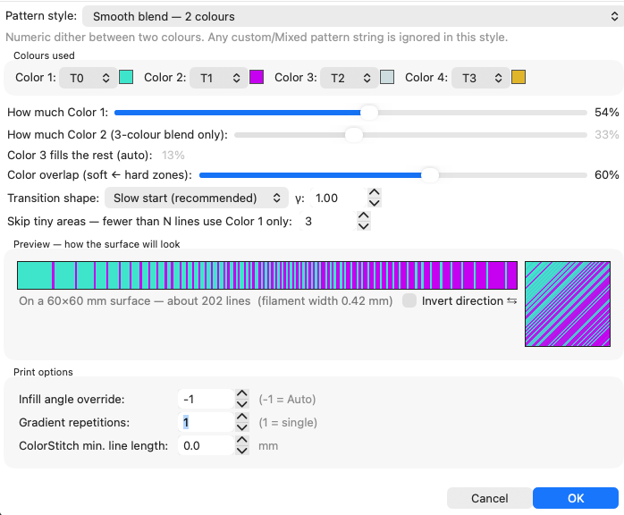

**Pattern style** picks *where the pattern comes from*. Only one style is active at a time — they're mutually exclusive by design (a custom string, a MixedFilament recipe, a weave, a blend and a set of stripes can't all drive the same pass at once), and a one-line note under the selector always says what the active style does, shown in amber when it overrides everything else:

| Style | What it produces |
|-------|------------------|
| **Custom pattern** | Click filament buttons to build a digit string by hand; the slicer loops it across lines (line 1 → first digit, etc.). For exact, repeating stripes you design yourself. `Clear` / `⌫ Undo digit` / `Invert` live here. |
| **MixedFilament recipe** | Pick one of your MixedFilament combinations (e.g. *F1+F2 50/50*) — it becomes the whole pattern. Only shown when MixedFilament virtual digits are enabled. Switching to another style clears the active recipe. |
| **Textile weave** | Ready-made weave structures generated for you — see below. |
| **Smooth blend — 2 colours** | Two filaments distributed across the surface with a percentage split, dithered so the transition looks smooth. The most common choice. |
| **Smooth blend — 3 colours** | Three filaments at configurable percentages; the middle colour concentrates in the centre. |
| **Stripes — manual band sizes** | Explicit band counts: N lines of Colour 1, M of Colour 2, … repeating. |

Two of those styles, with the live preview of how the surface will look:

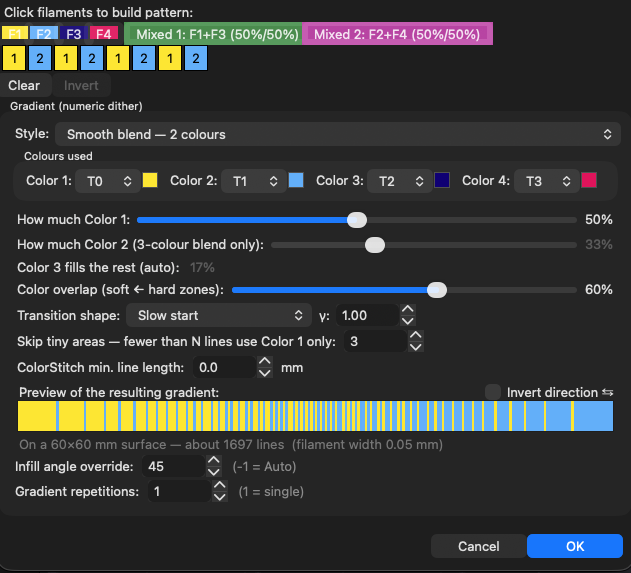

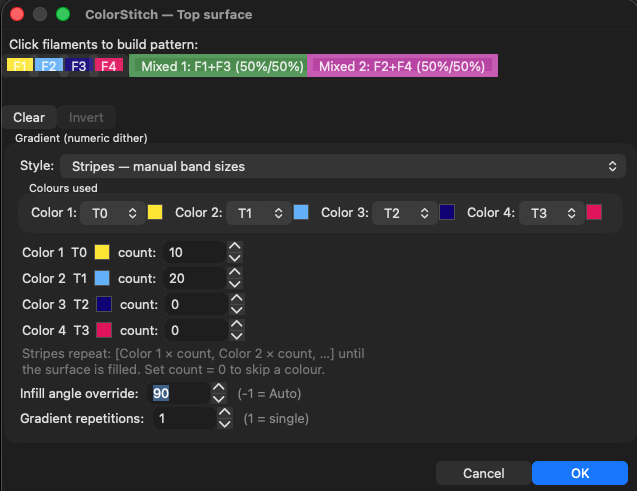

**Colours used** — pick **Color 1–4** (each maps to a loaded filament). Only shown for the two blend styles and Stripes — Custom/MixedFilament/Weave patterns already carry their own colours in the digit string.

**Preview** — a horizontal strip plus a square "how it will look" sample, drawn at the pass's infill angle, always visible for **whatever style is active**, including Custom strings and MixedFilament recipes (previously these had no colour preview at all). Blends **stretch to fill the square once**, the same way the slicer spreads a gradient across the whole surface; patterns (Custom, MixedFilament, Weave, Stripes) **tile** as a repeating motif, matching how they actually print.

**Blend controls** (Smooth blend styles):

| Control | What it does |
|---------|--------------|
| **How much Color 1 / Color 2** | The percentage split. (In 3-colour, *Color 3 fills the rest* automatically.) |
| **Color overlap (soft ← hard zones)** | How much colours bleed into each other in 3-colour blends. |
| **Transition shape** | Even (same density everywhere) · **Slow start** (the default when you first pick a blend style) · Slow end · S-curve (smooth start & end) · Custom shape (set **γ**) · Hard step. |
| **Skip tiny areas** | Surfaces with fewer than N fill lines use Color 1 only. |
| **Invert direction ⇆** | Reverses the per-line sequence (blend and stripe styles; Custom/Weave have their own `Invert` button instead). |

**Textile weave** — classic weave structures from real fabric construction, generated as pattern strings from two colours you pick:

| Weave | Pattern | Look |
|-------|---------|------|
| **Plain (tafetán)** | `1212` alternation | Balanced 50/50 mix, neither colour dominates. |
| **Twill 2/2 (sarga)** | `1122` | Diagonal weave — the true per-layer diagonal offset isn't implemented yet, so today it prints as a static repeat (the dialog flags this). |
| **Twill 3/1** | `1112` | One colour dominates, the other marks a diagonal (same offset caveat). |
| **Satin 5 (satén)** | `11112` | One colour covers ~80% of the surface; the other appears as scattered accent points. |
| **Houndstooth** | `1122` top / `2211` penultimate | The classic pattern only appears where Top and Penultimate cross at 90° — the dialog writes the correct half automatically for the surface you're editing and shows you the matching string for the other one. |

Pick **Colour A** / **Colour B** to substitute into the weave; if you set both to the same filament, Colour B is nudged to the next one automatically (a one-colour weave isn't a weave). **Edit as custom pattern…** copies the generated string into the Custom style for hand-tweaking.

**Stripes controls** — for each of Color 1–4: a swatch (following the colour picked above) and a **lines:** count. Bands repeat `[Color 1 × lines, Color 2 × lines, …]` until the surface is filled; 0 lines skips that colour.

**Print options** (apply to every style):

| Control | What it does |
|---------|--------------|
| **Infill angle override** | `-1 = Auto`. Scroll the **mouse wheel over the pass preview bar** to rotate it live — the bar's stripes rotate with it. A **fixed** angle (≥ 0) is now honoured **exactly** in the G-code (the per-layer fill rotation is locked out for that pass), so the print keeps the angle you set. `-1 = Auto` lets the slicer alternate per layer (uniform finish, but the orientation won't match a static preview). |
| **Gradient repetitions** | `1 = single`; higher repeats the pattern across the surface. |
| **ColorStitch min. line length** | Fill lines shorter than this (mm) are skipped, so they keep the surrounding colour and avoid toolchanges on tiny segments. Default **0** (don't skip). |

An estimate of how many lines a 60×60 mm surface would have at your filament width is shown next to the strip preview.

**⚠️ Required fill pattern: Monotonic Line.** ColorStitch only works correctly with the **MonotonicLine** top-surface fill pattern, because the slicer pre-splits the surface into individual straight paths before assigning tools. Monotonic and Rectilinear look fine on simple convex shapes but mis-sequence on complex objects. Set **Quality → Top surface pattern → Monotonic Line** before using ColorStitch.

---

### 1c. PathBlend pass — smooth gradient

A **PathBlend** pass creates a **continuous gradient** across the surface: one filament dominates at one edge, another at the opposite edge (Full mode), with the two flows changing in exact proportion path-by-path in between — a real, physical Z gradient within a single layer, not a dithered pattern. Choose **Half** (ramp only, no cap) or **Full** (ramp + complementary cap) when picking the kind.

**Basic controls**, on the pass's own row:
- **floor** — the ramp's starting height (mm), at the low edge of the surface.
- **ramp end** — the ramp's top height (mm), at the high edge. In **Half** mode this is locked to the full layer height (no cap exists to fill the rest). In **Full** mode you can drag it all the way up to the layer height too — that leaves **zero** of the cap's colour in that area ("techo"), useful when a translucent (high-TD) filament needs full opaque coverage instead of a thin sliver of the wrong colour on top.
- **Mode** — a cycling button through **Linear / Ease In / Ease Out / Ease In-Out**, shaping how quickly the ramp climbs (only used by the older Sandwich-Editor-only engine path; the per-scanline staircase engine that actually prints today ramps linearly in `t` before the start/end zone below is applied).

**`ADV…` — start/end zone editor.** Opens a small cross-section graph of the layer: the horizontal axis is position across the surface, the vertical axis is real height in mm. Two draggable handles set the shape:
- the **low handle** — where the ramp starts to rise, and how low its floor sits;
- the **high handle** — where the ramp finishes rising, and how high its top reaches.

By default the ramp spans the full surface edge-to-edge (the classic behaviour). Drag the low handle right to add a flat "start zone" before the ramp begins climbing; drag the high handle left to add a flat "end zone" after it's done. This is the same editor, same model, in both the **Sandwich Editor**'s `ADV…`/Advanced button and the **ColorStitch Painter**'s Pro tray — whichever one you use, they write the same pass data.

> **(2.4.0) Fixed — a flat PathBlend on some surfaces.** The staircase gives **one height per fill line**, which quietly assumed the surface pattern hands it **one line at a time**. `Monotonic line` does; plain `Monotonic` (and other patterns that chain their lines into a long zigzag) does **not** — the whole surface arrived as a single line, got a single height, and the gradient came out flat with no Z change at all. It was most visible on **bottom surfaces**, whose default pattern is `Monotonic`, while tops set to `Monotonic line` looked fine — but the same top would have broken with the same setting. PathBlend now asks for unchained lines itself, so **the gradient no longer depends on the surface pattern you chose**.

The gradient runs across the build-plate **Y axis** — rotate the object to change direction. PathBlend works best on surfaces with many fill lines; on small surfaces the gradient is coarse. It shares the **Line distribution mode** (§1f) — if a gradient looks broken across holes, try **LaneQuant** or **DirCluster**. In the **ColorStitch Painter** specifically, PathBlend also exposes its own **fill angle** field (`-1 = auto`, or a fixed 0–359° override) next to the Mode button — the Sandwich Editor doesn't have a separate control for this and leaves it on auto.

> ⚠️ **PathBlend is the most fragile part of the engine.** Its per-scanline staircase model — one physical print-height step per fill line, each step resting on the layer below and its neighbours — is validated and must not be disturbed by unrelated changes. The start/end zone and floor/ramp-end controls above are an intentionally **safe** extension of that model: left at their defaults they reproduce the exact same G-code as before. A future, more ambitious idea — letting the ramp rise **and fall** within one pass instead of always climbing — was considered and set aside for now, because the current staircase can't do that without risking unsupported overhangs at the print head; it would need a different, multi-pass engine (closer to the Bump Mapping Editor's approach, §10) to do safely.

---

### 1d. Zone and filament filters

These apply to whichever passes are active on each zone.

**Zone — All surfaces vs. Topmost only.** On many models the "top surface" appears on every horizontal face. *All surfaces* applies the effect everywhere; *Topmost only* restricts it to the single highest horizontal surface. Available independently for Top and Penultimate — use *Topmost only* on stepped objects to colour just the very top.

**Filament filter (0–16).** Apply the effect only to regions assigned to a given filament number. `0` = no filter. Example: red body (filament 1) + white logo (filament 2) → set `1` to leave the logo untouched.

---

### 1e. Filament & TD preview

The **Filament & TD** panel visualizes how passes combine optically. Each filament has a **Transmission Density (TD)** value — **low TD = opaque, high TD = translucent**:

| TD range | Type |
|----------|------|
| 0.1 – 0.5 | Highly opaque — 1–2 passes fully cover the lower colour |
| 0.5 – 3.0 | Opaque-translucent — some lower layer shows through |
| 3.0 – 7.0 | Translucent — needs several passes to block |
| 7.0 – 10+ | Highly translucent — lower colour almost always visible |

Four **TD sliders** (one per filament) are saved **per machine** (`neotko_td_1..4`) — they describe your actual filaments, not the print profile. The preview shows the blended Top result, the Penu result, and the final on-print result (penu showing through the top by opacity), plus a `transmit=` readout.

> The inverse colour-match ("find the recipe closest to a target colour") lives in **ColorStitch Studio → Target + Match ▸** (§1g), using ΔE2000.

---

### 1f. Line Distribution Mode

This controls *how* the slicer maps colour assignments (ColorStitch slots / PathBlend positions) to the **physical fill lines** of a surface. It does not change the pattern — only how slots find which lines belong to which spatial "lane." It lives in **Quality → Surface ColorStitch → Line distribution mode** (directly below *Minimum line length*) and affects both ColorStitch and PathBlend.

| Mode | Best for |
|------|----------|
| **Default** | Raw print order. Simple rectangular surfaces, Custom-text patterns. |
| **GeoSort** | Print order scrambled but the spatial direction is clean. |
| **LaneQuant** | Surfaces with **holes, concavities or disconnected sub-regions** — fragmented stripes stay the same colour. Recommended for complex tops. |
| **DirCluster** | The fill engine rotated direction per sub-region — each region keeps its own coherent gradient. |

**Quick rule**: if the gradient looks wrong, move one mode up and re-slice.

---

### 1g. ColorStitch Studio — palette generators

The **Studio** (bottom of the Sandwich Editor) generates a strip of colour swatches from your loaded filaments + TD, each one a complete pass recipe with its predicted colour. Click a swatch to load it into the live editor. The **Mode** dropdown:

| Mode | What it generates |
|------|-------------------|
| **Gradient ramp** | A manual **top-only** ramp between two tools (**A** visible side, **B** contrast). Set **Steps** and the **Split** (thinnest → thickest top pass, mm; floor 0.04). |
| **Flat color (predict)** | The gamut reachable by stacking solid passes — robust, predictable colours. |
| **Mixed approximation (predict)** | An extended gamut: a dithered ColorStitch base plus a translucent solid on top — colours no single filament can make. |

**Target + Match ▸** — pick a MixedColor target and press **Match**; the Studio runs an inverse search (minimising ΔE2000) and loads the closest achievable recipe, showing the resulting ΔE.

**Name + Export** — turns swatches into saved Surface Effect Profiles (§6). The strips react live to the TD sliders.

---

## 2. Neoweaving + Monotonic Interlayer Nesting (WIP)

> **(WIP — not wired in this build.)** Neoweaving and its companion, Monotonic Interlayer Nesting, are not yet ported to this Snapmaker 2.3.4 base and will arrive in a later release. The description below documents the intended behaviour.

**Neoweaving** alternates the Z height of successive fill lines on each layer: odd lines at the nominal height, even lines slightly higher (by an *amplitude*). The next layer inverts the pattern, so the elevated lines nestle into the recesses below — **mechanical interlocking** between layers, like puzzle pieces. It improves inter-layer adhesion and vibration damping without changing external dimensions. This is a structural technique, not a visual one.

**Monotonic Interlayer Nesting** is the companion that makes Neoweaving clean and controllable: it shifts the monotonic fill reference by half the line spacing on alternate layers, so the lines of layer N sit over the *gaps* of layer N−1. That precise registration is what lets Neoweaving's raised/recessed lines lock together layer to layer — so the two ship together.

---

## 3. Penultimate Top Layers

The layer(s) just below the top surface — the *penultimate* layer — normally behave like ordinary solid infill. This feature classifies them as their own zone so they can carry their own density and their own ColorStitch/PathBlend/Solid passes.

Set it in **Strength → Top/bottom shells**:

- **Penultimate top layers** — number of solid layers below the top treated as penultimate. **Default 0** (feature off); set 1 or 2 to enable (max 20). These use reduced density for a smoother transition and faster printing.
- **Penultimate solid infill density** — density of that layer (default 100%).

When painting (§6), **penu autonomy** auto-forces 2 penultimate layers for an object whose painted recipe declares penu activity, so the effect has a surface to print on.

---

## 4. Libre Mode

Libre Mode unlocks Snapmaker Orca for workflows where the normal constraints get in the way — **multi-part assemblies**, **professional workflows**, **experimental printing**.

### 4a. Enabling Libre Mode

Libre Mode uses a **two-key gate** so it never interferes with normal use:

1. **Master switch** — **Preferences → "Enable Neotko LibreMode (requires restart)"** (off by default). Until this is on, no Libre Mode UI exists at all (Snapmaker sees a stock build).
2. **Active toggle** — once the master switch is on (and after the restart), a side button labelled **"Neotko LM: Off / On"** appears in the toolbar. Click it to toggle the active state.

> ⚠️ Because the master switch builds UI at start-up, enabling it **requires a restart**. Some panels (e.g. full Assembled-parts options, §4f) only appear after that.

While active, Libre Mode also signals the slicer: an object with no first layer becomes a **warning** instead of a hard error, and split/assemble operations are allowed across Z=0.

---

### 4b. Floating objects

> ⚠️ **Moved.** Floating/anchoring is no longer part of Libre Mode — it is its own independent
> toggle, **"True Objects"** (Gravity), covered in full in **§17**. This section stays as a pointer
> so old links keep working. Libre Mode still opens the door to it (the button only exists once
> the Libre Mode master switch is on), but turning Libre Mode itself on/off no longer affects
> whether objects float — only **True Objects** does.

With **True Objects** active, objects can sit at **any Z height** — floating above the bed or partly below it — instead of being snapped to the plate. The slicer still generates G-code and warns (instead of erroring) when an object has no initial layer. Use it for assemblies whose parts print at specific heights, or parts that clip into a structure already on the bed.

The floating Z is **preserved across object operations** — copy/paste, *Paste Process Settings*, reload-from-disk, replace-STL, boolean, mesh simplify, move/rotate/scale/mirror and *face the camera* no longer snap a floating object back to Z=0. To drop a floating object to the bed on purpose, use the **sinking** column in the object list (that path is left intact).

**Real "is it floating?" detection.** The stock warning used a blind heuristic — *empty first layer = floating* — which is wrong the moment an object rests **on top of another object** (empty first layer of its own, but not floating). This build measures it instead: for an object whose lowest geometry starts above the bed, each instance is checked against the bed **and** against the top surface of every other object's instances — real Z gap, real XY footprint, per-instance. An object stacked on another no longer gets a bogus warning, and a genuinely floating island still surfaces one (the old blanket suppression that could hide real floaters is gone). The tree-support sharp-tail seed uses the same check. This is also the foundation of **PerObject Support** (§16) and **True Objects / Gravity** (§17), which goes further than "can it float" into "what does the slicer actually do with a stacked piece" (honest bridges instead of guesswork).

---

### 4c. Assembled Boolean mode

When you combine parts into an **Assembled** object, the stock slicer performs a boolean union. **Assembled Boolean mode** (right-click an object → toggle; `neotko_assemble_boolean`, default **on**) lets you turn that off **per object**: the parts are sliced and merged *without* a union, so overlapping multi-material geometry (inserts, interlocking colour regions) is kept as separate co-existing meshes instead of being collapsed. This mode is **print-verified**.

---

### 4d. Per-volume XY compensation

Normally XY contour/hole compensation is per-object. With Libre Mode and an Assembled object, each **volume** (individual mesh / part) can have its own XY compensation; the slicer applies the *delta* between the part's value and the object's to that part before merging. Use it for multi-material assemblies whose materials shrink differently (e.g. a PETG insert in a PLA shell). The controls appear in the part settings.

---

### 4e. Copy / Paste Process Settings

Libre Mode adds **Copy Process Settings** (a submenu with **Speed / Quality / Strength** and **All**) and **Paste Process Settings** to the object context menu. Copy one object's process settings and paste a chosen block onto another:

- **All** → replaces the target's process settings.
- A single category (Speed / Quality / Strength) → merges into the target, leaving the others untouched.

Use it to propagate a tuned block across many parts without overwriting their other settings.

---

### 4f. Assembled Parts — full options

In stock OrcaSlicer the **parts** inside an Assembled object expose only a limited subset of settings. With Libre Mode active each part's settings tab exposes the **full option set** (the combined Print-object + Print-region keys).

> ⚠️ The parts tab is built once at start-up — toggling Libre Mode may need a restart for the full set to appear.

---

### 4g. World-space import (WIP)

> **(WIP — basic functionality works.)** With Libre Mode active, objects can be imported at their **source-file world coordinates** instead of being re-centred on the plate, preserving relative positions across an assembly.

> **Recommended workflow in this build:** rather than relying on world-space import alone, import as an **Assembled** object and then **split in Libre Mode**. That is the reliable route while the world-space path is being finished.

---

### 4h. Internal-bridge handling

On floating objects and unusual geometries, internal-bridge detection can misfire and apply bridging where it isn't wanted. Note that the **stock 2.3.4 default** `internal_bridge_density` is 25% — if a top surface looks unexpectedly filled or empty, that stock setting is usually the cause, separate from Libre Mode. (The older fork's automatic "disable internal bridges" behaviour is deliberately **not** carried as-is here; it caused a layer-count bug and will return later as an explicit opt-in.)

---

### 4i. Realistic Shading (2.3.9) — Phong + SSAO + contact shadow in Prepare

With Libre Mode active, the **Prepare** tab's 3D objects render with the same Phong + fresnel +
screen-space ambient occlusion + projected contact shadow shading that RealColor already used for
shells in the **Preview** tab. Turn Libre Mode off and objects go back to the stock flat/Gouraud
look — nothing changes for a normal build.

- Applies to the normal opaque object view only; the Assemble tab and the sinking/transparent
  pass are untouched.
- The contact shadow appears on the bed under each object, same as it already did in Preview.
- No new toggle to learn — it's automatic once Libre Mode is on, and falls back silently to the
  stock shader if a shader/framebuffer isn't available on your GPU.

---

## 5. S3DFactory — Simplify3D project import

This pack can open **Simplify3D `.factory` project files** — a complete project with multiple objects, positions and extruder assignments. A `.factory` **always loads as a single Assembled object** (its parts share one world-space layout — base, texts, etc.). Use **File → Import → Import 3D model** (or drag & drop) and pick the `.factory` file.

> **Recommended workflow in this build:** after import, **split in Libre Mode** to recover the individual parts in place. The importer is functional this way; a little positioning fine-tuning is still unfinished, so the assembled→split path is the reliable route.

---

## 6. Surface Effect Profiles & ColorStitch Painter

Save Sandwich configurations as named **profiles**, then **paint them onto specific surfaces** of your model with a brush gizmo — different parts of one object can carry different Sandwiches. Profiles and painted areas are saved inside the **3MF**, so they travel with the print.

At slice time, when an object has any painted facets it switches to **painter mode**: the preset Sandwich settings are ignored for that object and each painted area uses its own profile. This is the cleanest way to apply several different surface effects to one object without splitting the mesh.

---

### 6a. Saving and managing profiles

In the **Sandwich Editor**, **Save as profile…** captures the current pass stacks as a named profile (a popup reports how many keys were captured). **Manage Sandwich Profiles** lets you **Load into dialog**, **Update from current**, **Rename** and **Delete**.

**Orphan warning**: deleting a profile that has painted areas emits a **non-critical slicing warning** (*"…painted regions referencing deleted Surface Effect Profile(s)…"*); the slice continues and those areas just get no effect. Re-paint or re-create the profile to fix.

---

### 6b. The ColorStitch Painter gizmo

The Painter lives in the **left-side gizmo toolbar** of the 3D view.

**Tools (top row)**

| Tool | What it does |
|------|--------------|
| **Select** | Click objects in the scene to choose which ones you can paint. Shift-click removes one. |
| **Paint (smart fill)** | Click a flat face → flood-fills the coplanar region with the active profile. |
| **Eraser** | Smart-fill removes paint under the cursor. |
| **Pick** (eyedropper) | Reads the recipe under the cursor and loads it as the active colour. |
| **Sticker** | Places the loaded SVG on a flat top face (§ Stickers, in Palette). |

**Mouse rules** — left-click paints/erases/picks with the active tool; **right-click is camera only**; **Shift + left-click** is a one-shot erase.

*(2.4.0)* **You can paint several objects.** Open the Painter with nothing selected and it starts in **Select** so you can click the objects you want; open it with a selection and those objects are already picked. While painting, moving the cursor onto another chosen object switches to it automatically, and **clicking an object that isn't in the set adds it** (that first click adopts it — the one after paints).

*(2.4.0)* **The active colour tells you its state.** Next to the swatch at the top of the panel you will see one of:

| Badge | Meaning |
|-------|---------|
| **slot N** (green) | The colour already owns a paint slot on this object — painting applies it right away. |
| **ready** (grey) | A colour is chosen; it takes a slot the first time you actually paint with it. |
| **no colour** (amber) | Nothing is selected — clicking the model will not paint (and will not erase either). |

This replaces a long-standing trap where the swatch kept showing a colour that had quietly stopped being paintable after a slice or a tab change, so clicks did nothing until you re-picked it from the palette.

**The panel**

1. **Palette strips** — collapsible **Gradient ramp** and **Flat color** sections, scrollable strips of swatches generated from your filaments + TD (same engine as the Studio, §1g). They regenerate when colours/TD change.
2. **Pro** — the composer, and **the Pro panel IS the active colour**: build **Top / Penultimate / Bottom** passes (Solid / ColorStitch / PathBlend Half|Full) with a per-pass Z box and a **Perimeter override** checkbox. If the active colour is linked to a saved profile, editing it here rewrites that profile in place.
   *(2.4.0)* The three zones are edited one after another in a single panel, top to bottom in printing order — the old **Top Surface / Bottom Surface** switch is gone. The **Recipe | Result** preview sits at the top of the panel, and the **(TD)** grid has moved out to the **Object & TD** department.
   *(2.4.0)* **Right-click any pass's preview bar** for **Duplicate pass**, **Move up / Move down** and **Delete pass** — the clone splits the original's thickness in half, so nothing else in the stack moves. Under each zone a **copy to:** row copies the whole zone onto another one (**Top → Penultimate / Bottom**, and back). The ColorStitch pattern is translated to the destination zone's keys on the way, and a stack landing on **Bottom** is normalised to the Bottom rules (max 2 Solid, max 1 ColorStitch, PathBlend forced to Full).
3. **Save** — promote the active recipe into the saved **Profiles** library.
4. **Duplicate** *(2.4.0)* — make an **independent copy** of the active colour and open it in Pro. Because editing in Pro rewrites the linked profile *in place* (everywhere it is already painted), this is how you make a variant without touching the original.
5. **Profiles** — saved palettes; click one to load and paint with it. **Right-click a swatch** for **Duplicate / Save to palette / Delete**.
6. **In use on this object** *(2.4.0)* — every paint slot this object is spending: its colour, its name, how many facets it covers, and two actions — **Use** (make it the active colour) and **Free** (erase that colour from this object and release the slot).
7. **Brush & view** *(2.4.0)* — **Smart fill angle** and the section-view **clipping** slider. These live **outside** the department tabs now, because the brush keeps working whichever tab is open; before, you had to go back to Palette to adjust them.
8. **Erase all painting** — the coral button in the tool row. It now **asks for confirmation** and tells you how many objects it will clear (it wipes every chosen object, not just the active one).

**How to paint**: pick a swatch or compose one in Pro mode (it becomes the active colour) → click the surface to paint. Use **Pick** to grab a colour already on the model.

> *(2.4.0)* **Fluidity.** Dragging a divider or a number in Pro used to re-schedule a slice on **every frame** of the drag. Now the heavy work is committed **once, when you let go** — the same rule the **(TD)** sliders already followed. The Recipe/Result previews still update live while you drag.

**The four departments**

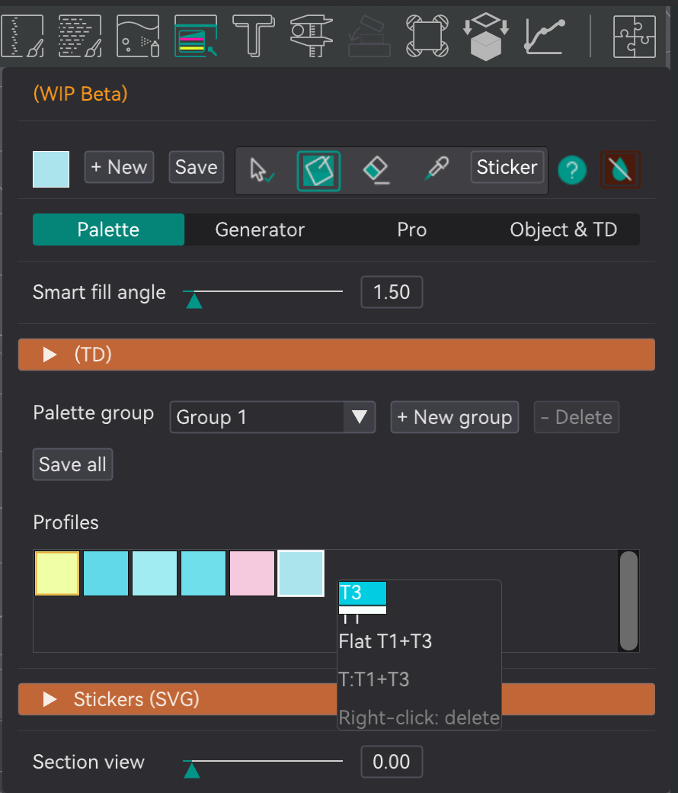

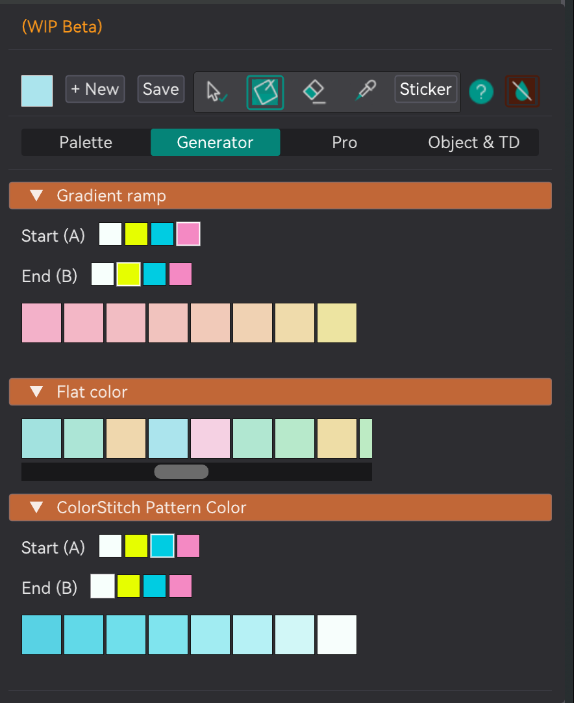


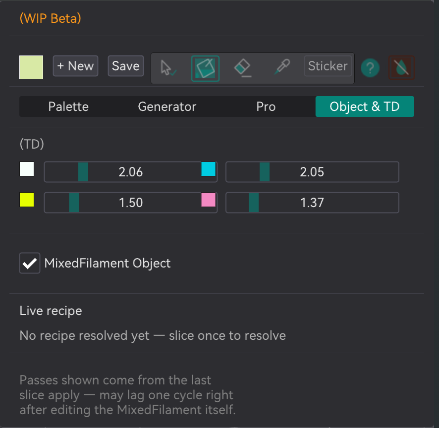

**Walkthrough — painting a multi-pass Sandwich, step by step**

> The panel chrome in these seven shots predates the 2.4.0 reorganisation (they still show the
> **Top Surface / Bottom Surface** switch and **(TD)** inside Pro). The **workflow is unchanged** —
> for the current layout see the four department shots just above.

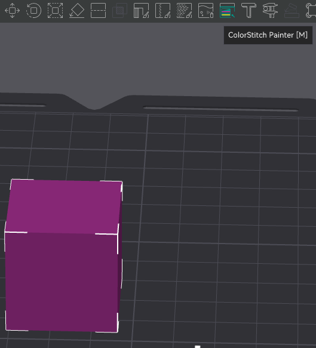

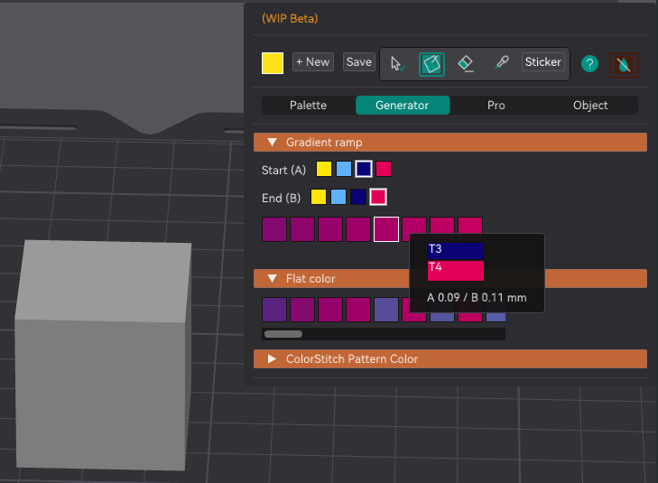

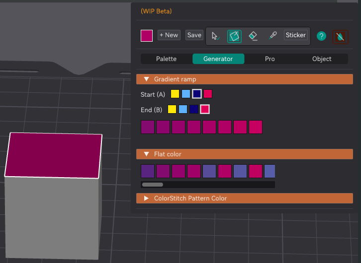

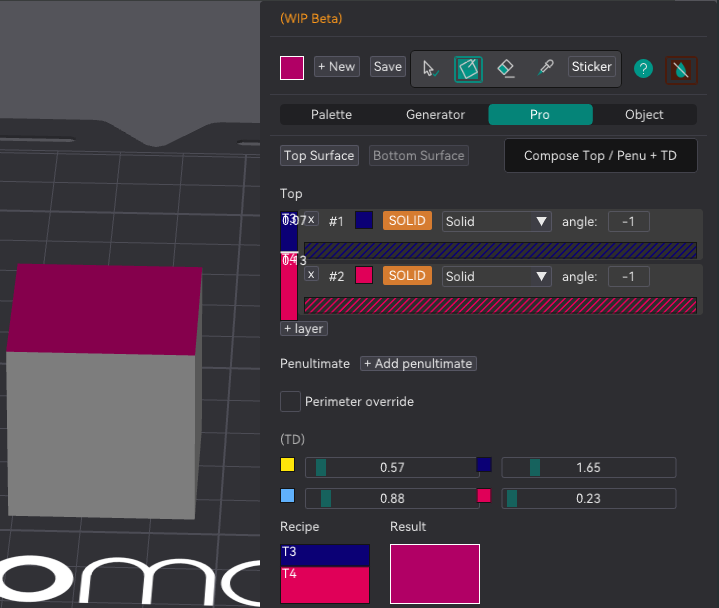

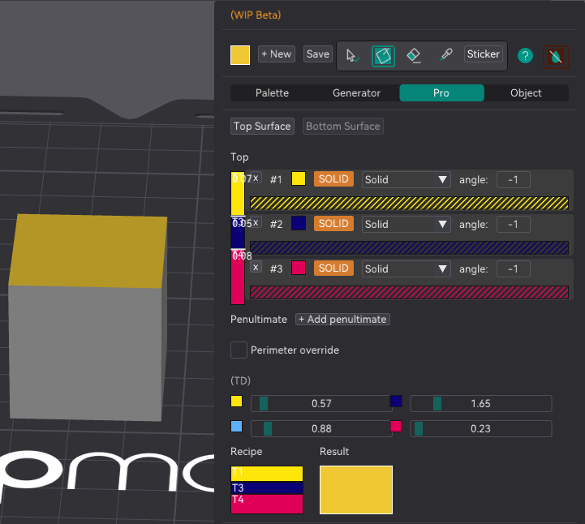

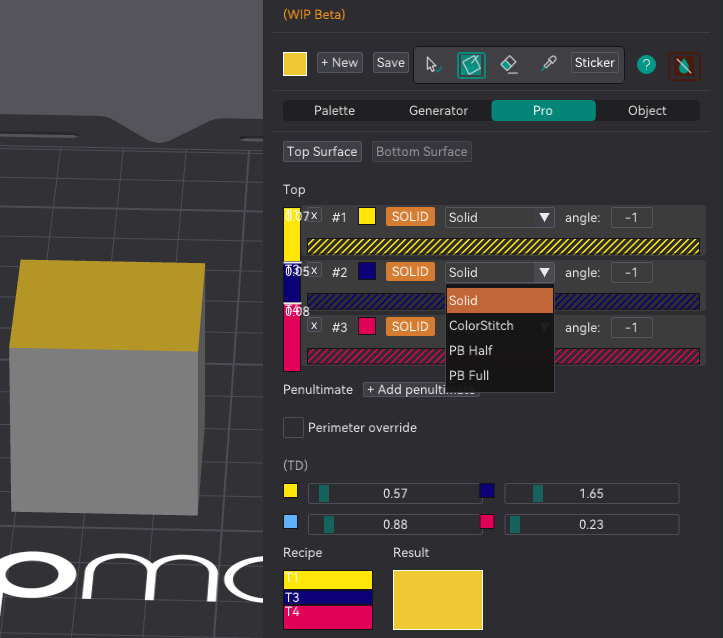

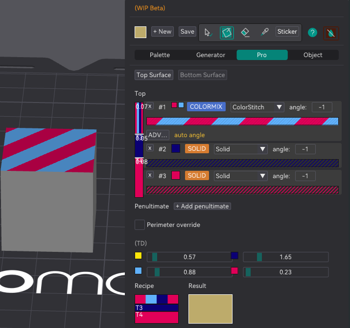

**Layout and pass rows** *(2.4.0)*. The tool row (Select · Paint · Eraser · Eyedropper · Sticker · **?** ·
Erase all) sits on **its own line** under the active-colour header, instead of sharing it — the panel had
grown too wide. Each zone is titled by a **coloured chip** (green Top, darker green Penultimate, orange
Bottom — the same codes the 3D highlight uses, see §6h), because three plain labels did not read as three
different things. In every pass row:

- The **thickness bar** on the left is twice as wide, so its millimetre value no longer collides with the
  pass number, and its **drag handles** between passes are easier to grab (they light up teal under the
  cursor and stay clear of each other on thin bands).
- **`^` `v` reorder** and **`x` remove** close the row on the **right**, with the `x` set apart: reordering
  passes (raise the Solid, lower the ColorStitch, swap them) is a core move when composing a recipe and it
  used to be hidden in a right-click menu, while the `x` sat next to the thickness control — one adjusts,
  the other destroys.
- A **`!CS`** or **`!PB`** button appears on a *Solid* pass that still carries a leftover ColorStitch or
  PathBlend payload — a pass degraded by an older build. The engine slices it as Solid (the kind wins) but
  the recipe looks like an effect, so the preview came out flat. Click it to restore the pass. New ones
  cannot be created: switching a pass to Solid now clears its payload.

---

### 6c. Palette groups, slot cap & Save All

**Working vs saved.** Colours you paint are *working colours* — created on demand, deduplicated, and garbage-collected when no face uses them (shown with an amber border while occupying a slot). Browsing palettes does **not** consume slots. *Saved* palettes are deliberate, named, and travel in the 3MF.

**Palette groups** — saved palettes are organised into **groups** (up to 10, global). Use **+ New group** to add one and the **Group** selector to switch; deleting a group moves its colours to Group 1.

**Slot cap** — up to **254** painted slots per object (slot 0 = unpainted).

**Save all** — promotes **every unsaved working colour** into the active palette group at once, so a later *Erase all* leaves nothing dangling.

Painting and the slot→profile mapping are recorded for **undo/redo** within the session.

**Save keeps the Bottom zone** *(2.4.0, bug fix)*. A colour's recipe is carried as Top + Penultimate,
and **Save** built the saved palette from those two only — a recipe with a **Bottom** zone was saved
*without* it, silently, in the very gesture meant to preserve your work. The Bottom now travels with
the colour, and it also counts when Save looks for an identical existing palette: two recipes that
match on top and differ underneath are **different colours**, and collapsing them was how twin
profiles appeared, one of them carrying the Bottom and the other not.

**The list no longer reshuffles under the cursor** *(2.4.0, bug fix)*. Working colours are listed while
they occupy a slot, and that was checked against the *active* object — which changes on simple
**hover** in Paint/Eyedropper mode. The grid reordered itself as you moved the mouse across the plate,
and with it whatever Save appeared to do. It now counts the active object **and every chosen one**, so
the list stays put until you change your selection. And if Save promotes a colour that lives in another
**group**, the view now **jumps to that group** instead of leaving you looking at an unchanged grid —
the colour is filed where it belongs, not moved behind your back.

---

### 6d. Painter mode at slice time

| Situation | What applies |
|-----------|--------------|
| Object with zero painted facets | **Preset mode** — Sandwich Editor values apply |
| Painted object — painted area | The **painted profile** applies; preset ignored for that area |
| Painted object — **unpainted** area | **No effect** (preset suppressed for the whole object) |

This "all or nothing" rule prevents mixing preset and painted effects. For each top/penu fill at each layer the slicer uses the dominant painted slot in that Z range, so different regions at the same height each get their own effect. The wipe-tower planner uses the same lookup as the slice, so plan and G-code stay in sync.

---

### 6e. Profile persistence and 3MF round-trip

Everything is saved inside the 3MF: the **profile library** (project-level base64 JSON), the **per-volume slot tables** (slot → profile id), and the **per-triangle paint** (mirroring MMU painting). Opening a 3MF restores all three. Profiles live inside the 3MF only — there is no cross-project library; save a template 3MF to reuse a set.

> **Known limitation — PathBlend on Penu.** The penultimate PathBlend has a gradient-direction bug on multi-stair objects, so the PathBlend pass is restricted to the Top zone for now. The engine supports penu PathBlend; it will be re-enabled when the bug is fixed.

---

### 6f. Weave preview on the painted surface

Painted top surfaces show the **ColorStitch weave directly on the model** — the per-line tool stripes (or dither / gradient / hard bands) instead of a flat swatch colour. The preview is built from the **same per-line sequence the slicer produces** (`build_dithered_tools_*` / `build_custom_bands` / pattern), so the **filament colours, density and pattern match the G-code**. The same sequence builder also drives the small pass strip in the **Pro tray** and the **Sandwich editor**, so the strips and the 3D view stay identical. (The preview is always on now; the old *Preview weave* toggle was retired.)

**Scale fits the painted area at the real line width.** The stripe pitch comes from the **resolved top line width** (config, no slice needed), and the gradient/pattern is scaled to the **painted region's own extent** — computed **per island**: each flat zone (e.g. a stair step) is detected as a connected component (edge-adjacency, so zones that only touch at a corner stay separate) and gets its **own** gradient ramp, just like the slice. Tiled patterns repeat at the real line width (shader wrap), so the stripe width matches the print regardless of zone size.

**Orientation matches the slice for a fixed angle.** The stripes run at the pass's **fixed angle**, and that angle is now **honoured exactly in the G-code**: for a fixed ColorStitch angle the slicer's per-layer fill-angle rotation is **locked out** (internally via the template-angle flag), so every layer keeps the painted orientation. Set the angle by **scrolling the mouse wheel over the pass preview bar** (Pro tray and Sandwich editor) — the bar, the 3D model and the print all rotate together in real time.

> **Auto angle (`-1`).** With auto angle the slicer **alternates the fill direction every layer** (this is what gives a uniform finish), so a static preview cannot match the print. An amber **"auto angle"** tag appears next to **ADV** in that case — set a **fixed angle** (wheel over the bar) to lock the orientation.

**The Bottom zone is previewed too** *(2.4.0)*. Until now every on-model preview read the **Top** recipe only, so a colour whose **Bottom** zone carried its own ColorStitch or PathBlend showed up flat — or worse, wearing the Top colour. Now each painted slot is previewed **per zone**: upward-facing facets show the Top recipe, downward-facing facets show the Bottom one, each with its own islands and its own scale. A Bottom made only of Solid passes has no weave to draw, so it gets its **own composed colour** instead of borrowing the Top's.

**Where you can paint.** Painting follows the **zones the colour actually uses**: a recipe with Top/Penultimate content keeps **upward-facing** facets, one with Bottom content keeps **downward-facing** ones, and a recipe with both keeps both. Side walls are never painted — that is where the effect would not print anyway.

**The preview no longer flickers when you change object** *(2.4.0)*. Chosen objects that are not the active one are drawn with their own weave now; previously they fell back to a flat composed colour, so sweeping the cursor across a plate made patterns blink in and out.

> **Remaining limitations (this version).** The stripe scale uses the painted-area projected extent, **not** the exact line count after perimeters/gap-fill are subtracted, so it can differ by a line or two. Islands wider than ~64 lines coarsen in the preview (64-entry shader LUT) — gradients just lower resolution; patterns still tile at real width.

---

### 6g. MixedFilament Object mode (Beta)

A **MixedFilament** (Filament Settings → the *MixedFilament* rows built from two of your
loaded filaments) can be assigned to a whole object as its extruder, the same way you'd
assign any normal filament. **MixedFilament Object mode** is a one-click way to make that
object's **top surface, penultimate layer and bottom surface** actually *look like* that
MixedFilament's colour, instead of printing with whatever the default treatment would be.

> **2.4.0** — the Bottom zone is new. Before, the mode replaced Top and Penultimate but left
> Bottom resolving to whatever painted recipe was underneath, so an object could print under
> two different recipes at once while the interface said it was fully governed. Fixed.

**How to use it**: open the **ColorStitch Painter** gizmo (§6b) on an object whose extruder
is a MixedFilament. A new checkbox — **"MixedFilament Object"** — appears above the palette
strips, with a small colour swatch next to it showing the approximated result.

- If the object's extruder is **not** a MixedFilament, the checkbox is greyed out with a
  tooltip telling you to assign one first.
- Turning it **on**:
  - Auto-generates a small sandwich (up to 3 solid passes) that approximates the
    MixedFilament's colour using your other loaded filaments and their **TD** values
    (§1e) — the same colour-matching math the ColorStitch Studio uses.
  - Turns **Perimeter override** on automatically, so the walls get reprinted to match too.
  - **Locks out** manual painting/patterns for that object (the palette strips, zone
    editors and the Perimeter override checkbox grey out) — the object is either "painted
    by hand" or "driven by its MixedFilament," not both at once.
    *(2.4.0)* The lock now covers the **brush in the 3D view** as well, not just the panel.
    Before, the controls greyed out but clicking the model still painted: slots were spent
    and re-slices scheduled for paint the engine then ignored — work lost with no warning.
    Placing a **sticker** on such an object is blocked for the same reason. **Select** and
    the **eyedropper** keep working: changing object or reading a recipe are still useful.
- Turning it **off** restores whatever was painted before (nothing is lost).

> **Beta.** This feature is functional and print-verified in principle, but still young —
> report anything that looks off. One known rough edge: the swatch shows the **colour**
> only, not a preview of the pattern/passes that will actually print.

---

### 6h. Highlight active colour — where is this colour applied? (2.4.0)

The panel always knew which colour was active; the 3D view never said **where that colour is
already applied**. With two similar colours on one plate that question had no answer other than
squinting at the mesh. **Highlight active colour** (checkbox at the bottom of the painter, next to
the brush and section-view controls) answers it.

**What it draws.** The **outline of the painted region** for one slot — the boundary edges only, so
it frames the area without covering the weave preview you are looking at — plus a faint **box around
each painted island** for reading at a distance, and a **badge** carrying the slot number. The
outline is drawn twice: solid on the surface, and as a **ghost through the object**, so a zone facing
away from you still shows without orbiting blind. A slow pulse keeps it apart from the paint itself.

**Zone colours, the same ones as the panel.** The zone chips in the Pro tray and the highlight share
one palette: **green = Top** (the Penultimate is a darker green — it is the layer under the same top
surface, not a separate thing), **orange = Bottom**. So a recipe that paints both zones is obvious at
a glance: green outline above, orange below. Each badge shows the **slot number**, a disc in the
**colour of the slot** (what colour it is), and a ring plus a wedge in the **zone colour** (where it is
applied) — the wedge points up for a top island, down for a bottom one, and bottom badges sit *under*
their island.

**Which slot is highlighted.** The **active** colour by default, so while you paint you always see
where that colour already is. **Hovering a swatch** in the palette grid, or a row of **In use on this
object**, highlights *that* colour instead — "show me where this one is". Move the cursor off the
panel and it returns to the active colour.

**The counter next to the checkbox** reads `sN — 137` (slot and facet count) or `sN — not painted
here`. That distinction matters: "the colour is active and I see nothing" has two very different
causes — it is not painted on this object, or it is painted on a face pointing away from you.

**It is an aid, not a preview of the result** — turn it off to check the clean weave preview.

> **Notes.** On a multi-instance object only the first instance is highlighted. A bottom outline can
> be hidden by the build plate, since the plate is drawn after the objects — that is what the badge
> under the island is for.

**Assembled objects now show their paint** *(2.4.0, bug fix)*. On an object made of several parts
(what **Assemble** produces) painting a colour that already had a slot recorded the facets but not
the colour itself on the other parts: the part sliced correctly while the painter showed it **grey**,
the eyedropper read no recipe there, and the highlight had nothing to light up. Paint slots are
**per part**, and the profile is what identifies a colour across parts — that is now respected
everywhere (painting, eyedropper, highlight, preview). Objects already in this state are **repaired
when the object is opened** in the painter: orphan paint recovers the colour from the sibling part
that still had it.


### 6i. Painted colours stay visible outside the painter (2.4.0)

Until now a painted Sandwich only existed **while the ColorStitch Painter was open**. Close the
gizmo and the object went back to one flat colour: nothing on the plate told you which parts were
painted, with what, or how the effect would land — you had to reopen the painter, object by object,
to find out. Plate thumbnails had the same blind spot.

Painted objects are now **drawn painted in the normal 3D view**, gizmo closed, with the **full
weave** — the same per-line stripes, dithers, hard bands and PathBlend gradients you see inside the
painter, per island and at the real line width, composed against the object's actual base colour and
its TD. It is the same code doing the drawing in both places, so there are no two versions of the
truth to drift apart.

**What is identical to the painter, and what is not.** The colours and the pattern are the same
calculation. Two differences worth knowing:

- **Lighting is not the same.** Inside the gizmo the model is drawn by the painter's own shader;
  outside it is the normal one — or Libre Mode's realistic shading with its ambient occlusion and
  shadows. Same bands, different light on top of them.
- **Small leftover facets print flat here.** Inside the painter, faces too small to form an island
  fall back to a whole-object weave. Outside they take the slot's **flat composed colour**. In
  practice this is stray fragments between zones.
- With the object **selected**, the unpainted part carries the selection tint and the painted zones
  do not — the same behaviour MMU painting has always had.

**Turning it off.** A checkbox, **Keep paint visible outside this gizmo**, sits with the other view
aids at the bottom of the painter (next to *Highlight active colour*). It is on by default and
applies to the whole project.

**With MMU painting on the same object** *(2.4.0)*. Both are drawn, each on its own faces: the
Sandwich first, the MMU on top of the faces it owns. That is now exactly what the slicer does —
**where you painted MMU, MMU rules**; everywhere else the Sandwich applies. What you see is what
prints.

In the MMU area you get **no Sandwich effect**: that surface prints plain, in its own filament.
Both painters tell you how much of your paint is affected, in amber, when it actually happens.

---

### Seeing your Sandwich effects while you paint MMU *(2.4.0)*

The MMU painter draws your Sandwich painting too, with the full weave — the same way the normal 3D
view does — so you can decide where MMU paint goes without working blind. Where both meet, MMU is
drawn on top, matching the slicer.

A checkbox, **Show Sandwich effects**, appears in the MMU panel on objects that carry Sandwich
painting. On by default, project-wide.

> **Known limitation.** Where a surface is split — by MMU paint, or anything else — each piece
> restarts its gradient instead of continuing it. The line spacing stays continuous across the
> boundary; the colours restart. Cross a ColorStitch or PathBlend zone with MMU paint and the
> pattern begins again on the far side.

---

### Stickers (SVG) — ⚠️ rough, and deliberately tucked away

Load an SVG in the Palette tab and the **Sticker** tool places it on a flat top face. It is not
geometry: the shape becomes a **2D mask** carrying a Sandwich recipe, resolved at slice time. Stack
several and the **topmost one wins** where they overlap — it occludes, it does not blend.

It works and it slices. But it is the least finished part of the painter, and you should know what
you are getting before you build anything around it:

- **You cannot see a sticker anywhere.** Not in the normal 3D view, not inside the MMU painter, and
  not even inside the Sandwich painter itself unless you are actively editing that sticker. You
  place it, it disappears, and you find out what it did in the preview or the G-code.
- **A sticker overrides everything under it, silently** — hand-painted zones *and* MMU paint. It is
  applied last, over whatever survived, so it takes the surface back from both. Nothing warns you.
- **Top surfaces only.** Bottom stickers were never implemented.
- The wipe tower does not currently switch between a painted tower and a sticker one.

All of this is being addressed together in a **Mask-Painting** section planned for a future release,
where stickers and a drawing tool become one thing. Until then, treat stickers as experimental.

---

## 7. Align & Stack — align and stack two objects

**Align & Stack** is a gizmo (left-side gizmo toolbar, **"Align & Stack"**) for placing one object against another — **#1**, the object clicked first, is the **anchor**; **#2** is the one that moves. Click two objects in the scene to set them (click a third to swap out #2 — the gizmo only ever relates two objects, so there's no chain to manage); click a chip or **Reset** to clear.

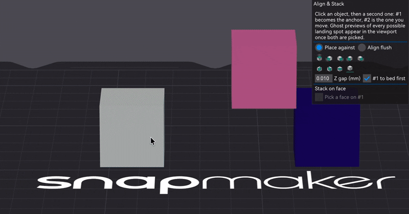

**Two modes:**

| Mode | What it does |
|------|--------------|
| **Place against** | #2 comes to rest **touching the chosen face of #1**. This is the stacking mode. |
| **Align flush** | #2's same-side face becomes **coplanar** with #1's (Illustrator-style alignment). |

A row of **face / centre buttons** picks which face or centre axis to align or stack against (the tooltip changes with the mode). **Z gap (mm)** sets a controllable gap between stacked objects, and **Drop to bed (Z = 0)** drops every ordered object back onto the plate.

**Viewport AABB aid — see the landing spot before you click it.** With #1 picked, its bounding box is drawn as a wireframe "zone" directly in the 3D view. Once #2 is picked too, every possible placement (all 5 face ops + the 3 centering ops) is previewed live as a translucent **ghost wireframe of #2** at exactly the position it would land — computed with the same math the click would run, so the preview never lies. Each ghost carries its own big, semi-transparent **mini-cube icon** floating right at the seam between #1 and the ghost: hover it for a tooltip, click it to run that placement immediately, no need to go back to the side panel or decode which abstract X‑/X+ button means "behind". Ghost previews only show for a #1+#2 pair currently on-screen; from a camera angle where a given ghost isn't really visible, its icon simply doesn't appear rather than showing up somewhere meaningless.

> Works together with Libre Mode (§4) for floating/assembled workflows — align or stack the parts, then slice with the arrangement you need. Pair it with **True Objects / Gravity (§17)** when stacking *separate* (non-Assembled) objects — Align & Stack places the pieces exactly, Gravity is what makes the slicer treat the touching face honestly instead of as a false bridge.

---

## 8. NeoArachne — alternative wall generator

**NeoArachne** is a wall-generation engine that sits beside the stock Classic and Arachne engines and lets you choose, *per feature* (outer wall, inner walls, gap fill), which underlying engine prints it — plus extra controls targeting Arachne's known failure modes (width breathing, blobs at thin transitions). The default recipe — **Neotko Hybrid v2** — uses Classic for the outer wall and stock Arachne for the inner walls. It ships a **Preview Lab** (§8d) that renders wall paths before slicing.

> **NeoArachne is exposed only under Libre Mode** (§4): the **NeoArachne** entry in the wall-generator dropdown, and its controls, appear only when Libre Mode is active. It is opt-in — existing presets are unaffected.

### 8a. Turning it on

1. Enable **Libre Mode** (§4a).
2. **Quality → Wall generator** (Advanced) now offers **Classic / Arachne / NeoArachne**.
3. Select **NeoArachne** — its controls appear inline below the dropdown. Leave them at defaults for a first slice (the Neotko Hybrid v2 recipe).

### 8b. Per-feature engine choice

Three source dropdowns route each wall kind through an engine:

| Setting | Options |
|---------|---------|
| **NA — outer wall source** | Classic / Arachne (stock) / Arachne (NeotkoEdge) |
| **NA — inner walls source** | Classic / Arachne (stock) / Arachne (NeotkoEdge) |
| **NA — gap-fill source** | Off / Classic / Arachne (stock) / Arachne (NeotkoEdge) |

- **Classic** — constant width, cleanest visible surface, no breathing; can't adapt to thin features without a gap-fill pass.
- **Arachne (stock)** — variable-width beading with integrated gap fill. Best for inner walls.
- **Arachne (NeotkoEdge)** — Arachne with the NeotkoEdge bead-count stabiliser. *(Its extra tuning knobs from the older fork are not exposed in this build yet.)*

The default **Neotko Hybrid v2** = outer Classic, inner Arachne (stock), gap fill Off.

### 8c. Edge Closure controls

| Control | Range / default | What it does |
|---------|-----------------|--------------|
| **NA — allowed perimeter overlap** | 0–100%, default **0%** | How much the first inner Arachne bead may overlap the Classic outer. Raise to 5–15% only if you see a seam; high values blob. |
| **Min Line Width** | 5–100% of nozzle, default **40%** | Minimum bead width Arachne emits. Higher widens thin features (blob risk). 30–50% recommended. |
| **Max Line Width** | 100–200% of nozzle, default **200%** | Ceiling on bead width. Lower (130–150%) for more, narrower beads. |
| **Min Feature Threshold** | 1–100% of nozzle, default **10%** | Geometry thinner than this is discarded. Keep low; must stay ≤ Min Line Width. |
| **Preserve Thin Edges** | on/off, default **on** | Keeps short closure tails near the outer perimeter for cleaner seams. |

### 8d. Preview Lab

A panel inside the NeoArachne section that renders planned wall paths **before slicing**: outer + inner paths in distinct colours, the execution (chain) order, seam dots, travel moves, and a head animation. Controls include a layer slider, animation speed, a ghost/printed build mode, zoom, "use selection," and a **Dump** button that exports the full plan as JSON for off-line diagnosis.

> **Known limitation**: a small visual divergence vs the real slice on the second-to-last inner wall in narrow "waist" regions of some geometries — use **Dump** to share the JSON (and the 3MF) for diagnosis.

---

## 9. NeoTower — post-slice wipe tower

**NeoTower** is an alternative wipe-tower planner. The stock planner decides geometry up front; NeoTower runs **after slicing**, when every toolchange is known — including the sub-layer primes that Sandwiches and Solid-pass stacks insert *inside* a layer. Seeing the full toolchange list first lets it build a **fixed, predictable footprint** that stays in sync with the real G-code and understands variable layer heights. Options live in **Quality → Prime tower**.

> **You usually don't have to choose it.** Any scene that uses a Sandwich or a multi-pass stack **auto-promotes to NeoTower** regardless of the setting below. NeoTower requires a prime tower to be active.

### 9a. Tower type

| Setting | Behaviour |
|---------|-----------|
| **Classic** (default) | The standard WipeTower2 planner. |
| **NeoTower** | The post-slice planner — fixed footprint, delta-Z aware, with the options below. |

### 9b. Zigurat taper

**Default: on.** Limits how fast the footprint may shrink between consecutive real layers (one perimeter width per side) so every wall ring rests on the ring below (*wall-on-wall*). Disable to save material and time, at the cost of rings only partially supported by the sparse interior grid.

### 9c. Sandwich purge compaction

Sandwich / multi-pass purges run at microscopic heights and would inflate the tower. **Purge compaction** is a flow-boost cap that compacts those thin purges into a narrower band (the surplus hangs into the hollow interior), reducing the footprint.

- **1.0** = off. Higher = more aggressive. **Default 1.7.** Range 1.0–5.0. Confirm with a test print.

### 9d. Sandwich wipe reserve

The volume (mm³) purged before each Sandwich sub-layer toolchange (Solid / ColorStitch / PathBlend, Top + Penultimate). The config key is `multipass_prime_volume`, labelled **"Sandwich wipe reserve"**.

- **Default 10 mm³.** Lower = thinner/shorter tower; higher = better purge. Set **0** to disable. Requires a wipe tower active.

### 9e. Variable layer height (Experimental)

Because NeoTower plans from the real post-slice toolchange list and is delta-Z aware, it is the mechanism that lets **adaptive / variable layer height + multiple tools + a Sandwich** coexist on one coherent tower. Stock Orca refuses to slice such scenes; NeoTower can purge each toolchange at the real per-layer height.

A new option **Variable layer height (Experimental)** sits under **Tower type** and is exposed **only with Tower type = NeoTower and Libre Mode active** (it is visible but greyed-out otherwise). **Default: off.** When **on**, the slicer stops blocking:
- scenes that **mix objects with different layer heights**, and
- **adaptive / variable layer height combined with more than one filament**.

> **(Experimental.)** The wipe-tower issue that previously left **empty/short tower layers** (missing "drawers" on real layers, including the *"empty first layer"* abort) is **fixed in 2.3.1** — the tower now stays coherent under variable layer height. The capability is proven and was solid on the **2.2 line (older FS099 fork)**, and is now consistent on this 2.3.4 base too. It is still flagged Experimental: review G-code before long multi-tool runs. The option only takes effect with Tower type = NeoTower.

---

## 10. Bump Mapping Editor — texture-driven wall & top-surface relief

The **Bump Mapping Editor** is one gizmo (`GLGizmoTextureBump`) with three modes, switched via a
bar at the top of its panel: **All**, **Painter**, and **Top**. All three turn a grayscale (or
any) PNG into physical Z relief at slice time — the difference is *where* the relief goes and
*how* it's scoped.

> **Hidden behind a double gate in this build — expert-only, on purpose.** The gizmo only appears
> in the toolbar with **both** (1) **Libre Mode** active (§4a: master switch in Preferences +
> restart, then the toolbar toggle) **and** (2) the debug env var `ORCA_DEBUG_TEXTUREBUMP` set
> before launch; Top mode additionally needs `ORCA_DEBUG_ZBUMP` (or `ORCA_DEBUG_ALL=1`) for ZBump
> to actually apply when slicing. This isn't a placeholder gate — some option combinations here are
> genuinely capable of producing bad extrusion (see the Classic-wall-generator note in §10a and the
> per-mode limitations below), so it's kept off unless you've deliberately opted in and are prepared
> to read the resulting G-code. Full per-OS activation steps and the safety notes that go with them
> are in `NEOTKOCM_RELEASE_2_35.md`.

### 10a. All mode — object-wide wall texture

Applies one texture to every wall of the selected object, projected via **Planar / Cylindrical /
Spherical / Cubic** (Quality → wall texture settings, or the panel's Source/Relief/Transform
sections). Three on-canvas 3D handles adjust it without leaving the viewport:

| Handle | Colour | Drag controls |
|--------|--------|---------------|
| **V** | blue | Scale (tile size, mm) |
| **U** | orange | Repeat count |
| **Yaw ring** | purple | Rotation around the pivot |
| **Pivot** | pink | Pan — moves the tile origin |

A live textured overlay shows the pattern on the object before slicing, so you can line it up by
eye. The real object dims while the gizmo is open so the projection isn't hidden behind it.

> ⚠️ **Wall generator: Arachne only.** Wall-texture bump (All + Painter modes) requires the
> **Arachne** wall generator. It's deliberately disabled on **Classic** — a real test print showed
> Classic silently over-extrudes when adjacent walls carry different bump amounts, and the preview
> hides it while the G-code doesn't. **NeoArachne isn't wired up for it yet either.** Even on
> Arachne, adjacent walls with very different bump amounts can still show a visible gap between
> them (nothing adjusts line *width* to compensate, only the centreline moves) — this is a known,
> open limitation, not something the gate gets you past.

### 10b. Painter mode — per-zone texture

Paint zones on the model (same brush/erase interaction as the other painter gizmos) and assign
each zone its **own** texture, projection mode, scale, and thickness — independent of the
object's base (All-mode) settings and of every other zone. Each zone gets its own overlay preview
and a thumbnail in the zone list so you can tell them apart at a glance.

### 10c. Top mode — ZBump, top-surface height-map relief

A different feature entirely (no shared engine code with All/Painter's wall texture) that
modulates the **Z height of the top-surface fill**, not wall XY. A grayscale image becomes a
literal height field: brighter pixels raise the top surface, sampled point-by-point along every
top-fill line for a real 2D relief (not one flat Z per line).

| Control | What it does |
|---------|--------------|
| **Height (mm)** | Max Z displacement at full-white texture value. Shown in red past a safe-height estimate (0.8× nozzle − layer height) — a warning, not a hard cap; you can go past it and judge from the resulting G-code. |
| **Reinforcement passes** | Splits the total height across multiple stacked passes when it exceeds what one pass can safely reach on its own. |
| **Scale / Repeat** | Physical size of one image tile, and how many times it repeats. |
| **Pan X / Y** | Shifts the tiling phase — drag the on-canvas green handle, or type exact values. |
| **Edge ramp (mm)** | Smoothstep margin from the top-fill's own contour, so the wall itself stays flat. |

The green pan handle rests at the object's own center plus the current offset, and a live
textured overlay (cropped to roughly where top-fill actually starts, inset from the object's
outer edge by its perimeter walls) previews the pattern before slicing — drag the handle or the
numeric fields, both update the same preview live.

> **Preview vs. slice.** The overlay is a GUI-only approximation (perimeter inset is estimated,
> not the engine's exact fill boundary) — always meant as a placement guide, not a pixel-perfect
> match. It's cross-checked against the real slicing math via a calibration log
> (`ORCA_DEBUG_ZBUMP`, `/tmp/neotko_zbump.log`) that logs identical probe points from both the
> GUI and the engine side for direct comparison.

**Known limitation:** the on-canvas scale/rotation handles (in any mode of this gizmo) can
disappear when the print bed renders behind them, depending on camera angle — visible fine from
below. Long-standing, not specific to any one mode; not yet root-caused.

---

## 11. Precision Adaptive Layer Height — point-based layer height curve

A gizmo (left-side toolbar) that replaces the stock "Layers editing" brush with an exact,
point-based curve editor for variable layer height. Instead of clicking and dragging to add/remove
detail (imprecise — you can't say "I want exactly 0.28 mm at Z=14.2 mm"), you place **control
points** at an exact Z and height, drag them, and set a **tension** per segment to shape the curve
between them.

> Like **Align & Stack** (§7), this gizmo is gated behind **Libre Mode** (§4) — its icon is
> **always visible** in the toolbar but stays disabled (greyed out) until Libre Mode is active. It
> never affects the stock Variable Layer Height dialog/brush, which remains untouched and fully
> usable with Libre Mode off.

**How to use it**

1. Enable **Libre Mode** (§4a), select a single object, open the gizmo.
2. The panel shows a graph: height (mm) across, Z across the object's height vertically.
   - The **bottom point** (grey) is the object's fixed first layer — it can't be moved or deleted.
   - The **top point** (amber) can be dragged in height only.
   - **Click anywhere else in the graph** to add a new point; **drag** any non-bottom point to move
     it; **right-click** a point to delete it.
3. With 3+ points, a **tension slider** appears per segment below the graph: `0` = straight line
   (identical to the engine's default linear interpolation), `1` = a smooth curve through the
   segment (monotone — it never overshoots past the two points' heights, so it can't spike outside
   `min`/`max layer height`).
4. While dragging or hovering a point, a translucent band lights up **on the object itself**,
   showing exactly which Z-slice you're affecting — teal on hover, amber while dragging. A small
   label over the point shows the exact Z and layer height live.
5. Every discrete edit (point add/move/delete, tension change, Reset) is a normal undo step and
   triggers a re-slice, same as the stock brush.

**Current limitations (first version)**
- Min/max layer height are **read-only** (from the printer/nozzle) — no per-object override yet.
- Reopening the gizmo on an object that already has a *very* dense profile (e.g. one painted with
  the old stock brush) falls back to a flat 2-point start rather than importing hundreds of points
  as control points.
- No result preview from the classic Adaptive/Smooth buttons — this gizmo is a separate, precise
  path, not a replacement for those.

### 11a. Adapt to Color (2.3.8, WIP) — color-aware height guidance

Layer height and MixedFilament color are not independent: the height you slice at changes how the
color reads on the part. Turn on the **Adapt to Color** checkbox and the height editor shades the
ranges where the object's color setup actually works:

- **Red on the right — pattern-resolution ceiling.** Above the mix band (follows the "Dithering
  cadence" upper bound in your print settings), a Cycle/gradient pattern gets too coarse to read
  as a blend. Applies object-wide to any object with a mixed pattern, paint or Sandwich.
- **Red on the left — color-fidelity floor (Sandwich zones only).** Where the mesh has a plausible
  Sandwich top surface, the filaments' **TD** (translucency, from the ColorStitch settings) sets a
  minimum thickness: thinner than this and a translucent pass washes out over what's below. This
  never applies outside real Sandwich zones — a plain Cycle object shows only the ceiling.
- **Green line — optimal height per Z**, and a **Snap to optimal** button that rewrites every
  editable point of your curve to it in one click.

Dragging stays completely free within the nozzle limits — the guidance is visual (a point sitting
in a red zone turns **orange**), and the emitted profile is hard-clamped to the safe range only at
commit, so what reaches the slicer always respects the color. The info panel shows the color-safe
range for whichever point you hover or drag.

### 11b. Slope Pattern Recolor (2.3.8, WIP/experimental) — keep the pattern alive on slopes

**The problem (no stock slicer addresses this):** on a sloped surface, each layer's contour steps
inward, and that staircase ledge exposes the **interior perimeter rings** to view. Those rings
print in whatever the layer's color happens to be, so a clean MixedFilament banding degrades into
noise exactly where the model curves. The wider the step (`d = layer height × tan(slope)`), the
more rings show — at 0.2 mm on a steep slope you're already looking at one or two interior rings.

**What it does:** with the **Slope recolor** checkbox on, the gizmo scans the mesh for slope
bands, computes at your committed layer heights how many interior rings each band exposes, and
stores a per-object recolor plan (in the project 3mf, undoable, erased when you untick). At slice
time the engine applies it:

- The **external perimeter is never touched** — its per-layer alternation IS the pattern's visible
  rhythm and it keeps printing exactly as your recipe dictates.
- The **exposed interior rings** print a side-by-side combination of the recipe's own components,
  chosen by ΔE2000 color distance so the ledge's blended appearance matches the recipe's intended
  mix color — the step fills with the mix instead of a random solid.

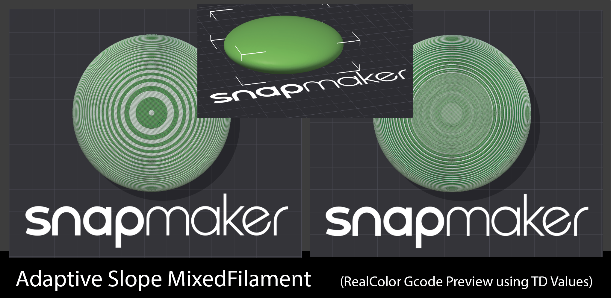

Works with Cycle, gradients and manual patterns. The **violet shading** in the height editor shows
which heights expose rings at each Z (drag the curve below the violet edge and thin layers cover
the slope instead — the two strategies are complementary), and the info panel reports the exposed
ring count plus the suggested ring colors for the focused point.

**Interaction with adaptive height:** you now have both answers to the same geometry problem —
**fine layers** shrink the ledge until nothing extra shows (slow, maximum quality), **Slope
recolor** accepts tall layers and colors what shows (fast, great finish at 0.12–0.2 mm). Use the
violet shading to choose per zone.

**Current limitations (WIP — needs broad print testing)**
- Best on surfaces with one dominant slope. Two very different slopes sharing the same height
  range currently share one plan (the steeper wins) — refinement planned.
- The plan is per height-band, not per-region: on a model that is sloped on one side and vertical
  on the other at the same Z, the vertical side's interior rings recolor too (invisible there, but
  it costs tool changes).
- A "Sandwich + slope" zone (top surface on a slope) still prioritizes the thick-top Sandwich —
  spreading the recipe across several thin top layers ("Sandwich 2.0") is a planned future system;
  the panel warns when you're in one of these zones.

---

## 12. NeoWave Support (WIP) — Wave-Huygens roof + hollow pillar + contact layer

> **(WIP, paused mid-implementation — Libre Mode only.)** The support roof and hollow pillar
> described below are implemented and **print-validated**. The second mechanism — a **contact-layer
> toggle** (§12a) that ripples the object's own bridge fill directly above the roof — is now shipped
> and **slice-verified**, but has not yet been through a real print (its first print is still ahead).
> Both the support engine and the contact layer are experimental; expect this section to expand in a
> later release.

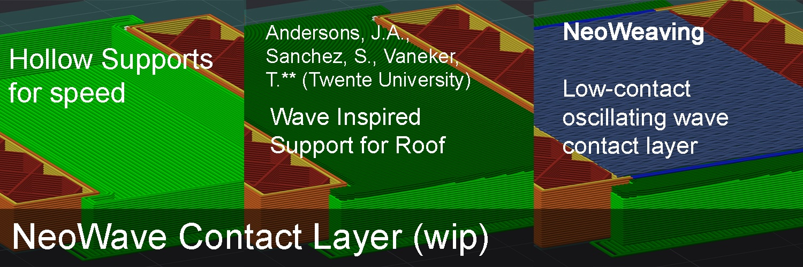

**NeoWave** is a support type that replaces the interface/roof fill with a *wave-front* pattern —
long, continuous paths that diffract around concavities (ported from a published wave-overhang
algorithm), instead of straight parallel lines. It optionally hollows out the support body itself
(perimeter-only, no infill) underneath that roof, trading material and print time for a support
that still closes cleanly on top.

> **Exposed only under Libre Mode** (§4): the **NeoWave** entry in **Support type**, and the Wave
> roof controls below, appear only when Libre Mode is active.

**Turning it on**

1. Enable **Libre Mode** (§4a).
2. **Support → Support type**: select **NeoWave**. Selecting NeoWave now **locks the support to its
   tested shape automatically** — **Base pattern → Hollow** and **Interface pattern → Wave (NeoWave
   roof)** are set for you and greyed out, since the other base/interface patterns don't apply to
   NeoWave and only added clutter. Switch back to a normal support type and the full choices return.
   (Previously you had to set both by hand.)

**Wave roof controls** (appear once Interface pattern = Wave)

| Control | Options / default | What it does |
|---------|-------------------|--------------|
| **Wave roof shape** | Concentric / **Wave** | *Concentric* collapses nested rings inward from the roof boundary. *Wave* sweeps open arcs across the region, diffracting around concavities. **Print-tested: Wave is the one that works — Concentric fails to close cleanly over a hollow pillar (see below).** |
| **Wave roof order** | **Smart** / ZigZag / Monotonic | Print order of the same fronts — the drawn shape doesn't change, only how it's traversed. Smart hooks each front onto whatever is already printed (fewest long travels); ZigZag chains fronts into one continuous path; Monotonic keeps every front separate. |
| **Reverse wave roof order** | on/off, default **off** | Flips which edge (or, for Concentric, which ring) the fill starts from. |
| **Hollow pillar walls** | 0–10, default **0** | Number of perimeter walls for the support body, printed with **no infill** — a hollow pillar. `0` keeps the normal solid body. The first layer always stays solid for bed adhesion. |

> **🖨️ Print result so far**: a hollow pillar (**Hollow pillar walls ≥ 1**) capped with a **Wave**
> roof of **2 interface layers** printed cleanly. The same pillar capped with a **Concentric** roof
> did **not** close properly over the hollow — use **Wave**, which is already the default shape.

### 12a. Contact layer (new, WIP — slice-verified, print-pending)

A separate, independent toggle that ripples the Z of the object's own bridge fill wherever it lands
directly above a support roof — valleys touch the roof, crests stay in the air, leaving intentional
microscopic contact gaps meant to reduce bonding force so the support separates more easily. Unlike
the original idea (a paintable Sandwich effect), this shipped as a **plain on/off toggle under
Support**, independent of the Sandwich/ColorStitch system entirely: it works whether or not the
object has any painting on it, and it never touches colour/pattern — only Z.

| Control | Options / default | What it does |
|---------|-------------------|--------------|
| **Support neoweave contact** | on/off, default **off** | Enables the wave ripple on bridge fill directly above a support roof. |
| **Contact wave amplitude** | mm, default **0.1** | How far the wave deflects (upward only — it never digs into the roof below, by construction). |
| **Contact wave period** | mm, default **0.6** | Distance between successive wave peaks along the fill line. |

> ⚠️ **Slice-verified, print-pending.** The toggle is confirmed to fire correctly wherever bridge
> fill sits over a support roof, and the resulting G-code looks correct — but this specific mechanism
> has never been through a real print. Orca's G-code preview also **doesn't render the Z variation**
> this produces (same known limitation as Neoweave top/penu and ZBump) — the G-code is right even
> though the on-screen preview looks flat.

**Known gaps (this build)**

- No dedicated key yet for roof layer count — it uses the existing **Interface top layers** setting.
- No dedicated UI panel/gizmo yet; all controls above live as plain fields under **Support**.

---

## 13. Painter Pro Mode — precision tools for the stock Color Painting gizmo

> **Not the same gizmo as §6.** This section is about Orca's own **stock multi-material painter** — the **Color Painting** tool in the left-side gizmo toolbar (needs 2+ filaments configured; it's what you'd use to hand-assign filaments to triangles in any Orca build). It is a **different tool** from this pack's own **ColorStitch Painter** (§6), which paints *Sandwich effect profiles*, not raw filament assignment. **Pro Mode** is a collapsible section added to the bottom of the stock Color Painting panel with four precision add-ons on top of the regular brush. It is **always available** — no Libre Mode needed.

The stock brush paints by hand with a circle/sphere cursor, which is naturally imprecise on small or fine details — a click can bleed well past where you meant to paint. Pro Mode's tools attack that problem from different angles: finer brush subdivision, limiting paint to a thin perimeter ring instead of filling solid, two "mask" tools that paint an exact area in one shot instead of brushing it by hand, and (2.3.8) **Surface depth** — projecting a painted top/bottom design into the object as solid material, with optional per-color control.

### 13a. Brush precision

A **Precision** slider (1×–8×) in Pro Mode subdivides the mesh more finely right where you're painting, so the edge of a brush stroke follows the surface more closely instead of stair-stepping at low mesh resolution. Higher values cost more memory/CPU on dense meshes. Default `1×` = identical to a build without Pro Mode.

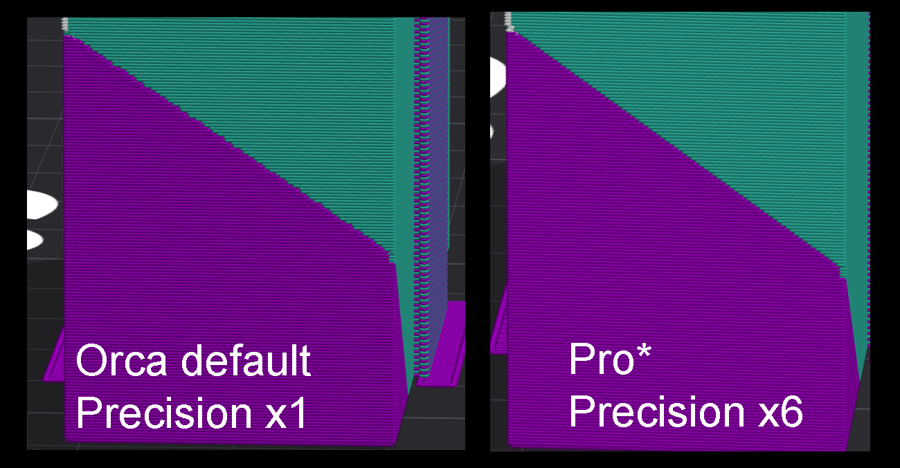

### 13b. Paint perimeters only + Extra walls

Two checkboxes/fields that change *where* a painted colour actually gets used, without touching the brush itself:

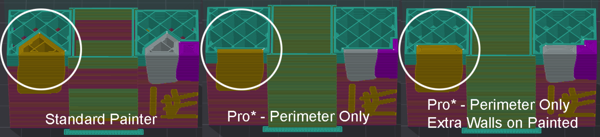

| Control | What it does |
|---------|--------------|
| **Paint perimeters only** | Limits the painted colour to a ring near the painted region's contour (about wall-count × line-width wide) instead of filling the whole painted area solid. The interior reverts to the object's base colour. Reduces wasted filament and colour changes buried in solid infill where nobody will ever see them. |
| **Extra walls** | Adds this many extra perimeter walls to the painted region **only**, on top of the object's normal wall count — for a painted logo or trim that needs a bit more wall depth than the rest of the print. `0` = disabled. |

Turning on **Extra walls** automatically widens the **Paint perimeters only** ring to make room for them — if you raise Extra walls after already enabling the ring, the ring re-widens to match.

> **By design: Extra walls has no effect where the painted colour matches the object's own filament.** If you paint a region with the same colour the object already prints in, there is no visible colour change there anyway — so Extra Walls is skipped for that region automatically, rather than silently doubling up walls in the same physical spot for no visible benefit. This only matters if you're using the painter to add wall thickness rather than colour — paint with a genuinely different colour (even one you don't intend to keep) to force the extra walls, or use a plain modifier mesh instead for pure geometry changes.

### 13c. Rectangle & Polygon masks

Two alternative "paint" tools for when hand-brushing an exact shape is fiddly — you outline an area on screen and it gets painted in one shot with whichever colour is currently active, instead of brushing it by hand.

| Tool | How to use it |
|------|---------------|
| **Rectangle mask** | Enable the checkbox, then click-drag a box anywhere on screen; release to paint everything under it. |
| **Polygon mask** | Enable the checkbox, then **click** to place vertices one at a time. **Click near the first vertex again** (with at least 3 placed) to close the shape and paint it. **Click-drag an existing vertex** to reposition it before closing. **Right-click** cancels and clears the in-progress shape. |

Both tools only paint **front-facing** triangles — the side of the mesh actually facing the camera — so a mask never bleeds through to the back of the object the way a naive screen-space fill would. The two checkboxes are mutually exclusive (turning one on turns the other off), the same way Vertical/Horizontal work elsewhere in this panel. Works with either **Classic** or **Arachne** as the wall generator.

> **Escape doesn't cancel a polygon in progress — right-click does.** Keep that in mind if you're used to Escape backing out of in-progress tools elsewhere in Orca.

### 13d. Surface depth (2.3.8) — project a painted surface into the object

Paint a design on the top (or bottom) of an object — a logo, a letter, a mark — and **Surface depth** extends it *into* the object as **solid infill of the painted color**, following the painted silhouette exactly, for as many layers as you choose (`0`–`20`, `0` = off).

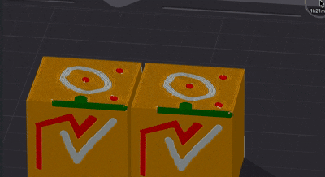

- The painted shape projects **straight down** (or straight up from a bottom surface), layer after layer, keeping its size — only trimmed where the object's real geometry changes. It is not a cosmetic reclassification: those layers genuinely print as solid walls-to-walls material of the painted color, surrounded by whatever sparse infill the rest of the layer uses.
- Depth is counted in **extra layers past the painted surface** (the painted surface itself is already solid). Where the projection overlaps areas that were already solid (your normal top shell layers, vertical shells, Sandwich internals), nothing double-counts — the projection only converts sparse infill, and never touches Sandwich's penultimate layers.
- Works symmetrically for **bottom-painted** surfaces, projecting upward.
- Deep projections can add tool changes on layers that previously had none — same as if you had painted deeper by hand. The wipe tower handles it with its normal machinery.

### 13e. Per color (2.3.8) — different Walls / Depth per painted color

The **Per color** checkbox switches "Extra walls" and "Surface depth" from one global value to a **per-color table**: one row per filament, showing its color swatch plus a **Walls** (`0`–`8`) and a **Depth** (`0`–`20`) field. A value of `0` in the table means "use the global value" — so you can, say, give a silver logo 8 extra walls and 5 layers of depth while a red mark next to it gets 2 and 20, without touching each other.

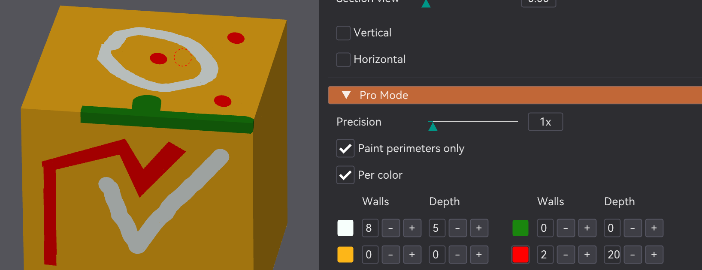

- Clicking a **color swatch** in the table also selects that color for painting — same colors, same selection highlight as the filament strip at the top of the panel.
- With the checkbox off, the two global fields behave exactly as before.
- Mixed-filament note: **Depth** distinguishes mixed slots individually; **Extra walls** for mixed slots falls back to the global value (mixed paint resolves to its physical components at wall-generation time).

> **Known edge case (not a Surface depth bug):** a MixedFilament blend that **ends in the same color as the object's own filament** will not generate its lower blend layers either — the whole blend chain is skipped, not just the (correctly redundant) top layer. Suspected stock-pipeline gap. Workaround: don't end the blend on the object's base color.

---

## 14. NeoStitch Interlock (WIP, ⚠️ UNTESTED) — Z-axis layer interlocking

> ⚠️ **Brand new, work-in-progress, and genuinely UNTESTED — preview-only, never printed.** Everything
> below is confirmed working **in the 3D preview only**. Treat this section as a curiosity/early-look,
> not a feature to rely on. One of its own controls (fill speed, see table below) is a **confirmed
> no-op bug** — turning it doesn't currently change anything in the resulting G-code.

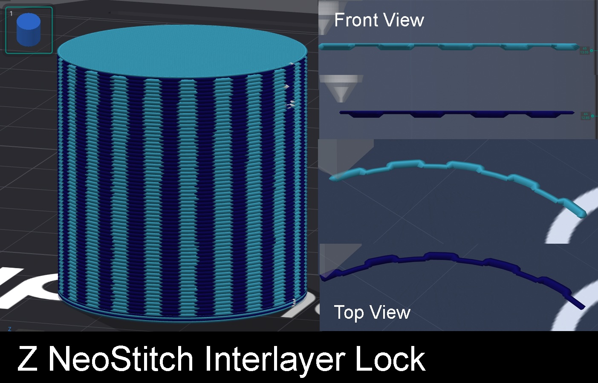

**NeoStitch** interlocks consecutive printed layers of a chosen wall **without ever moving Z**. Along
the wall's own path, each layer alternates short **notch** segments (the wall deflects inward, leaving
a gap at the nominal position) and **fill** segments (the wall over-extrudes there instead to fill the
gap left by the layer above/below). The pattern's phase flips on alternating layers, so a fill segment
always lands over the notch of the layer beneath it — a vertical "stitch" between layers, mechanically
different from a Z-brick-layer interlock (Z itself never moves; only XY position and extrusion width
change).

**Where to find it**: **Strength → NeoStitch Interlock** (per-region setting, same place/pattern as
Fuzzy Skin).

| Control | Default | What it does |
|---------|---------|---------------|
| **NeoStitch Interlock** | **Disabled** | Which wall gets the interlock: Outermost / Second / Third / Innermost wall. |
| **Stitch depth** | 0 mm (**auto** = the wall's own line width) | How far the notch deflects inward. An explicit value overrides the auto. |
| **Stitch length** | 3.0 mm | The flat plateau length of each notch/fill segment. |
| **Ramp length** | 1.0 mm | The transition ramp in/out of each segment (also smooths the pressure/flow change). |
| **Stitch period** | 10.0 mm | Distance between successive notch/fill events along the wall. |
| **Stitch flow** | 100% | Scales the fill segment's extra extrusion; 100% = automatic volume conservation for the notch depth being filled. |
| **Skip bottom layers** | 3 | Extra layers to skip above the object's first layer before the interlock starts. |
| **Fill speed** | 75% | ⚠️ **Known bug — does not currently work.** Intended to slow down only the fill segments (Klipper's pressure advance doesn't like the non-constant flow at full speed); confirmed via G-code inspection that the speed does not actually change yet. Root cause not yet found. |
| **Fill margin** | 1.0 mm | Shrinks the fill segment shorter than its matching notch by this much per side, so the over-extrusion lands *inside* the gap instead of bridging across it. **Confirmed working.** |

**Why "notch"/"fill" instead of moving Z**: the whole point is to interlock layers without changing
layer height or printing outside the normal Z steps — it's a pure XY-deflection + flow-modulation
effect, always fully backward compatible with normal slicing when turned off (**Disabled** by default,
per-region, exactly like Fuzzy Skin).

**Known limitations / open items (this build)**:
- **Fill speed control doesn't work yet** (see table above) — everything else in this section is
  otherwise implemented.
- Only verified visually in the 3D preview — the alternating notch/fill pattern is visible and
  registers correctly from layer to layer, but **no real print has been made with it yet**.
- Only Arachne wall generation is supported (v1); Classic walls are unaffected by this setting.
- Interacts with Fuzzy Skin / Bump Mapping by mutual exclusion, not composition — if either of those
  is active on the same wall, NeoStitch skips that wall rather than stacking effects.
- A cascade to neighbouring walls (so an interior wall "follows" the perturbed contour of the wall
  NeoStitch targets, instead of keeping its original offset) is designed but not implemented.

---

## 15. Expert G-code Reprocessor (2.3.8) — layer-ranged, per-tool G-code post-processing

> 🧪 **Expert-only, Libre Mode only.** Edits real G-code. A warning shows once, when you turn the
> panel on. **Print-verified** (2.3.8): a real multi-tool print ran clean with by-tool speed/flow/
> fan/Z-offset rules active, and the exported G-code was checked afterward line-by-line.
> **"Avoid Wipetower" is separately G-code-verified** (2.3.8): checked directly against an
> exported file to confirm a rule with it enabled never touches wipe-tower purge G-code.

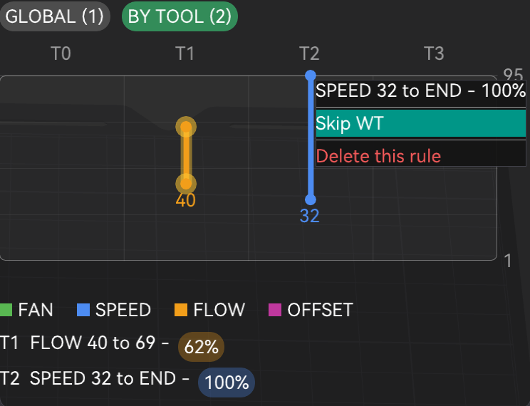

**Where to find it**: G-code **Preview** → the view-type dropdown (the same one **RealColor**
lives in) → **"Gcode Reprocessor"**, when **Libre Mode** is on. It renders inside the same legend
panel as every other view mode — no separate floating window.

Master **"Reprocessor enabled"** checkbox at the top gates the whole panel — when off, none of the
rules below do anything, however many you have. Below it, a **GLOBAL / BY TOOL** toggle switches
the chart between rules that apply everywhere and rules scoped to one tool; each tool gets its own
column (**T0, T1, T2, ...** — 0-based, matching the real `T<n>` G-code command).

**The chart is the only editor** — there's no separate list of fields to fill in:
- **Right-click empty space** in the chart to add a rule at that layer (and tool, in BY TOOL
  view) — a small menu offers the four rule types, color-coded.
- **Drag either endpoint** of a rule's bar to change its layer range — dragging the top endpoint
  all the way up snaps it to "to the end of the file."
- **Click a rule's colored value badge** (in the text summary below the chart) to type its exact
  number — percent for speed/flow, raw PWM for fan, mm for Z-offset.
- **Right-click an existing point** for a menu with **"Skip WT" / "Don't Skip WT"** (see below)
  and **"Delete this rule."**

A rule whose layer range no longer exists (e.g. the object got shorter after the rule was
created) shows its dot pinned to the chart's edge in gray instead of disappearing off-screen —
still fully draggable and deletable from there.

- **Speed override rules** — `M220 S<1-300%>` from layer X to Y (or a tool's active stretch).
- **Flow override rules** (2.3.8, new) — `M221 S<20-200%>`, same behaviour as speed.
- **Fan override rules** — `M106 S<0-255>` (raw PWM, not percent) from layer X to Y.
- **Z-offset rules** (2.3.8, new) — `SET_GCODE_OFFSET Z=<value>`, clamped to **±0.3mm, 0.01mm
  steps**. By-tool Z-offset rules restore right before a toolchange and re-apply right after —
  timed around the physical tool swap on purpose.

Global rules (the default) affect the whole ranged layers; by-tool rules only affect that range
while the picked tool is actually active — the effect automatically reverts when the print
switches to another tool, and re-applies when it comes back, all without touching the wipe
tower's own toolchange G-code. Mode is per rule, so a global fan rule and a by-tool speed rule can
both be active together. **No "Apply" button** — every edit saves immediately.

**"Avoid Wipetower" (2.3.8, new)** — any rule can independently opt out of applying inside wipe
tower G-code, shown as a permanent gold glow on its chart bar. On machines where the wipe tower
fires between layers for drip control, not only at toolchanges, a rule's range can otherwise land
inside that purge G-code rather than only "real" printing — this excludes every wipe-tower
segment from the rule's active range, splitting the range around a purge that falls in the
middle rather than skipping the whole thing.

Also fixed in 2.3.7 alongside the original version of this panel: Snapmaker U1/Klipper
toolchanges were forcing `M220 S100` on every color change (wiping any manual speed override) and
emitting `M220 B`/`M220 R` — both leftover from older Marlin-based Snapmaker machines and
meaningless on the U1's Klipper firmware. Both are gone now; toolchange G-code is simpler and no
longer fights a manual speed setting.

---

## 16. PerObject Support (2.3.9) — support that avoids the other objects on the plate

Stock slicers generate each object's support as if it were alone on the plate. Two separate
(non-Assembled) objects close enough that their supports share space produce a collision — each
support grows through the other object and through the other's support. The only stock workaround is
to merge everything into one Assembled object, which changes how the parts slice and defeats the
point when they're meant to be separate.

**PerObject Support** (checkbox directly under **Support → Enable support**, `support_cross_object_avoidance`,
default **off**) makes an object's support treat every *other* object on the plate — its body **and**
its already-generated support — as collision geometry to route around, keeping the normal
support/object XY distance from them. No Assemble, no boolean union: the objects stay independent and
the support simply stops colliding.

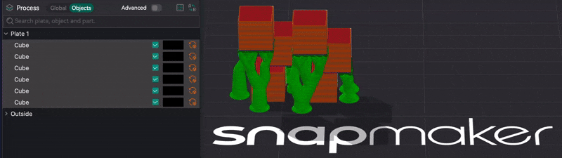

**Turning it on**

1. **Support → Enable support**.
2. Tick **PerObject Support** on each object that should avoid the others.
3. Slice. It only takes effect when the plate prints **all objects at once (by layer)** — in
   sequential by-object printing the neighbors aren't on the bed yet, so avoidance is inert.

**What it covers**

| Support kind | Cross-object avoidance |
|--------------|------------------------|
| Tree — Default / Slim / Strong / Hybrid | ✅ (hybrid tree engine) |
| Tree — Organic | ✅ (separate organic engine) |
| Normal / Grid | ✅ (classic engine) |
| NeoWave (§12) | ✅ (built on the classic engine) |

- **Support vs. support** — not just bodies. When two objects' supports would tangle, the one
  generated second routes around the first's finished support, not only around its body.
- **Move-aware** — nudging one object regenerates every nearby object's support against the new
  position. (Stock Orca never invalidated an object's own support on a move, because support was a
  per-object silo; PerObject Support adds that dependency.)

**Trade-off (deliberate).** The wide first-layer base/brim that support engines grow for bed
adhesion is a free outward offset stock code never clips against anything (exaggerate it and it
collides even with itself). Under PerObject Support that first-layer expansion is dropped to keep
bases from spilling across objects — supports grab the bed a little less at the very first layer in
exchange for never colliding. Only applies while the toggle is on.

Built on the real cross-instance contact detector (§4b): support avoidance and floating-object
detection share the same geometry. Stored per-object in the project (3mf). First appearance of
cross-object support avoidance in this slicer family.

---

## 17. Gravity ("True Objects") — real floor, honest bridges

Stock slicing assumes a few things that are only true when an object sits alone on the bed: "my
layer 0 is the bed", "below me is only my own previous layer", "support only ever grows from the
bed". Those assumptions break the moment two **separate** (non-Assembled) objects are placed one
on top of the other — a face resting on another object gets misclassified as a bridge over thin
air, even though there's solid material right underneath it.

**Gravity** measures what's *really* underneath every surface — the bed, another object, or
genuine air — and slices accordingly, **by area, not by object**: the part of a face that rests on
something solid prints as a normal contact surface; the part that's genuinely unsupported still
prints as a real bridge, in the same layer if that's how the geometry actually sits.

**Turning it on**

The toggle is called **"True Objects: On/Off"**, a toolbar side button next to the Libre Mode
button — it appears once the Libre Mode **master switch** is on (Preferences → Enable Neotko
LibreMode), but it is its own **independent axis**: turning Libre Mode's own active state on/off
does **not** turn True Objects on/off, and vice versa. Think of it as: *Libre Mode opens the door
to the fork's pro features; True Objects decides whether things fall.*

> Upgrading from an older build that already had Libre Mode's floating active? True Objects is
> seeded to match it automatically the first time, so existing floating/stacked projects keep
> working exactly as before — nothing falls to the bed on upgrade.

**What changes with True Objects on**

| Before (stock) | With True Objects |
|---|---|
| A face resting on another object → false bridge (bridge speed/fan, wrong angle) | Same face → normal solid contact surface, correct fill angle |
| An object's own floating first layer → always solid, even over open air | The part genuinely over air → a real bridge |
| Perimeter overhang measured only against this object's own layer below | Measured against the *real* floor — a wall resting on a neighbor isn't flagged overhang |
| Support requested under a face that's actually resting on another object | No support requested there — the neighbor's top counts as ground |
| Elephant-foot compensation applied to any first layer, even a stacked one | Never applied to a face that isn't touching the bed — stacked contact faces keep their true size |
| PerObject Support (§16) is opt-in per object | Forced on for every object while True Objects is active (nothing is overwritten — turn True Objects off and each object's own PerObject Support setting is exactly as you left it) |

**Where it shows up**: two objects stacked exactly on top of each other (pair this with **Align &
Stack**, §7, to place them precisely) — the touching face prints solid instead of showing up as a
bridge in the preview. An object resting **partly** on another and partly hanging over open air
shows **both** in the same layer: solid where it's supported, bridge where it truly isn't — that
split is the clearest way to see the feature working.

**A note on Assembled objects.** If your stacked pieces are already combined into one **Assembled**
object (one `ModelObject`, multiple parts), this was never broken — the slicer already sees the
whole stack as one body. Gravity/True Objects is specifically for pieces that stay **separate**
objects on the plate.

**Limits (v1)** — things Gravity does not do yet:
- Support still only lands on the bed or on the object's own body — it does not yet *land on* the
  top of another object (that's a future extension).
- Auto-arrange/auto-orient can still scatter a hand-placed stack across the plate — it has no
  concept of "these objects are meant to stay stacked". Don't run auto-arrange after stacking by
  hand.
- Only takes effect in **by-layer** printing (the whole plate rises together); in sequential
  by-object printing a neighbor object may not exist yet at a given height, so nothing is treated
  as floor there.

### 17a. Snap & Drag — auto-rest on the real surface below (2.3.9, extended 2.4.0 and 2.4.3)

With **True Objects** on, dragging an object in the viewport can rest it on whatever it is really
above, instead of leaving it floating wherever you dropped it.

**Where the settings live (2.4.3).** Click the **magnet icon** in the plate's icon column — under
the camera — and a small **Snap & Drag** panel opens with everything in one place: the master
switch, **Snap to bed**, and **Move selection as one block**. It stays open while you work and
closes with its own ✕ or by clicking the magnet again.

Before 2.4.3 these lived in an object's right-click menu, which meant they were only reachable for
the selection that produced *that particular* menu — select several objects and they simply weren't
there, which is exactly when they matter most. The magnet doesn't depend on the selection, so the
problem is gone rather than patched. (Snap & Drag is still a sub-behaviour of True Objects, not a
separate axis: with True Objects off the panel says so and its controls are greyed out.)

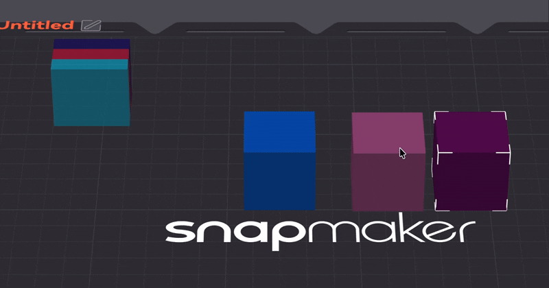

**How it decides where to land.** Detection is by 2D footprint overlap, not a raycast under the
cursor — a corner that only barely overlaps a pillar is not treated as resting on it (the overlap
must clear a threshold before it engages, and a slightly lower threshold to stay engaged once it
has — this hysteresis is what stops the object flickering up/down when you drag near a pillar's
edge). Once a candidate qualifies, its landing height is sampled with a handful of real raycasts
against the candidate's **actual mesh**, not its flat bounding-box top — so a hollow box (tall
rim, low interior floor) resolves correctly depending on exactly where the overlap lands, instead
of always reporting rim height. If several candidates qualify, the object rests on the **highest**
real surface under it; if an object has more than one instance and they'd land on pillars of
different heights, the whole object uses the **lowest** of those targets, so one instance landing
on something tall never silently drags the others up with it.

**Does the plate count? (2.4.0, renamed 2.4.3)** By default yes: **Snap to bed** in the magnet
panel is on, and an object dragged over empty space lands on the build plate, the way placement
behaves in any ordinary slicer. Switch it off and only other objects can catch you — an object with
nothing underneath keeps floating exactly where you dropped it, which is what you want while
assembling something in mid-air. The plate never competes with a real object: it is simply a floor
of height zero, and the highest surface under your footprint always wins. (This is the option that
was called **Snap & Drag: Allow Bed** in 2.4.0–2.4.2; same setting, same default, new home.)

With Allow Bed off and nothing qualifying underneath, the object is left exactly where it is —
Snap & Drag then only ever pulls something *down* onto a floor it actually finds, in keeping with
True Objects' own "nothing auto-drops" promise.


**Landing indicator (2.4.0).** While a drag is engaged the object hovers a little above its landing
spot rather than sitting flat on it, so what is underneath stays visible, and that gap is filled
with the evidence behind the decision:

- the **corner marks** of the box where the object will come to rest;
- the **recognised zone** — the exact patch being read as the height — highlighted on the surface
  it was found on;
- a translucent **column** standing between that zone and the object's underside;
- the **sample points** the height was actually taken from, as fat dots at their real hit heights;
- **colour**: cyan when another object caught you, amber when the plate did.

Underneath it all is the older soft contact shadow. None of this takes part in the calculation — but
it is what makes aiming possible: when a large part refuses to catch a thin rim, the dots show you
that the samples went through the opening instead of onto the rim.

**Dragging several objects at once (2.4.0).** By default a multi-object selection is resolved by
*stacks*. Anything standing on another member of the same selection travels with it and keeps its
exact relative height; anything with nothing of its own underneath resolves its own floor and falls
independently. Pick up a stack of three plus a loose box, move them together, and the stack lands
intact while the loose box drops to the plate — in the same drag. Two objects count as stacked when
one overlaps the other's footprint and sits within about a millimetre of its top, so hand-built
stacks that were never seated perfectly still hold together.

**Move selection as one block (2.4.3).** Sometimes that independence is the wrong answer: you are
not placing parts, you are *carrying* an arrangement somewhere else and it must arrive unchanged.
Tick **Move selection as one block** in the magnet panel and the whole selection becomes one rigid
body — **nothing changes height relative to anything else**, and the block falls until its **first**
part meets a surface, then stops. Nothing is ever pushed through its own floor to make some other
part land.

That last point is the practical difference. With the option off, a loose object dragged together
with an assembled one is its own stack and finds its own floor, so it can drop to the plate while
the assembled part stays high — correct behaviour when placing, surprising when moving a finished
arrangement. With it on, they travel as they are.

It's **off by default**: parts falling independently is what Snap & Drag is for most of the time,
and it's the behaviour every earlier version had. The option only affects selections of more than
one object or instance — a single object is a rigid body all by itself.

**Limits:** vertical (-Z) detection only — it does not help with side-by-side mating inside
Assemble View, which has no single "down" direction. The magnet icon itself only appears in
**LibreMode**, and only on the Prepare plate. No chaining *outside* the selection: moving an
object that something else is resting on does not drag that object along, only things picked up
together move together.

---

## 18. Typographic Spacing (2.3.9) — real kerning for embossed text

Stock Orca doesn't compose text, it **drops glyphs**: every letter is placed at a fixed advance and
that is the whole of it. The **Char gap** control it offers is *tracking* — one shift applied
identically between every pair of characters. That is not kerning.

**Kerning** is the correction the type designer builds into the font for *specific pairs*, so that
`AV`, `To` or `Wa` close the diagonal gap that plain advances leave gaping. Orca never read it.

### 18a. Turning it on

**Left-side gizmo toolbar → Text (Emboss) → Advanced → Font kerning.**

Tick it and the embossed text uses the kerning pairs stored in the font. **Char gap** is unchanged
and the two are independent: tracking shifts everything uniformly, kerning fixes individual pairs.
The setting is stored per style in the project (`.3mf`).

With **Font kerning** off, embossed text is identical to what earlier versions produced — this is a
pure opt-in.

### 18b. When the checkbox is greyed out

Not every font ships kerning data. When the selected font carries none, the checkbox is disabled and
labelled **"Font has no kerning data"** instead of silently doing nothing.

Typical fonts without kerning data: monospaced faces (Courier, Andale Mono, SF Mono), symbol and
Braille fonts, CJK fallbacks, and a number of display faces (Copperplate, Big Caslon, Bodoni 72).
Across a typical macOS font library of ~900 styles, roughly three quarters do carry usable kerning.

### 18c. macOS fonts — a fix specific to this fork

The font library Orca is built on reads the **Microsoft `kern`** table and **OpenType GPOS**, but
silently ignores the **Apple `kern` version 1.0** table. That is precisely the format the macOS
system fonts use — Helvetica included. Without a fix, "Font kerning" would appear to work for some
fonts (Helvetica Neue, most Google/Microsoft fonts) and do nothing at all for others, with no
explanation.

This fork adds a reader for the Apple format, so both layouts work.

A handful of fonts use Apple's state-machine kerning subtables (formats 2/3 — Geeza Pro, Apple
Chancery); those are still reported as having no usable kerning data.

### 18d. Font search actually filters now

Unrelated to kerning but in the same gizmo: typing in the font selector used to make the entire list
**disappear** instead of narrowing it. The search was implemented correctly — but the cached font
list, which is what you get from your second launch onward, populated only the names drawn on screen
and left the list the search matches against empty, so any keystroke matched zero fonts. Only a
first launch on a clean profile ever worked.

Fixed: the font selector filters as you type. The bug is present in upstream Orca as well.

### 18e. Under the hood (and what comes next)

The glyph advance used to be baked into the shape cache, which is keyed by character alone — so a
per-*pair* value could not be expressed at any price. Text composition now happens in one place,
`Emboss::layout_text()`, which the geometry goes through and which future typographic controls
(manual pair kerning, baseline shift, per-range scaling) will hook into.

---

## 19. Bridging infill extra expansion (2.4.0) — anchor bridges before they cross

**Quality → Bridging → Bridging infill extra expansion** (mm, default **0**).

Orca already grows each bridge region a little into the area around it, so the strand has somewhere to
land instead of starting in mid-air. Two things are wrong with how it does that: the amount is
hard-wired, and it is derived from your **wall count** — raise `wall_loops` for stiffness and you
silently change the anchoring of every bridge in the part. This setting adds millimetres on top of the
automatic amount and decouples the two.

What it buys you: the bridge takes over the neighbouring region **of the same part**, so the nozzle is
already extruding over solid, supported material before it reaches open air. A strand that starts
anchored behaves very differently from one that starts unattached — each pass has something to grab,
and the filament tensions across the gap instead of simply hanging.


**There is no cap.** Turning it up until the bridge claims the entire surrounding region is a normal
way to use this — it removes the seam artefact where the bridged area meets the supported one, and
gives the layer a single continuous direction. Values in the hundreds are accepted.

### Notes

- **Additive.** At 0 the slicer behaves exactly as before, byte for byte.
- Applies to **external bridges** only.
- The custom **bridge angle** is honoured across the expanded region.
- The expansion grows into solid infill, sparse infill, top surfaces and **supported bottom
  surfaces**. That last one is the important case: a beam resting on two blocks ("dolmen") has its
  bridge sitting right next to the supported area, and that supported area is the best possible
  landing ground — solid, with material directly underneath.
- Costs a little extra material and some bridge-speed travel over a region that was already solid.

### Debugging

`ORCA_DEBUG_BOTTOM=1` writes `BRIDGE_EXPAND` / `BRIDGE_EXPAND_DONE` lines to
`/tmp/neotko_bottom.log`, one pair per layer that contains a bridge:

- `extra_cfg` — the value that reached the engine. If this is 0 when you set something else, the
  problem is config invalidation, not the expansion.
- `exp_solid_mm` / `exp_sparse_mm` — how far the bridge may grow into each kind of neighbour.
- `zone_solid_mm2` / `zone_sparse_mm2` / `zone_top_mm2` / `zone_bottom_mm2` — how much area of each
  neighbour actually exists next to the bridge. All zeros means there is nowhere to grow, which is
  the usual reason for "it does nothing". `zone_bottom_mm2` reads `-1` when the setting is 0, since
  that zone is only created when you ask for extra expansion.
- `delta_mm2` — how much bridge area was actually gained.

---

## 20. RealColor View — see the colour you are actually going to print

**Where to find it**: G-code **Preview** → the view-type dropdown at the top of the legend panel →
**RealColor**.

Every slicer shows you multi-material G-code the same way: each extrusion drawn in its filament's raw
colour. That tells you *which tool* prints *where*, which is the right answer for a tool-change
preview and the wrong one for this pack. A Sandwich surface is not "some blue lines and some pink
lines" — it is a **stack** whose colours mix optically as light passes through the upper passes and
bounces back off the ones underneath. Read line by line, that surface looks like stripes. Printed, it
is one blended colour.

**RealColor** renders the second thing. It composites each surface the way the eye will resolve it,
using each filament's **TD** (§1e) to decide how much of what is underneath shows through.


Same G-code in both halves. Only the interpretation changes. Look at any tile that reads as stripes on
the left: on the right it has become the one colour your eye will see on the finished part. The tiles
that were already a single filament barely move — which is the point, because that is exactly where
the two ways of drawing agree.

### Notes

### 20a. Photo Mode in the G-code viewer (2.4.4)

**Where**: the RealColor legend → **Photo mode…**

RealColor got close enough to a photograph of a printed part that going back to the Prepare tab to
light one stopped making sense. The lighting of the G-code view is no longer fixed: **key and fill
can be aimed by dragging a ball**, and the part is lit in the room rather than by a lamp bolted to
the camera — orbit and the light stays where you put it.

**Raised lettering casts real shadows onto its own face.** Until 2.4.4 nothing in this view knew
where the light came from, so embossed text read as *sunken* rather than as lit from a direction.
The object's own mesh now casts a proper shadow onto the printed surface. Supports, brim and the
wipe tower are not part of that mesh and do not cast.

**Getting the picture out** — **Save PNG…** and **Copy image**, at 1080p, 1440p or 2160p:

- **Pure white or fully transparent background**, your choice. No bed, no plate, no grid — just the
  print.
- **The cast shadow is preserved in the transparency.** Paste the PNG onto any colour and the part
  still sits on a soft shadow instead of floating. It is what separates a cutout from a product shot.
- Nothing about the print is changed: this is presentation, and it never touches the G-code.

> Filament finish and TD live in their own window (**Filament finish…**, next to it in the legend) and
> are shared with the normal view — there is deliberately no second copy of them inside Photo Mode.

### 20b. Notes

- **TD is what makes it accurate.** RealColor is only as good as the transmission-distance values you
  gave each filament. With TD roughly right the match to the printed part is genuinely close; with TD
  left at defaults on filaments that differ a lot in opacity, expect the preview to drift. Tuning TD
  (§1e, and the **Object &amp; TD** department of the painter, §6b) pays off here more than anywhere
  else.
- **It is a simulation, not a promise.** The panel says so itself: *"Approximated optical simulation —
  not a guarantee of the final print colour."* Surface finish, lighting and the printer's own
  colour-blending behaviour all move the result.
- Changes **nothing** about the G-code. It is a rendering mode, and switching back to **Filament**
  gives you the standard view instantly.
- The RealColor legend shows **Filament Usage** and **Time Estimation** only — the per-tool tower/cost
  breakdown and the Travel/Retract/Seams toggles belong to the Filament view.

---

## 21. Real prints — what this actually looks like off the bed

Everything above is previews and dialogs. This section is the printed result, so you can judge for
yourself how far the simulation is from the plastic.

### Hilbert Curve × ColorStitch

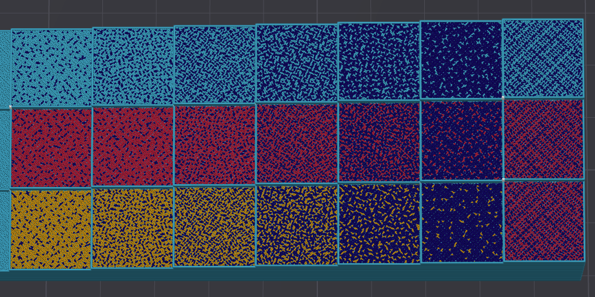

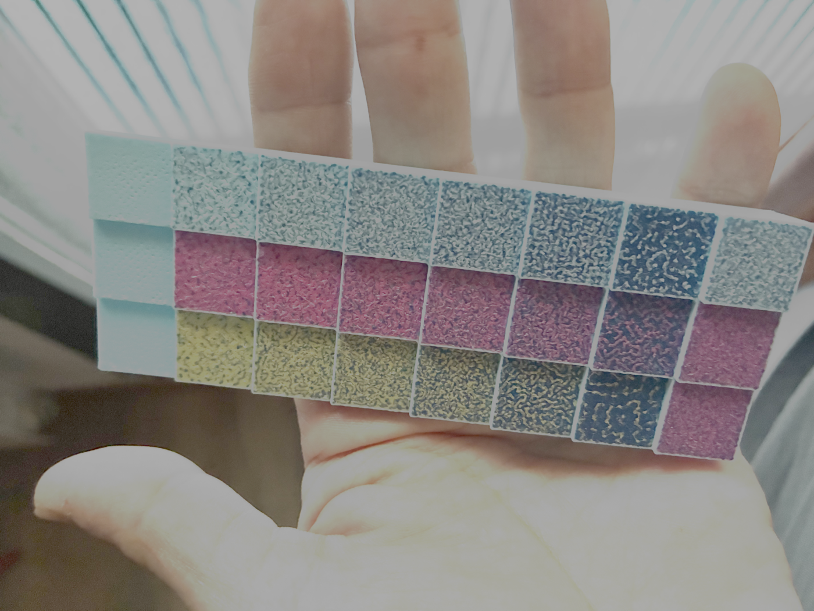

This pair is the clearest argument for why the G-code view alone is misleading for this pack, and why
**RealColor** (§20) exists.

### The BIGTEST board

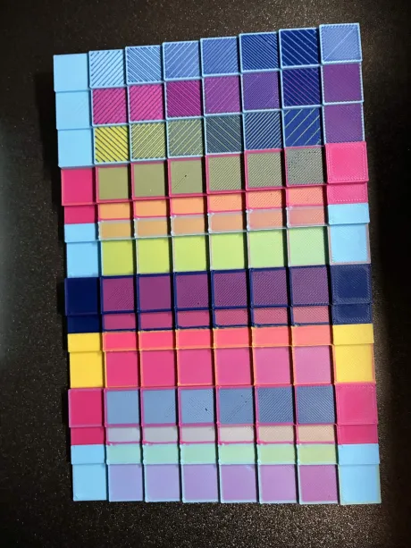

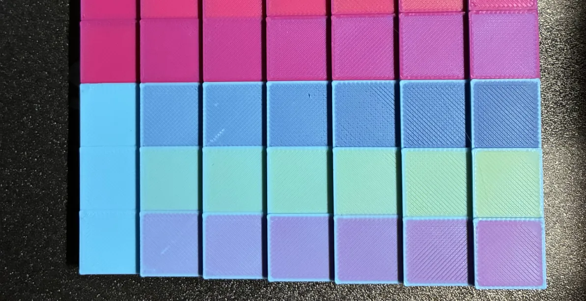

The `BIGTEST.3mf` project used for this board is in the fork's GitHub repository, so you can slice and
print the same reference yourself.

### MultiPass gradients

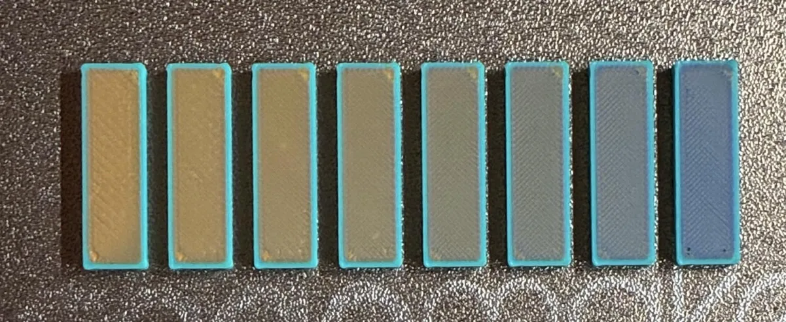

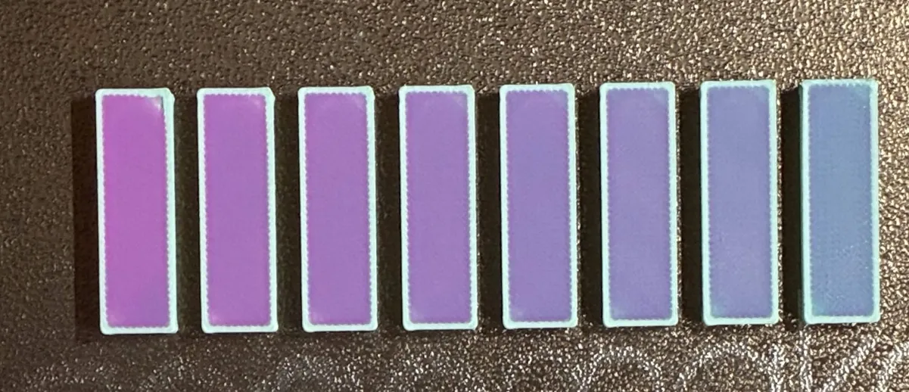

### Print vs screen

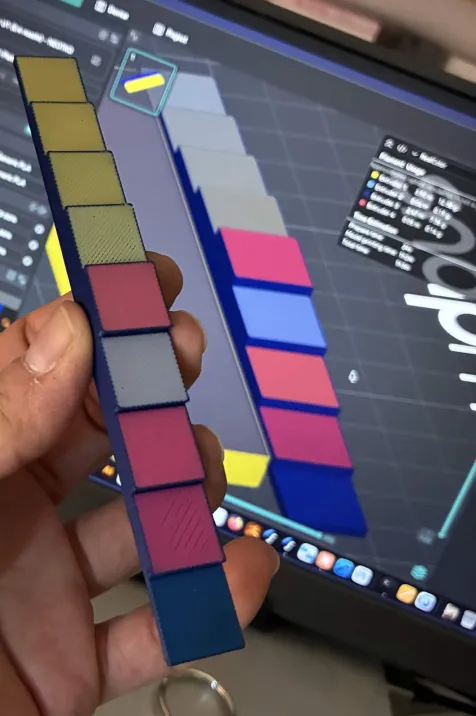

With TD values set correctly for the filaments in use, the match is close. That is the whole point of
tuning TD (§1e) rather than leaving it at defaults.

---

## 22. Photo Mode (2.4.2) — a photo studio inside Prepare

**Where to find it**: **Prepare** → the **camera button** at the bottom of the plate's icon column
(also in the right-click menu on empty space). **Requires Libre Mode** (§4).

A client asks what the part looks like in a different colour. You change it — and now you need a
picture. Opening a real renderer for that is a five-minute detour for a thirty-second question, so in
practice you send a screenshot of the slicer: gantry, grid, Snapmaker logo, toolbars and all.

Photo Mode turns the Prepare viewport into a small photo studio. Your object does not move and does
not change; everything *around* it does.

It changes **nothing** about the model, the settings or the G-code. Esc, the camera button, or
switching to Preview leaves it.

### 22a. The stage

| Stage | What you get |
|---|---|
| **Print bed** | Everything as normal. For when the bed *is* the context you want to show. |
| **Lightbox** | A **cyclorama**: a floor that sweeps up into a back wall through a rounded corner, with no visible seam. The white sweep a product photographer shoots against. |
| **Backdrop** | The floor alone, no wall. For top-down shots. |

On Lightbox and Backdrop the bed, grid, exclusion zones, plate numbers, the Snapmaker logo, the
gizmos and the toolbars all disappear — the logo first, because it is the single most obvious "this
is a screenshot of a slicer" element in the frame. The camera button stays, because it is also how
you get out.

Floor colour, size (as a multiple of your bed) and corner radius are adjustable.

### 22b. Lights

Three: **key**, **fill** and **rim**. Each has a **draggable ball** instead of three number boxes —
drag toward where you want the light and the shadow follows. Azimuth and elevation are also shown in
degrees, so a setup you liked can be written down and reproduced.

The light lives **in the room, not on the camera**. Orbit around the object and the lighting stays
put, the way it would in a real studio. (The normal viewport does the opposite: its light is pinned
to your eye. That is why the object never has a dark side while you spin it.)

Only the key light casts the shadow. Each light has an intensity and a colour tint.

**Presets** sit at the top and do most of the work:

| Preset | What it is for |
|---|---|
| **Neutral (as viewport)** | Identical to the normal 3D view. The default — entering Photo Mode changes the scene around the object, not the object. |
| **Studio 3-point** | Key high to one side, fill opposite to open the shadows, rim behind to separate the object from the backdrop. |
| **Softbox top** | One big overhead source, heavy ambient. The "product on white" look. |
| **Rim / backlight** | Weak key, strong edge light from behind. Sells profile and surface finish. |
| **Flat catalog** | Deliberately boring: almost no shadow, heavy ambient. What a shop listing wants, and what survives being cropped. |
| **Dramatic** | Grazing key, almost no fill. Long shadows — sells geometry rather than colour. |

### 22c. Materials, per filament slot

Each slot gets its own finish, picked from a list that shows the slot's **real colour** beside it:

| Material | Reads as |
|---|---|
| **Plastic** | The default — pixel-for-pixel the shading you already had. |
| **Glossy / resin** | Small, hard highlight. Polished or resin-printed. |
| **Matte PLA** | Broad, weak sheen. |
| **Rubber / TPU** | Almost no highlight at all — which is exactly what makes TPU look like TPU. |
| **Metal** | Highlight tinted by the object's own colour, no diffuse. |
| **Silk** | Half-metallic: a coloured sheen over a coloured body. What silk PLA actually is. |

On a **painted multi-colour object** the material follows the **colour**, not the part. One keyring
body can be matte on the stripes and metal on the lettering, from a single mesh.

> **Metal and Silk look much better with the Environment on** (§22d) — a metal is sold by what it
> reflects. They work without it, reflecting your lights directly, but there is not much *in* the
> reflection until you give them a room.

### 22d. Environment

Off by default. When on, it builds a **virtual room out of your own three lights**, which the objects
then reflect: move the key light and its reflection moves with it. There is a **rotate room**
control, which turns the reflections without moving the lighting — the fastest way to make a metal
look right.

It is off by default on purpose: with it on, Photo Mode no longer reproduces the normal viewport
exactly, and that equivalence is worth keeping as the starting point.

### 22e. Quality, and the floor reflection

| Quality | Shadow map | Floor reflection |
|---|---|---|
| **Normal** | 2048 px | — |
| **High** | 4096 px | available |
| **Ultra** | 8192 px | available |

The higher tiers also **widen the shadow's soft edge** to match the resolution. Raising the
resolution alone would give you a thinner but equally hard edge — better measured, worse looking.

**Floor reflection** mirrors the objects in the floor, stronger at grazing angles than face-on, with
an adjustable strength. It is a genuine reflection of the scene rather than a screen-space
approximation, so it does not fall apart at the object's outline — which is the part of a reflection
anyone actually looks at.

It draws the whole scene a second time, which is why it is gated above Normal. On an **M4 with a
fairly complex model, Ultra with the reflection on runs at 10–15 fps** — fine for framing a still,
not meant for modelling. Drop to High if you want to orbit comfortably.

### 22f. Getting the picture out

**Hide UI for screenshot** clears every control — including the Photo Mode panel itself — for an
adjustable few seconds, so you can grab the frame with your system screenshot tool (⌘⇧4 on macOS).
Esc cancels the countdown; a second Esc leaves the mode.

> **Save PNG** and **Copy to clipboard** are still **disabled here**, as of 2.4.4. The off-screen
> render frames the shot wrongly and a button that writes a broken file is worse than no button.
> The screenshot route above is the supported way in **Prepare**.
>
> **The G-code viewer's Photo Mode does export properly** (§20a) — same lights, plus PNG, clipboard
> and shadows carried in the transparency. If what you want is a file rather than a screenshot,
> that is the route that works today.

### 22g. Presets

**My presets** saves lights, materials, stage, environment and quality under a name you choose.

They are stored **with the application, not in the 3MF**. A lighting setup is your preference as the
person taking the picture — it should follow you across every project, rather than ride along inside
a model file that gets shared and printed. Saving over an existing name replaces it.

### Notes

- **Libre Mode must be on.** Photo Mode is built on the Libre Mode object renderer (shadows, ambient
  occlusion, contact shadows); with Libre Mode off the button does not appear at all, rather than
  appearing and doing nothing.
- **Transparent materials are deliberately not supported.** Showing a client a semi-transparent part
  would be *dishonest* — that is not how it comes off the printer. If you want to see inside a part,
  that is what **RealColor** (§20) is for, where the translucency is the whole point.
- Switching to **Preview**, **Device** or **Project** leaves Photo Mode automatically.

---

## 23. Height Adaptive Effects (2.4.3) — settings that change with height

**Where to find it**: left-side gizmo toolbar → **Height Adaptive Effects**. **Requires Libre
Mode** (§4). Per object.

Orca can already vary settings by height — that is what height range modifiers are. The problem is
that you type a Z into a box and find out where the transition actually landed *after* slicing.

This gizmo turns it around: you draw a curve **on top of the object's real layer bands**, adaptive
layer height included. The horizontal lines in the graph are the layers you are going to get, so
the layer you are affecting is visible while you affect it.

Curves are stored **per object**, so they travel inside the 3MF and go through undo/redo like
anything else. An object with no curve slices exactly as before.

### 23a. Building the list

The panel starts empty. Press **Add**, pick an effect from the list, and it joins *this object's*
effects — so the panel only ever shows what you actually use, no matter how many effects exist.

- **Trash button on a row** removes the effector completely, curve and all.
- **Clear** (at the bottom) empties the curve but keeps the effect in the list.
- Each row carries a **small preview of its own curve** and its point count, which is what keeps a
  list of similarly-named effects readable at a glance.

### 23b. Drawing the curve

Inside the graph: **click** to add a point, **drag** to move it, **right-click** to delete it.
Height runs up the left edge, the effect's value across the top.

- Hovering anywhere in the graph gives a **live readout** of the Z you are on and what the curve is
  worth there — you do not have to grab a point to read a number.
- Dragging a point highlights the matching **band on the object itself**, in 3D.
- **Open Z points** opens a numeric table, one row per point, with the layer number each Z lands
  on — for when you want to type an exact value instead of dragging to it.
- **Presets** seed a shape for the effects that have sensible ones.
- **Refresh layers** re-reads the bands after you change the adaptive layer height profile (§11).

> Z is measured from the **bottom of the object**, not from the bed. If you print with a raft, the
> raft is not part of this axis.

### 23c. Steps or ramp — and the number that decides

**Steps** holds the value constant inside each band and changes it in one jump at a layer boundary;
every point snaps to a real layer. **Ramp** varies it continuously.

Steps is not just the cautious option. Sparse infill deliberately keeps its spacing constant across
layers so the lines stack on the ones below — a width that drifts walks every line off its support.

But what breaks the stacking is the drift **between consecutive layers**, which depends on how
*steep* your curve is, not on it being a curve. A slow ramp moves each layer by a fraction of a
micron. So instead of forbidding ramps, the panel measures yours:

- **Line shift per layer** shows how far the infill of one layer lands from the one below, at the
  far edge of the object, as a percentage of the line width. It turns amber above roughly 25%.
- **Staircase** turns your ramp into that many layer-aligned bands, keeping the shape while giving
  the lines back their constant spacing inside each band.

A **shortest-band warning** also appears in steps mode: under about four layers, the jump costs
more than it gives.

### 23d. The effects

| Effect | What it is for |
|---|---|
| **Sparse infill width** | Thin lines low down where the infill has to support the solid above it, thick lines deep inside where nothing rests on them. Same density, same material, less time. |
| **Outer wall width** / **Inner wall width** | Wall thickness following the height. |
| **Fuzzy skin thickness** | Texture that is born and dies with the height. |
| **Fuzzy skin point distance / noise scale / octaves / persistence** | The texture's *character* changing with height, not only its depth. |

Only the three line widths that **stack** are offered. Internal solid infill and top surface were
wired up, looked at, and deliberately taken back out: a ramp there varies the width of the very
surfaces the eye reads as flat, which is not something a print wants.

Two things worth knowing:

- **Fuzzy skin thickness reaching 0 switches the fuzzy skin off** for that layer, rather than
  merely flattening it. A zero-amplitude fuzzy would otherwise still resample every perimeter into
  thousands of points: same printed result, much fatter G-code.
- The curves **scale** fuzzy skin, they do not turn it on. If fuzzy skin is off for the object, the
  panel says so rather than letting you slice and find nothing changed.

### 23e. What it does to a real print, measured

A 26.6 mm cube, 0.2 mm layers, 25% crosszag infill, one curve on **sparse infill width**. Reading
the numbers back out of the G-code layer by layer:

| | near the bottom | through the middle | up near the top |
|---|---|---|---|
| line width | 0.43 mm | 0.66 mm | 0.39 mm |
| line spacing | 1.53 mm | 2.47 mm | 1.40 mm |
| lines in the layer | 45 | 27 | 50 |
| **density** | **25.0%** | **25.0%** | **25.0%** |

The density does not move on any of the 135 layers. What moves is the width, and the spacing
follows it, because `line_spacing = flow spacing / density`. So the widest band prints 27 lines
where the top prints 50, out of the same grams, and its cell is a little over **three times the
area**.

That last part makes it a structural control as much as a speed one. A cell three times the area
built from struts nearly twice as thick is a different lattice at the same weight. Put the open
band where you want the part to give and the fine band where you want it stiff and you have a
damper, a clip, a bumper or a foot, out of one object with no modifiers and no boolean surgery.

> **Density itself is not on the list.** The width moves and the density holds, which is what keeps
> the grams constant. If you want a genuine density change with height, that is still a height
> range modifier.

### Notes

- A setting driven by a curve is **greyed out** in the object's settings panel, so the same value
  is never being set from two places at once.
- A curve needs **at least two points** to mean anything. One point is a constant, which is what a
  plain per-object override is for.

---

## 24. Support Zones (2.4.4) — supports you aim

> **Requires Libre Mode** (§4). The engine has been printed, not only previewed.

A support enforcer block has always been a box that says *what* to support. Everything about it below
the object was thrown away, so the column fell straight down from the overhang no matter where you
put the box.

A support zone says *what* to hold up **and where the column may come down**.

### The gesture

You point at the surface you want held up, then you point at where it should land. That is the whole
thing. Only surfaces facing downward can be picked, so the top of the part is never taken by mistake,
and when several stacked surfaces sit under the cursor you cycle through them with the wheel.

The pillar that appears follows the surface you picked rather than a bounding box. Its roof **is** the
real patch, curve included, so it sits flush against a rounded underside instead of leaving a gap.

### The panel draws what you are going to get

The middle of the panel is a **section drawing of your pillar at true scale**. Forty five degrees on
the slider is forty five degrees on screen. It shows the patch you took, the lean, the knee, the drop,
the plate, and behind all of it a ghost wedge: everything the slicer can actually follow. A landing
outside that wedge is one the slicer will not reach, and you see that as a shape rather than reading
it as a number.

Every zone on the object is a card with a small drawing of its own pillar, the colour of its roof
filament on the cap, and a meter of what it catches. A zone that catches nothing is drawn hollow and
dashed, in amber.

### The lean has a ceiling, and the slicer sets it

A support column can only step so far sideways from one layer to the next. That means there is a
steepest angle it can actually follow, and asking for more produces a staircase in mid air.

So the angle is what you set, and everything else follows from it. The pillar leans at that angle,
reaches a **knee**, and drops straight down from there. Because the angle is the input rather than
the outcome, a link the slicer cannot follow is not something you get warned about: it is something
you cannot draw.

### Two maps, and they answer opposite questions

**Green** marks surface facing downward that a zone has already caught. This is the one that kills a
quiet, common failure: a block that swallows solid material looks completely full on screen and
produces nothing at all. Now it lights up nowhere and says so.

**Red** marks surface that leans past your threshold and sits inside no zone at all. Simplify3D fills
everything with support and lets you carve it back. This does the opposite: it shows you the gap and
leaves the decision to you. The detail of both maps is adjustable, and it is a viewing preference,
not a print setting.

Both are drawn through the part, so a gap hiding behind the model is still a gap you can see. The
part itself is ghosted while the tool is open, and how ghosted is up to you.

Red on the skirt where the model meets the plate is expected. That surface really does lean past the
threshold and really is inside no zone; it simply does not need support, because each layer there
grows outward only a little from the one below. Deciding that properly is the slicer's own overhang
test, not this map's job, so the map tells you the truth and leaves it to you.

### Shaping the pillar

**The footprint** is one of four: the whole patch, a round or square shape around the point you
picked, or **painted** by hand. You start in square, because that is the one that teaches you the
rest.

**Cut or cover.** A shape can work two ways, and the difference is worth understanding because it is
what decides how big a zone can get.

- **Cut** trims the shape to the surface you picked, so it can never be bigger than the patch. The
  roof is the surface itself.
- **Cover** makes the shape *be* the section of the pillar. It can be bigger than the patch and grow
  as far as you want, up to 200 mm. The roof still follows the real surface wherever there is one, so
  a big circle over a curved underside still sits flush; where there is nothing under it, the roof
  stays flat. It holds more area than it strictly needs, and that is the trade.

Growing the outline of a patch always runs out eventually, because the shape folds through itself.
Replacing the outline with a shape has no such ceiling. That is the whole reason **cover** exists.

**Painting.** Pick the brush and drag on the surface to mark the area you want held up. The brush is
the size of the slider, so a small brush draws a narrow strip and a big one fills a region in one
sweep. Shift and drag rubs it out. Marks left in one stroke are joined into a continuous band rather
than a row of dots.

While the brush is chosen, the surface you *can* paint on is lit faintly: everything connected to
where you are that faces downward. That canvas is deliberately much larger than the patch a single
click would take — on a curve, one click gives you a tiny coplanar patch, and painting is exactly
the tool for going past it. Painting does not cross onto a surface that faces up or sideways, because
those need no support.

Keep painting as long as you like; the tool does not jump to step 2 by itself the way a click does.
While the brush is armed, the ordinary object drag is switched off, so a stroke that starts on the
part paints instead of moving it.

**The edge** — labelled **head** and **foot** — is adjustable at the roof and at the foot
**separately**, in both directions. Set them differently and the pillar tapers: wide where it holds,
narrow where it stands. Less material and less to break off. Grow it instead and it catches the edges
of an eave. Pushing inward and growing outward have **different limits**, and both come from the
shape itself: a convex footprint has no growing limit at all, while pushing inward always runs out
somewhere.

**Zones that touch and share their settings print as one column.** Two pillars meeting under the
same overhang used to split the shared band, and the loser came out thinner all the way to the
plate.

### A soluble roof, and an ordinary body

Each zone can take **its own filament for the roof**, chosen from a strip of colour chips rather than
a menu. The roof is the part that touches your model, so a soluble roof gives you a clean underside
while the body of the support stays whatever is cheap.

The body deliberately stays on "same as the object", and that is not a shortcut. A support body set
to follow the object is where the slicer dumps its purge; pinning a tool to it gives that up and
grows the wipe tower instead, in exchange for controlling the part of the support that cares least
about material.

Two zones that touch and want different filaments do not merge, because they are no longer the same
column.

### It sets up the object for you

Creating your first pillar on an object writes a set of support settings onto **that object**: normal
supports, a 0.1 mm top gap, one support wall, three interface layers, solid rectilinear interface.
They are the values these pillars were tested and printed with, and they are per object settings you
can see, undo, or remove from the object list.

Two rules keep that honest. It only writes a setting you have not already set yourself. And if the
object was on **tree** supports it is switched to normal, keeping whether it was automatic or manual,
because the tree generator does not know about the corridor: with tree supports the lean and the knee
you draw here would not come out.

Support style is set to Snug the moment you open the tool, for the same reason. With any other style
the support grid re-aligns itself to every layer, so a column that should slide comes out in steps.

### Zones you can reopen

A pillar built with this tool remembers the two clicks that made it. Pick the **pencil** on its card
and the whole gesture comes back into the panel: the patch, the landing, the footprint, the edges and
the angle. Change what you want and press **Apply changes**. Nothing is written until you apply, and
one edit is one undo.

That memory only holds while the zone is **locked**, which is what the padlock on the card means. Move,
rotate or scale the zone with the ordinary gizmos and the link between the gesture and the geometry
is broken, so the lock is gone and the zone becomes an ordinary support block. It still prints exactly
as it is; it just cannot be reopened. You can also unlock it deliberately. Either way it is a one way
door, and making another zone is two clicks, which is what makes that trade fair.

Duplicating a zone gives you an ordinary block too, for the same reason: the copy sits somewhere else,
so the gesture that made the original does not describe it any more.

While you are editing, the two picks and the landing stay put. Editing is for the dials; the clicks
are for making a new one.

### Why this instead of tree supports

A drawn pillar is one column that goes where you put it. The toolhead prints it in one place and moves
on.

Tree supports branch, and every branch is another island on the layer, which is another travel and
another retraction. Fewer retractions is not only faster: it is much kinder to the materials that
hate being pulled back, and those are exactly the flexible and moisture sensitive filaments where
stringing and grinding show up first.

You also decide where the foot lands, so it can stay off a delicate surface instead of finding one on
its way down.

### What it will not do

- **A zone only makes support where it finds surface that needs it.** That is deliberate and it is
  what stops it fabricating support nobody asked for, but it does limit what shapes are possible.
- **The whole patch mode follows the flat surface it starts on.** On a large flat ceiling that means
  the whole ceiling, which is what the round and square cuts are there for. That mode is also the one
  that cannot be expanded, because there is no shape to put in the outline's place — which is why the
  tool does not start there.
- **The edge slider runs out on the way in.** Push the edge inward far enough and the shape would
  fold through itself, so the limit shrinks as you go. That is the shape telling you it has no more
  room. Growing outward usually has no such limit; if you need much more than the patch allows, that
  is what **cover** is for.
- **A patch that folds over itself in plan view is flagged, not fixed.** A band that wraps past the
  vertical projects onto itself from above, so the foot of the pillar would overlap itself. The panel
  says so and leaves the fix to you: crop it smaller, or pick a flatter part of the surface.
- **Painting costs CPU.** Every mark is real geometry being clipped against the surface, and a long
  stroke is a lot of it.

---

## Quick Reference — Where to find things

| Feature | Location in UI |
|---------|---------------|
| Sandwich Editor (pass stack, ColorStitch, PathBlend) | Quality → Surface ColorStitch → **Sandwich editor…** |
| Photo Mode (§22) | Prepare → **camera button** on the plate icon column *(Libre Mode only)* |
| ColorStitch pass pattern | Sandwich Editor → a pass set to **ColorStitch** → **Edit gradient…** |
| ColorStitch Studio | Sandwich Editor → **ColorStitch Studio** panel (bottom) |
| Colour match (inverse ΔE2000) | ColorStitch Studio → **Target + Match ▸** |
| Filament & TD preview | Sandwich Editor → **Filament & TD** panel |
| Line distribution mode | Quality → **Surface ColorStitch** → Line distribution mode (below *Minimum line length*) |
| Top surface fill pattern (needed for ColorStitch) | Quality → **Top surface pattern → Monotonic Line** |
| Penultimate layers / density | Strength → Top/bottom shells |
| Neoweaving (WIP) | *Not wired in this build* |
| Libre Mode master switch | **Preferences → Enable Neotko LibreMode (requires restart)** |
| Libre Mode toggle | Toolbar side button **"Neotko LM: On/Off"** |
| Assembled Boolean mode | Right-click an object (Libre Mode) |
| Per-volume XY compensation | Part settings inside an Assembled object (Libre Mode) |
| Copy / Paste Process Settings | Right-click object → Copy/Paste Process Settings (Libre Mode) |
| Assembled Parts full options | Part settings tab (Libre Mode) |
| Remove Slice Cache (force a full re-slice) | Right-click object(s) → **Remove Slice Cache** (always available) |
| PerObject Support (§16) | Support → Enable support → **PerObject Support** checkbox, per object |
| True Objects / Gravity (§17) | Toolbar side button **"True Objects: On/Off"** (independent from Libre Mode) |
| Snap & Drag (§17a) | **Magnet icon** in the plate icon column → **Snap & Drag** (requires True Objects on) |
| Snap to bed (§17a) | Magnet icon → **Snap to bed** (requires Snap & Drag on; was "Snap & Drag: Allow Bed" before 2.4.3) |
| Move selection as one block (§17a) | Magnet icon → **Move selection as one block** (requires Snap & Drag on) |
| World-space import (WIP) | Import with Libre Mode active *(recommend assembled → split)* |
| S3DFactory import | File → Import → Import 3D model → `.factory` *(loads assembled; split in Libre Mode)* |
| Save / Manage profiles | Sandwich Editor → **Save as profile… / Manage Sandwich Profiles** |
| ColorStitch Painter | Left-side gizmo toolbar |
| Painter tools (Paint / Eraser / Pick) | Painter panel top row |
| Palette groups / Save all / Pin to palette | Painter panel |
| MixedFilament Object mode (Beta) | Painter panel → **Pro mode** → "MixedFilament Object" checkbox |
| Align & Stack | Left-side gizmo toolbar → **Align & Stack** |
| NeoArachne (enable) | Libre Mode → Quality → **Wall generator → NeoArachne** |
| NeoArachne sources / line widths / Preview Lab | Quality → NeoArachne section |
| NeoTower (tower type) | Quality → Prime tower → **Tower type** |
| Zigurat / Sandwich purge compaction / Sandwich wipe reserve | Quality → Prime tower |
| Variable layer height (Experimental) | Quality → Prime tower → **Tower type** = NeoTower (greyed unless Libre Mode) |
| PathBlend start/end zone + techo editor | PathBlend pass → **`ADV…`** (Painter Pro tray or Sandwich Editor's Advanced button) |
| Bump Mapping Editor (All / Painter / Top) | Left-side gizmo toolbar *(expert gate: Libre Mode active **+** `ORCA_DEBUG_TEXTUREBUMP` set, **+** `ORCA_DEBUG_ZBUMP` for Top/ZBump — see `NEOTKOCM_RELEASE_2_35.md`)* |
| Precision Adaptive Layer Height | Left-side gizmo toolbar *(icon always visible, needs Libre Mode active to use — §11)* |
| Height Adaptive Effects (§23) | Left-side gizmo toolbar *(needs Libre Mode active)* |
| NeoWave Support (enable) | Libre Mode → Support → **Support type → NeoWave** |
| Wave roof (shape/order/reverse/hollow pillar) | Support → **Interface pattern → Wave** to reveal the controls (§12) |
| NeoWave contact layer (WIP, print-pending) | Support → Advanced → **Support neoweave contact** toggle (§12a) |
| Painter Pro Mode (Precision / Paint perimeters only / Extra walls / Rectangle & Polygon masks) | Left-side gizmo toolbar → **Color Painting** → **Pro Mode** section *(always available, no Libre Mode needed)* |
| NeoStitch Interlock (WIP, ⚠️ untested) | Strength → **NeoStitch Interlock** (§14) |
| Support Zones (§24) | Left-side gizmo toolbar *(needs Libre Mode active)* |
| Support Zones · edit a zone (§24) | Its card in the panel → **pencil** *(only while the padlock is on)* |
| Support Zones · roof filament (§24) | Select the zone in the panel → **Roof filament** chips |
| Font kerning / Typographic Spacing (§18) | Left-side gizmo toolbar → **Text** → Advanced → **Font kerning** |

---

## Frequently Asked Questions

**Q: ColorStitch doesn't apply on some layers — why?**

Confirm the top surface fill pattern is **Monotonic Line** (§1b) — the only pattern that works correctly on complex objects. Then check **ColorStitch min. line length** (short lines are skipped) and the **Zone** setting (*Topmost only* applies to just the top of the object).

**Q: Where did "MultiPass" go?**

It's now built from the pass stack: add **two or three Solid passes** to a zone and split the layer height between them with the dividers. That gives the cross-hatch / glaze / optical-blend effects the old MultiPass produced. See §1a.

**Q: My ColorStitch stripes look fragmented across holes.**

Change **Line distribution mode** (Quality, Advanced) to **LaneQuant** or **DirCluster**. See §1f.

**Q: How do I turn on Libre Mode? I don't see the button.**

Enable the **master switch in Preferences** ("Enable Neotko LibreMode") and **restart**; the **"Neotko LM"** side button then appears. See §4a.

**Q: Do I need Libre Mode to print normally?**

No. It's off by default and the build behaves like stock. It only unlocks the §4 workflows and exposes NeoArachne (§8).

**Q: My `.factory` (or world-space) import put parts in the wrong place.**

A `.factory` always loads as one **Assembled** object; **split it in Libre Mode** to recover the parts in place. Same recommendation for world-space import while it's being finished. See §4g and §5.

**Q: In the Painter, why don't picked colours show in the Profiles list?**

By design — colours you paint are *working colours* (created on demand, cleaned up when unused). Only palettes you deliberately **Pin to palette** appear in the saved list; use **Save all** to promote every unsaved working colour at once. See §6c.

**Q: Can I use adaptive layer height with multiple tools and a Sandwich?**

Yes, as of 2.3.1 — enable **Libre Mode**, set **Tower type = NeoTower**, and turn on **Variable layer height (Experimental)** (Quality → Prime tower). The wipe-tower "missing drawers" issue that made this rough is now fixed (§9e). It is still flagged Experimental, so review G-code before long runs.

**Q: My wipe tower uses more purge than expected.**

Check **Sandwich wipe reserve** (default 10 mm³) and **Sandwich purge compaction** (default 1.7) in **Quality → Prime tower** (§9). Lower the reserve for a thinner tower, or set compaction to 1.0 to disable it.

**Q: The "MixedFilament Object" checkbox is greyed out — why?**

The object's extruder isn't a MixedFilament. Assign one of your MixedFilament rows as the
object's extruder (same as assigning any normal filament), then reopen the Painter — the
checkbox and its colour swatch become active. See §6g.

**Q: Can I make a PathBlend gradient start or end somewhere other than the surface edges — or make it fully opaque at one end?**

Yes — open **`ADV…`** on the PathBlend pass (Painter Pro tray or the Sandwich Editor's Advanced button) and drag the two handles in the graph that opens. The low handle sets where the ramp starts rising (and its floor height); the high handle sets where it finishes (and its top height). Push the high handle all the way to the top for a full "techo" — zero of the cap colour in that zone. See §1c.

**Q: I want to try NeoArachne safely.**

Enable Libre Mode, set **Quality → Wall generator → NeoArachne**, leave the new controls at defaults (Neotko Hybrid v2), and slice. Switch back to Arachne/Classic anytime — the NeoArachne controls don't touch existing settings.

**Q: Is the "Color Painting" gizmo's Pro Mode the same thing as the ColorStitch Painter?**

No — different tools. **Color Painting** (§13) is Orca's own stock multi-material painter, and Pro Mode adds precision brushing/masking on top of it. The **ColorStitch Painter** (§6) is this pack's own gizmo for painting *Sandwich effect profiles* (pass stacks, gradients, patterns). Both live in the left-side toolbar as separate icons.

**Q: I turned on "Extra walls" but the painted area doesn't seem to have more walls.**

Check whether the colour you painted with is the **same** as the object's own filament — Extra Walls is skipped there by design, since it wouldn't be visible anyway (§13b). Paint with a genuinely different colour to see the extra walls take effect.

**Q: My Rectangle/Polygon mask painted something on the far side of the object too.**

It shouldn't — both tools only paint faces pointing toward the camera. Rotate the view to confirm what you're actually seeing is the front-facing paint, not a leak through the back.

---

All of this work is open and free. Fork it, improve it, credit it.

-----

Now all the info from the Original SnapMaker 2.3.5 Readme

-----


<h1> <p "font-size:200px;"> Snapmaker Orca</p> </h1>

[](https://github.com/Snapmaker/OrcaSlicer/actions/workflows/build_all.yml)
<br>Snapmaker Orca is an open source slicer for FDM printers based on OrcaSlicer.
 


# Download

### Stable Release
📥 **Download the Latest Stable Release 
Visit our GitHub Releases page for the latest stable version of Snapmaker Slicer, recommended for most users.

# How to install
**Windows**: 
1.  Download the installer for your preferred version from the [releases page](https://github.com/Snapmaker/OrcaSlicer/releases).
    - *For convenience there is also a portable build available.*
    - *If you have troubles to run the build, you might need to install following runtimes:*
      - [MicrosoftEdgeWebView2RuntimeInstallerX64](https://github.com/SoftFever/OrcaSlicer/releases/download/v1.0.10-sf2/MicrosoftEdgeWebView2RuntimeInstallerX64.exe)
          - [Details of this runtime](https://aka.ms/webview2)
          - [Alternative Download Link Hosted by Microsoft](https://go.microsoft.com/fwlink/p/?LinkId=2124703)
      - [vcredist2019_x64](https://github.com/SoftFever/OrcaSlicer/releases/download/v1.0.10-sf2/vcredist2019_x64.exe)
          -  [Alternative Download Link Hosted by Microsoft](https://aka.ms/vs/17/release/vc_redist.x64.exe)
          -  This file may already be available on your computer if you've installed visual studio.  Check the following location: `%VCINSTALLDIR%Redist\MSVC\v142`

**Mac**:
1. Download the DMG for your computer: `arm64` version for Apple Silicon and `x86_64` for Intel CPU.  
2. Drag Snapmaker_Orca.app to Application folder. 
3. *If you want to run a build from a PR, you also need to follow the instructions below:*  
    <details quarantine>
    - Option 1 (You only need to do this once. After that the app can be opened normally.):
      - Step 1: Hold _cmd_ and right click the app, from the context menu choose **Open**.
      - Step 2: A warning window will pop up, click _Open_  
      
    - Option 2:  
      Execute this command in terminal: `xattr -dr com.apple.quarantine /Applications/Snapmaker_Orca.app`
      ```console
          softfever@mac:~$ xattr -dr com.apple.quarantine /Applications/Snapmaker_Orca.app
      ```
    - Option 3:  
        - Step 1: open the app, a warning window will pop up  
              
        - Step 2: in `System Settings` -> `Privacy & Security`, click `Open Anyway`:  
              
    </details>
    
**Linux (Ubuntu)**:
 1. If you run into trouble executing it, try this command in the terminal:  
    `chmod +x /path_to_appimage/Snapmaker_Orca_Linux.AppImage`
    
# How to compile
- Windows 64-bit  
  - Tools needed: Visual Studio 2019, Cmake, git, git-lfs, Strawberry Perl.
      - You will require cmake version 3.14 or later, which is available [on their website](https://cmake.org/download/).
      - Strawberry Perl is [available on their GitHub repository](https://github.com/StrawberryPerl/Perl-Dist-Strawberry/releases/).
  - Run `build_release.bat` in `x64 Native Tools Command Prompt for VS 2019`
  - Note: Don't forget to run `git lfs pull` after cloning the repository to download tools on Windows

- Mac 64-bit  
  - Tools needed: Xcode, Cmake, git, gettext, libtool, automake, autoconf, texinfo
      - You can install most of them by running `brew install cmake gettext libtool automake autoconf texinfo`
  - run `build_release_macos.sh`
  - To build and debug in Xcode:
      - run `Xcode.app`
      - open ``build_`arch`/Snapmaker_Orca.Xcodeproj``
      - menu bar: Product => Scheme => Snapmaker_Orca
      - menu bar: Product => Scheme => Edit Scheme...
          - Run => Info tab => Build Configuration: `RelWithDebInfo`
          - Run => Options tab => Document Versions: uncheck `Allow debugging when browsing versions`
      - menu bar: Product => Run

- Ubuntu 
  - Dependencies **Will be auto-installed with the shell script**: `libmspack-dev libgstreamerd-3-dev libsecret-1-dev libwebkit2gtk-4.0-dev libosmesa6-dev libssl-dev libcurl4-openssl-dev eglexternalplatform-dev libudev-dev libdbus-1-dev extra-cmake-modules libgtk2.0-dev libglew-dev libudev-dev libdbus-1-dev cmake git texinfo`
  - run 'sudo ./BuildLinux.sh -u'
  - run './BuildLinux.sh -dsir'


# Note: 
If you're running Klipper, it's recommended to add the following configuration to your `printer.cfg` file.
```
# Enable object exclusion
[exclude_object]

# Enable arcs support
[gcode_arcs]
resolution: 0.1
```


## Some background
Snapmaker Orca is originally forked from Snapmaker_Orca.

Snapmaker_Orca is originally forked from Bambu Studio, it was previously known as BambuStudio-SoftFever.
Bambu Studio is forked from [PrusaSlicer](https://github.com/prusa3d/PrusaSlicer) by Prusa Research, which is from [Slic3r](https://github.com/Slic3r/Slic3r) by Alessandro Ranellucci and the RepRap community. 
Orca Slicer incorporates a lot of features from SuperSlicer by @supermerill
Orca Slicer's logo is designed by community member Justin Levine(@freejstnalxndr)  


# License
Snapmaker Orca is licensed under the GNU Affero General Public License, version 3. Orca Slicer is based on Snapmaker_Orca by SoftFever

Orca Slicer is licensed under the GNU Affero General Public License, version 3. Orca Slicer is based on Bambu Studio by BambuLab.

Bambu Studio is licensed under the GNU Affero General Public License, version 3. Bambu Studio is based on PrusaSlicer by PrusaResearch.

PrusaSlicer is licensed under the GNU Affero General Public License, version 3. PrusaSlicer is owned by Prusa Research. PrusaSlicer is originally based on Slic3r by Alessandro Ranellucci.

Slic3r is licensed under the GNU Affero General Public License, version 3. Slic3r was created by Alessandro Ranellucci with the help of many other contributors.

The GNU Affero General Public License, version 3 ensures that if you use any part of this software in any way (even behind a web server), your software must be released under the same license.

Orca Slicer includes a pressure advance calibration pattern test adapted from Andrew Ellis' generator, which is licensed under GNU General Public License, version 3. Ellis' generator is itself adapted from a generator developed by Sineos for Marlin, which is licensed under GNU General Public License, version 3.

The Bambu networking plugin is based on non-free libraries from BambuLab. It is optional to the Orca Slicer and provides extended functionalities for Bambulab printer users.

# Feedback & Contribution
We greatly value feedback and contributions from our users. Your feedback will help us to further develop Snapmaker Orca for our community.
- To submit a bug or feature request, file an issue in GitHub Issues or email us at support@snapmaker.com.
- To contribute some code, make sure you have read and followed our guidelines for contributing.
