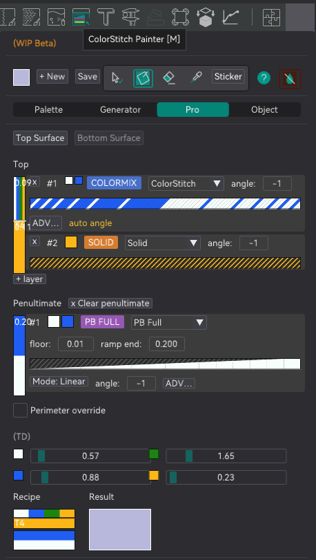
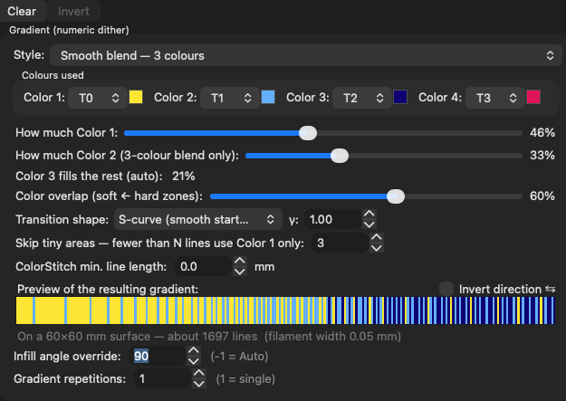
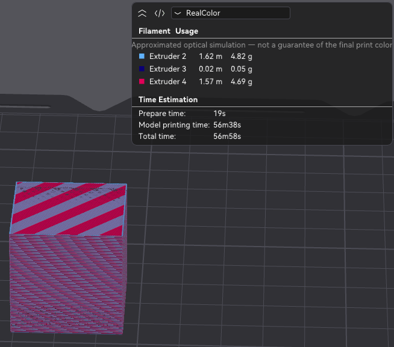
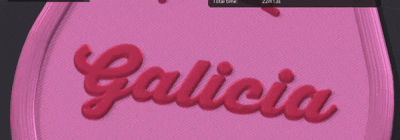
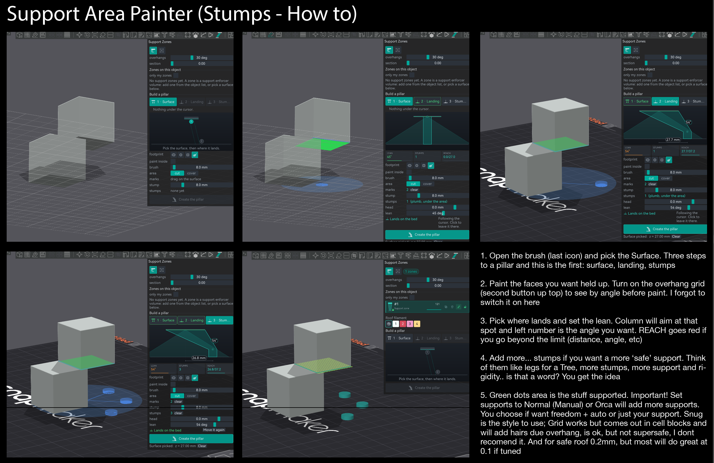
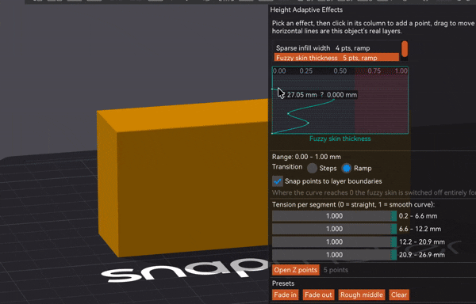
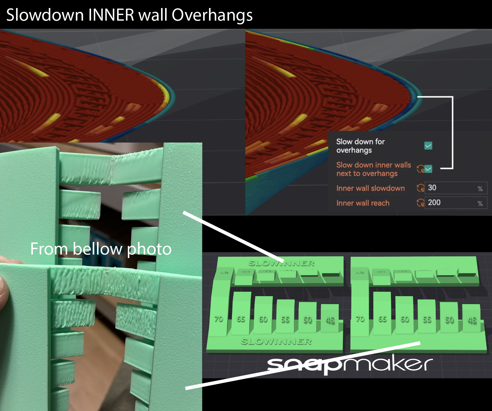

## Proud to announce that @Snapmaker is officially sponsoring this project!!

Development will be conducted in close collaboration with Snapmaker ecosystem and with Radoux/Radu, author of FullSpectrum the now official part of the Snapmaker team. So from v1.9 forward expect big things!
By Neotko — inventor of Ironing/Neosanding (Ultimaker Cura, PrusaSlicer)

# How does it work, what is this?

> ### 👉 **[Open the site](https://sebsucmor-alt.github.io/OrcaFS-NeotkoCM/)**
>
> Two ways in, pick either:
>
> - **[The interactive tour](https://sebsucmor-alt.github.io/OrcaFS-NeotkoCM/tour/)** — every feature,
>   with demos you can pull apart. Build a Sandwich and watch the printed colour resolve, drag a
>   gradient's ramp, draw a layer-height curve, see what the wipe tower has to swallow. The colour
>   maths and the dither are the slicer's own code, ported to run in your browser, so a recipe you
>   land on there is a recipe you can type into the app. 22 pages, 40 live demos, nothing to install.
> - **[The video series](https://sebsucmor-alt.github.io/OrcaFS-NeotkoCM/beginners.html)** — seven
>   short animated walkthroughs, in order, from "why fork Orca at all" to painting a Sandwich click
>   by click. The gentlest way in if you have never seen any of this.
>
> There is also **[the Playground](https://sebsucmor-alt.github.io/OrcaFS-NeotkoCM/tour/play.html)**,
> where the simulators live full size, and
> **[the feature map](https://sebsucmor-alt.github.io/OrcaFS-NeotkoCM/tour/map.html)**, which lists
> every feature with the gate it needs, how finished it actually is, and where the control lives.

# Download Last versión

> Check **[Releases](https://github.com/sebsucmor-alt/OrcaFS-NeotkoCM/releases)**

# Snapmaker Orca — the Neotko feature pack · User Guide

A pile of features living on top of Snapmaker Orca, built by one person who designs in 3D and reads
code. Everything here is opt-in: leave the new settings alone and the build slices like stock
Snapmaker Orca, and every release is checked against that.

**The full manual is [WIKI.md](WIKI.md)**, 25 sections with every control and every gate. What
follows is the shortlist, so you can see what is in here without reading all of it. Each title links
to its section of the WIKI, and each feature has a page of its own in
**[the interactive tour](https://sebsucmor-alt.github.io/OrcaFS-NeotkoCM/tour/)** with demos you can
pull apart.

## Colour

### [The Sandwich](WIKI.md#1-surface-colorstitch--the-sandwich-editor)

Your top surface stops being one pass in one filament and becomes a stack of up to three, each with
its own tool, angle and share of the layer height. Order matters, because light goes down through
the stack and comes back up.



### [ColorStitch](WIKI.md#1b-colorstitch-pass--per-line-color-patterns)

A pass that picks the filament for every single fill line: dithered blends, exact stripes, textile
weaves, patterns you type by hand. The dither is Bresenham, so the same recipe gives the same result
every slice.



### [PathBlend](WIKI.md#1c-pathblend-pass--smooth-gradient)

A gradient made out of geometry. One filament climbs as a real ramp inside the layer, one print
height step per fill line, and a second one caps the rest. Nothing is dithered and nothing is mixed
in a nozzle.


### [The ColorStitch Painter](WIKI.md#6-surface-effect-profiles--colorstitch-painter)

Save Sandwiches as profiles and flood fill them onto individual faces, so different parts of one
object each carry their own recipe. The weave is drawn live on the model.


## Seeing it before you print it

### [RealColor View](WIKI.md#20-realcolor-view--see-the-colour-you-are-actually-going-to-print)

A striped G-code preview tells you almost nothing about how a Sandwich will look. RealColor
composites the toolpaths the way the eye resolves them, using the same optics the slicer uses.



### [Photo Mode](WIKI.md#22-photo-mode-242--a-photo-studio-inside-prepare)

A photo studio inside Prepare and inside the G-code viewer. Light it like a product shot and export
a PNG whose shadow lives in the alpha channel.



### [Real prints](WIKI.md#21-real-prints--what-this-actually-looks-like-off-the-bed)

The same recipes off the bed, photographed, so you can judge the gap between the preview and the
part yourself.


## Supports

### [Support Zones](WIKI.md#24-support-zones-244-extended-in-245--supports-you-aim)

Point at the surface you want held up, then at where the column should land, and the pillar is built
between the two. Paint an area and a stump is planted for you, the head is the patch you painted and
the middle grows on its own.



### [PerObject Support](WIKI.md#16-perobject-support-239--support-that-avoids-the-other-objects-on-the-plate)

Support that routes around the other objects on the plate instead of growing through them, which
nothing else in this slicer family does.


## Placing things

### [Align & Stack, and Snap & Drag](WIKI.md#17a-snap--drag--auto-rest-on-the-real-surface-below-239-extended-240-and-243)

Place one object precisely against another, then drag it and watch it land on the real surface
below. With Gravity on, a face resting on another object prints as solid contact instead of a false
bridge over thin air.


## Structure and surface

### [Height Adaptive Effects](WIKI.md#23-height-adaptive-effects-243--settings-that-change-with-height)

The layer height curve pointed at any other setting. The infill cell opens where nothing rests on it
and closes under the top surface, at the same density and the same grams. Fuzzy skin is born, lives
for a band, and dies again.



### [Painter Pro Mode](WIKI.md#13-painter-pro-mode--precision-tools-for-the-stock-color-painting-gizmo)

Precision brushing, rectangle and polygon masks, and a surface depth that projects what you painted
into the object instead of leaving it on the skin.


### [Bump Mapping and ZBump](WIKI.md#10-bump-mapping-editor--texture-driven-wall--top-surface-relief)

A PNG becomes physical relief: it displaces wall centrelines around the object, per painted zone, or
modulates the Z of the top surface fill point by point into a real height field.


## G-code and finishing

### [Expert G-code Reprocessor](WIKI.md#15-expert-g-code-reprocessor-238--layer-ranged-per-tool-g-code-post-processing)

A layer ranged, per tool G-code post processor you edit as a chart. Pick a band of layers, pick a
tool, and change what happens there without touching the profile.


### [Overhang Shadow](WIKI.md#25-overhang-shadow-245--the-wall-an-overhang-lands-on)

The inner wall that sits right behind an overhang inherits part of its slowdown, and the fan comes
along for free. The wall an overhang lands on is the one that has to hold it.



### [Bridging infill extra expansion](WIKI.md#19-bridging-infill-extra-expansion-240--anchor-bridges-before-they-cross)

Bridges anchor on solid ground before they cross, instead of starting in mid air and hoping.


## Also in here

- **[NeoTower](WIKI.md#9-neotower--post-slice-wipe-tower)**, a wipe tower planned after slicing, when
  every toolchange is known, including the sub layer primes a Sandwich inserts inside one layer. It
  is what makes adaptive height, multi tool and Sandwich work together at all.
- **[Precision Adaptive Layer Height](WIKI.md#11-precision-adaptive-layer-height--point-based-layer-height-curve)**,
  layer height drawn as an exact curve with control points and per segment tension, over the
  object's real layer bands.
- **[NeoArachne](WIKI.md#8-neoarachne--alternative-wall-generator)**, pick which engine prints the
  outer wall, the inner walls and the gap fill, separately.
- **[Libre Mode](WIKI.md#4-libre-mode)**, the two key gate for the professional and experimental
  half: assemblies without a boolean union, per volume compensation, full part settings, Simplify3D
  import, realistic shading.
- **[Typographic Spacing](WIKI.md#18-typographic-spacing-239--real-kerning-for-embossed-text)**, real
  font kerning for embossed text.
- **[TD and the ColorStitch Studio](WIKI.md#1g-colorstitch-studio--palette-generators)**, Transmission
  Density, the reachable gamut from your four filaments, and a search for a colour you name.
- Work in progress, look but do not trust yet:
  **[NeoWave Support](WIKI.md#12-neowave-support-wip--wave-huygens-roof--hollow-pillar--contact-layer)** and
  **[NeoStitch Interlock](WIKI.md#14-neostitch-interlock-wip--untested--z-axis-layer-interlocking)**.

The **[feature map](https://sebsucmor-alt.github.io/OrcaFS-NeotkoCM/tour/map.html)** lists every
feature with the gate it needs, how finished it actually is, and where the control lives. Release
notes for the current version are in `NEOTKOCM_RELEASE_2_45.md`.

---

All of this work is open and free. Fork it, improve it, credit it.

-----

Now all the info from the Original SnapMaker 2.3.6 Readme

-----


<h1> <p "font-size:200px;"> Snapmaker Orca</p> </h1>

[](https://github.com/Snapmaker/OrcaSlicer/actions/workflows/build_all.yml)
<br>Snapmaker Orca is an open source slicer for FDM printers based on OrcaSlicer.
 


# Download

### Stable Release
📥 **Download the Latest Stable Release 
Visit our GitHub Releases page for the latest stable version of Snapmaker Slicer, recommended for most users.

# How to install
**Windows**: 
1.  Download the installer for your preferred version from the [releases page](https://github.com/Snapmaker/OrcaSlicer/releases).
    - *For convenience there is also a portable build available.*
    - *If you have troubles to run the build, you might need to install following runtimes:*
      - [MicrosoftEdgeWebView2RuntimeInstallerX64](https://github.com/SoftFever/OrcaSlicer/releases/download/v1.0.10-sf2/MicrosoftEdgeWebView2RuntimeInstallerX64.exe)
          - [Details of this runtime](https://aka.ms/webview2)
          - [Alternative Download Link Hosted by Microsoft](https://go.microsoft.com/fwlink/p/?LinkId=2124703)
      - [vcredist2019_x64](https://github.com/SoftFever/OrcaSlicer/releases/download/v1.0.10-sf2/vcredist2019_x64.exe)
          -  [Alternative Download Link Hosted by Microsoft](https://aka.ms/vs/17/release/vc_redist.x64.exe)
          -  This file may already be available on your computer if you've installed visual studio.  Check the following location: `%VCINSTALLDIR%Redist\MSVC\v142`

**Mac**:
1. Download the DMG for your computer: `arm64` version for Apple Silicon and `x86_64` for Intel CPU.  
2. Drag Snapmaker_Orca.app to Application folder. 
3. *If you want to run a build from a PR, you also need to follow the instructions below:*  
    <details quarantine>
    - Option 1 (You only need to do this once. After that the app can be opened normally.):
      - Step 1: Hold _cmd_ and right click the app, from the context menu choose **Open**.
      - Step 2: A warning window will pop up, click _Open_  
      
    - Option 2:  
      Execute this command in terminal: `xattr -dr com.apple.quarantine /Applications/Snapmaker_Orca.app`
      ```console
          softfever@mac:~$ xattr -dr com.apple.quarantine /Applications/Snapmaker_Orca.app
      ```
    - Option 3:  
        - Step 1: open the app, a warning window will pop up  
              
        - Step 2: in `System Settings` -> `Privacy & Security`, click `Open Anyway`:  
              
    </details>
    
**Linux (Ubuntu)**:
 1. If you run into trouble executing it, try this command in the terminal:  
    `chmod +x /path_to_appimage/Snapmaker_Orca_Linux.AppImage`
    
# How to compile
- Windows 64-bit  
  - Tools needed: Visual Studio 2019, Cmake, git, git-lfs, Strawberry Perl.
      - You will require cmake version 3.14 or later, which is available [on their website](https://cmake.org/download/).
      - Strawberry Perl is [available on their GitHub repository](https://github.com/StrawberryPerl/Perl-Dist-Strawberry/releases/).
  - Run `build_release.bat` in `x64 Native Tools Command Prompt for VS 2019`
  - Note: Don't forget to run `git lfs pull` after cloning the repository to download tools on Windows

- Mac 64-bit  
  - Tools needed: Xcode, Cmake, git, gettext, libtool, automake, autoconf, texinfo
      - You can install most of them by running `brew install cmake gettext libtool automake autoconf texinfo`
  - run `build_release_macos.sh`
  - To build and debug in Xcode:
      - run `Xcode.app`
      - open ``build_`arch`/Snapmaker_Orca.Xcodeproj``
      - menu bar: Product => Scheme => Snapmaker_Orca
      - menu bar: Product => Scheme => Edit Scheme...
          - Run => Info tab => Build Configuration: `RelWithDebInfo`
          - Run => Options tab => Document Versions: uncheck `Allow debugging when browsing versions`
      - menu bar: Product => Run

- Ubuntu 
  - Dependencies **Will be auto-installed with the shell script**: `libmspack-dev libgstreamerd-3-dev libsecret-1-dev libwebkit2gtk-4.0-dev libosmesa6-dev libssl-dev libcurl4-openssl-dev eglexternalplatform-dev libudev-dev libdbus-1-dev extra-cmake-modules libgtk2.0-dev libglew-dev libudev-dev libdbus-1-dev cmake git texinfo`
  - run 'sudo ./BuildLinux.sh -u'
  - run './BuildLinux.sh -dsir'


# Note: 
If you're running Klipper, it's recommended to add the following configuration to your `printer.cfg` file.
```
# Enable object exclusion
[exclude_object]

# Enable arcs support
[gcode_arcs]
resolution: 0.1
```


## Some background
Snapmaker Orca is originally forked from Snapmaker_Orca.

Snapmaker_Orca is originally forked from Bambu Studio, it was previously known as BambuStudio-SoftFever.
Bambu Studio is forked from [PrusaSlicer](https://github.com/prusa3d/PrusaSlicer) by Prusa Research, which is from [Slic3r](https://github.com/Slic3r/Slic3r) by Alessandro Ranellucci and the RepRap community. 
Orca Slicer incorporates a lot of features from SuperSlicer by @supermerill
Orca Slicer's logo is designed by community member Justin Levine(@freejstnalxndr)  


# License
Snapmaker Orca is licensed under the GNU Affero General Public License, version 3. Orca Slicer is based on Snapmaker_Orca by SoftFever

Orca Slicer is licensed under the GNU Affero General Public License, version 3. Orca Slicer is based on Bambu Studio by BambuLab.

Bambu Studio is licensed under the GNU Affero General Public License, version 3. Bambu Studio is based on PrusaSlicer by PrusaResearch.

PrusaSlicer is licensed under the GNU Affero General Public License, version 3. PrusaSlicer is owned by Prusa Research. PrusaSlicer is originally based on Slic3r by Alessandro Ranellucci.

Slic3r is licensed under the GNU Affero General Public License, version 3. Slic3r was created by Alessandro Ranellucci with the help of many other contributors.

The GNU Affero General Public License, version 3 ensures that if you use any part of this software in any way (even behind a web server), your software must be released under the same license.

Orca Slicer includes a pressure advance calibration pattern test adapted from Andrew Ellis' generator, which is licensed under GNU General Public License, version 3. Ellis' generator is itself adapted from a generator developed by Sineos for Marlin, which is licensed under GNU General Public License, version 3.

The Bambu networking plugin is based on non-free libraries from BambuLab. It is optional to the Orca Slicer and provides extended functionalities for Bambulab printer users.

# Feedback & Contribution
We greatly value feedback and contributions from our users. Your feedback will help us to further develop Snapmaker Orca for our community.
- To submit a bug or feature request, file an issue in GitHub Issues or email us at support@snapmaker.com.
- To contribute some code, make sure you have read and followed our guidelines for contributing.
